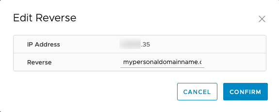

**Ultimo aggiornamento: 07/07/2020**

## Obiettivo

Il plugin OVHcloud Network è stato sviluppato per consentire una gestione più precisa degli indirizzi IP associati a una soluzione Private Cloud.

**Questa guida ti mostra come utilizzare il plugin OVHcloud Network sul tuo servizio.**

## Prerequisiti

- Disporre di una soluzione [Hosted Private Cloud](https://www.ovhcloud.com/it/enterprise/products/hosted-private-cloud/){.external}
- Avere accesso allo [Spazio Cliente OVHcloud](https://www.ovh.com/auth/?action=gotomanager)
- Disporre di un blocco di indirizzi IP associato al Private Cloud
- Avere accesso all’interfaccia vSphere

## Procedura

Accedi all’interfaccia vSphere e seleziona il tuo datacenter nel menu a sinistra. Posizionati nella scheda `Configure`{.action} e, sotto “OVHcloud” nella colonna di navigazione a sinistra, clicca sulla voce `Network`{.action} per visualizzare la sezione “Network summary”.

{.thumbnail}

In questa interfaccia vengono mostrati i blocchi IP e le informazioni di base ad essi associate. Clicca su un blocco per visualizzare nella tabella l’elenco di tutti gli indirizzi IP.

{.thumbnail}

In questo modo è possibile anche verificare il “reverse” di ogni indirizzo e la sua destinazione. Alcuni indirizzi sono contrassegnati come “Reserved”. Assicurati di non utilizzare questi **cinque indirizzi IP riservati alla configurazione del blocco e all’alta disponibilità**:

- il primo IP, che annuncia il blocco sul router
- l’ultimo IP, che corrisponde a quello di broadcast
- il penultimo IP, che corrisponde al gateway
- i due IP prima del gateway, che vengono utilizzati sui router come HSRP (Hot Standby Router Protocol)

> [!warning]
> Alcune configurazioni con un firewall virtuale non permettono di risalire agli indirizzi MAC se il protocollo ARP non è autorizzato.
>

In seguito è possibile personalizzare il “reverse” dell’indirizzo IP in questa tabella (ad esempio, durante la configurazione di un server di posta). Clicca sui tre puntini verticali a sinistra dell’indirizzo IP e seleziona `Edit Reverse`{.action}.

{.thumbnail}

Inserisci il “reverse” e clicca su `Confirm`{.action}: il nuovo valore apparirà nella tabella.

> [!primary]
>
> Questo processo di configurazione è disponibile anche nello [Spazio Cliente OVHcloud](https://www.ovh.com/auth/?action=gotomanager) 
> 

## Per saperne di più

Contatta la nostra Community di utenti all’indirizzo [https://community.ovh.com/en/](https://community.ovh.com/en/){.external}.
