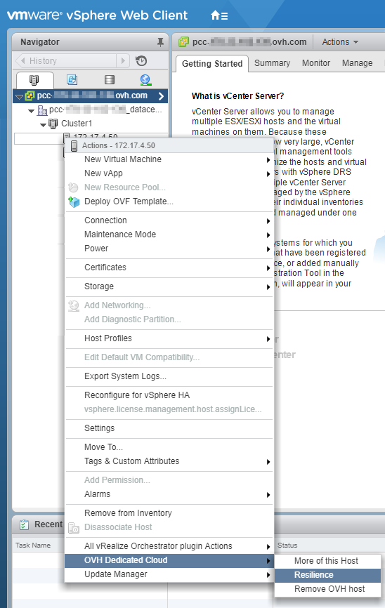
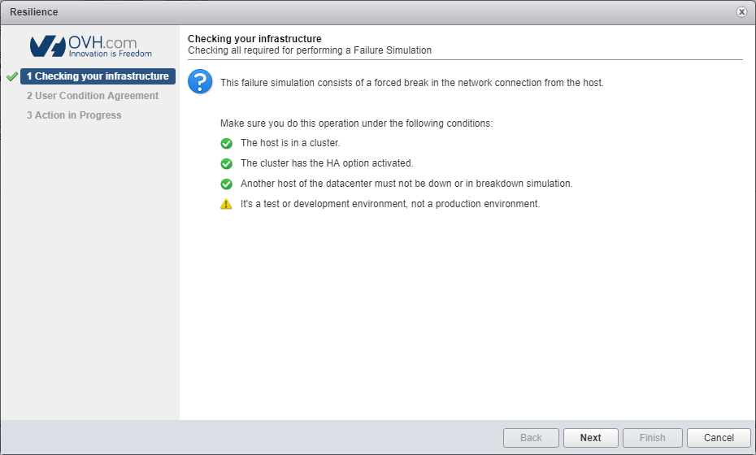

**Ostatnia aktualizacja z dnia 26-10-2018**

## Wprowadzenie

Tryb Resilience jest opracowanym przez OVH narzędziem, które symuluje awarię jednego z Twoich hostów (_serwerów_), umożliwiają przeprowadzenie testu obciążeniowego infrastruktury. Dzięki temu możesz sprawdzić, czy system typu *High Availability (HA)* i *Fault Tolerance (FT)* działa poprawnie w Twoim klastrze, **który wdrażasz**.

**Niniejszy przewodnik wyjaśnia, jak uruchomić tryb Resilience i przeprowadzić test obciążenia infrastruktury.**

## Wymagania początkowe

* Posiadanie oferty [Private Cloud](https://www.ovh.pl/private-cloud/){.external}
* Dostęp do interfejsu zarządzania vSphere

## W praktyce

Na wstępie sprawdź, czy spełnione są następujące warunki: 
- serwer-host musi być skonfigurowany w klastrze;
- opcja *High Availability* (HA) musi być aktywowana;
- inny serwer host w klastrze musi być dostępny i działać prawidłowo.

> [!warning]
>
> Ten test należy wykonywać w **środowisku testowym**. Nie przeprowadzaj tego typu operacji w **środowisku produkcyjnym**.
> 

### Uruchomienie testu obciążeniowego infrastruktury

Po zalogowaniu się do klienta vSphere przejdź do listy Twoich serwerów hostów i klastra. Wybierz odpowiedni serwer host, klikając prawym przyciskiem myszy. Następnie kliknij `OVH Private Cloud`{.action} i `Resilience`{.action}.

{.thumbnail}

Po sprawdzeniu, czy wszystkie wymagania początkowe są spełnione, kliknij przycisk `Dalej`{.action}.

{.thumbnail}

Przed uruchomieniem testu konieczne jest zatwierdzenie warunków korzystania z usługi. Po zaznaczeniu kratki `I accept the terms of the failure simulation agreement`{.action} kliknij przycisk `Next`{.action}.

{.thumbnail}

Polecenie uruchomienia testu obciążeniowego jest w toku.

{.thumbnail}

W ciągu kilku minut serwer host stanie się niedostępny.

{.thumbnail}

### Zakończenie testu obciążeniowego infrastruktury

Aby zakończyć symulację awarii, kliknij ponownie tryb Resilience.

{.thumbnail}

Polecenie zakończenia testu obciążenia infrastruktury.

{.thumbnail}

## Sprawdź również

Przyłącz się do społeczności naszych użytkowników na stronie <https://community.ovh.com/en/>.