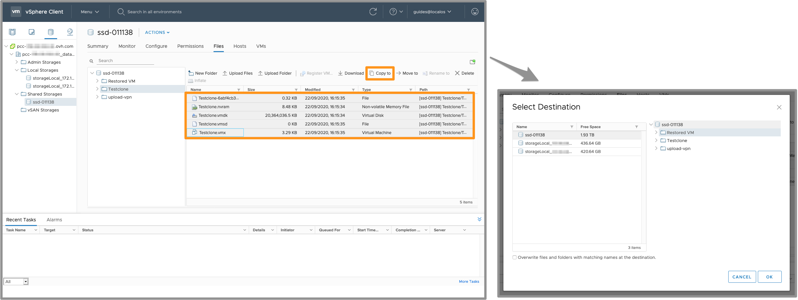

**Last updated 21/10/2020**

## Objectives

To ensure continuity of service and avoid data loss, OVHcloud automatically takes snapshots of your storage array (datastore) every hour.

**This guide will explain how it works**

## Requirements

* an OVHcloud Private Cloud [infrastructure](https://www.ovhcloud.com/fr/enterprise/products/hosted-private-cloud/){.external}
* Access the vSphere Web Client HTML management interface.

## Instructions

A file system consists of blocks that hold data. At the beginning of the file system, there is an index that contains the pointers, and these allow you to find the location of the different blocks.

A file is often fragmented into several blocks, so the index can optimise the access time to a file. The index is like the summary of a book, it allows you to know the page number of the chapter that we want to read.
 
A ZFS snapshot is like a photograph taken of the file system at a given time. It is usually used as the basis for a backup.
 
When creating the snapshot, ZFS does not need to copy the entire hard disk because all the files are already there. The snapshot saves the index containing pointers referencing the free blocks and blocks used. Overall, it stores the positioning of blocks and ZFS will add blocks to it according to changes in data. The snapshot takes up very little space as long as no data is modified, and it is very quick to take.
 
After the snapshot is created, ZFS will intercept write requests. It will do the following if the index pointer references:
 
- A block used it will copy the block into the snapshot and update the index so that it points to the new block, not the old block.
- A free block it will copy the block to the file system and ZFS will update the global index of the filesystem.
 
Adding a file does not make the snapshot larger, as the snapshot does not handle free blocks. Similarly, multiple block rewrites do not affect the snapshot size, because the snapshot retains only one version for each block: the one from the moment T.
 
It can therefore be said that the size of a snapshot is approximately equal to the size of the blocks used at its creation that have been modified since. Above all, remember that the size of a snapshot depends on how you use your file system, and the lifespan of the snapshot.
 
In practice, a snapshot created at time T will only be used in kilobytes. The snapshot size will increase as changes are made to the next snapshot. If you delete your data, the space will only be freed when the snapshot is deleted.

## Snapshot at H-1

You can retrieve the latest ZFS snapshot (H-1) from the vSphere Web Client HTML, as it is directly stored in your datastores. 

### Retrieve a snapshot at H-1

In your HTML vSphere Web Client, go to the datastores view, then to the `Shared Storages` folder on the datastore containing the virtual machine you want to restore.

Browse the data store by clicking `Browse Files`.

{.thumbnail}

Create a folder where you will later copy the files to restore.

{.thumbnail}

Go to the `.zfs` folder, then expand the tree-view to the folder on the virtual machine you want to restore, then copy all of the files in that folder to the new folder created in the previous step.

{.thumbnail}

The files are present now just add this machine in your **inventory** by clicking on the `.vmx` file, then on `register VM`{.action} above.

{.thumbnail}

You now need to follow the VM Creation Wizard to complete the procedure.

## What about snapshots after the last hour?

OVHcloud retains the other 23 hourly snapshots (up to H-24) on a storage array (datastore) to which you do not have direct access. However, you can request an intervention request made to the technical support team (charged at €80 ex. VAT) to restore a snapshot (beyond H-1) for a particular VM. We can only restore the requested snapshot on the same datastore, and we cannot guarantee this restoration under any circumstances.

This is security normally used internally by OVHcloud. Hourly snapshots are **NOT** a backup system and are **NOT** guaranteed.

This is an additional security for internal use, put in place on datastores that should only be used as a last resort in order to prevent any potential data loss.

We recommend using a full backup solution, such as our [Veeam Backup](https://docs.ovh.com/gb/en/private-cloud/veeam-backup-as-a-service/){.external-link} service, or any other system that performs a full backup of your virtual machines.

## Go further

Join our community of users on <https://community.ovh.com/en/>.
