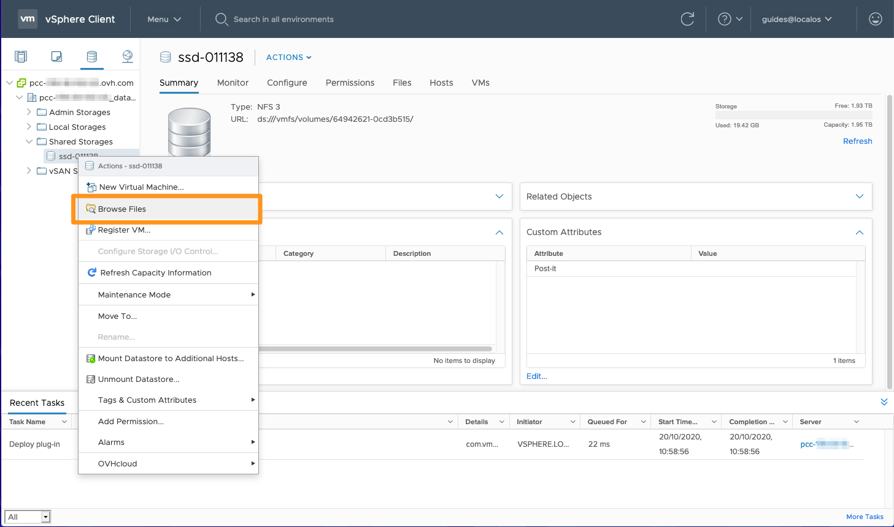
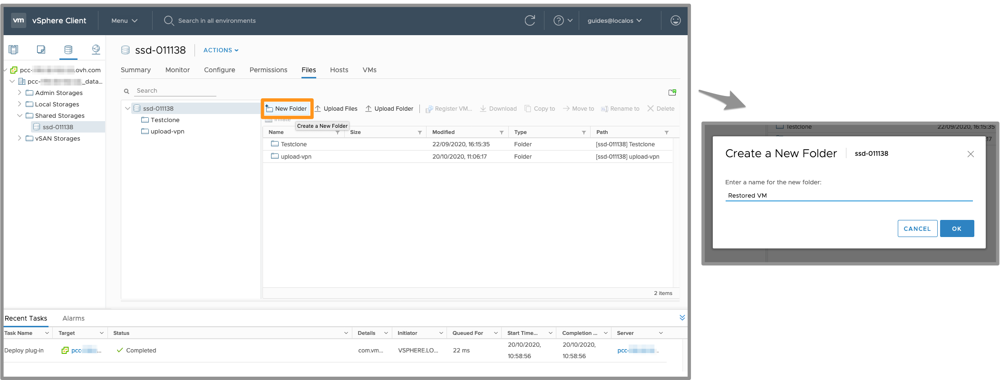

> [!primary]
> Esta traducción ha sido generada de forma automática por nuestro partner SYSTRAN. En algunos casos puede contener términos imprecisos, como en las etiquetas de los botones o los detalles técnicos. En caso de duda, le recomendamos que consulte la versión inglesa o francesa de la guía. Si quiere ayudarnos a mejorar esta traducción, por favor, utilice el botón «Contribuir» de esta página.
> 

**Última actualización: 21/10/2020**

## Objetivo

Para garantizar la continuidad del servicio y evitar la pérdida de datos, OVHcloud realiza automáticamente snapshots de su rack de almacenamiento (datastore) cada hora.

**Esta guía explica cómo funcionan las migraciones.**

## Requisitos

* Disponer de una [infraestructura Private Cloud](https://www.ovhcloud.com/es-es/public-cloud/){.external} en su cuenta de OVHcloud.
* Acceder al panel de control vSphere Web Client HTML.

## Procedimiento

Un sistema de archivos consiste en bloques de datos. Al principio del sistema de archivos, hay un índice que contiene los punteros, y estos permiten localizar los diferentes bloques.

Un archivo suele estar dividido en varios bloques, por lo que el índice permite optimizar el tiempo de acceso a un archivo. El índice es como el sumario de un libro, permite conocer el número de la página del capítulo que queremos leer.
 
Un snapshot ZFS es como una foto tomada del sistema de archivos en un momento T. Suele servir de base para una copia de seguridad.
 
Al crear el snapshot, ZFS no necesita copiar todo el disco duro, ya que todos los archivos están presentes en él. El snapshot guarda el índice que contiene los punteros que apuntan a los bloques libres y a los bloques utilizados. Almacena el posicionamiento de los bloques y ZFS añade bloques en función de los cambios de los datos. El snapshot ocupa muy poco espacio mientras no se modifiquen los datos y es muy rápido de realizar.
 
Una vez creado el snapshot, ZFS interceptará las solicitudes de escritura. Realizará las siguientes operaciones si el puntero del índice hace referencia a:
 
- Un bloque utilizado. copiará el bloque en el snapshot y actualizará el índice para que apunte hacia este nuevo bloque, y no hacia el antiguo bloque.
- Un bloque libre; copiará el bloque al sistema de archivos y ZFS actualizará el índice global del filesystem.
 
El snapshot no se expande debido a que este no se ocupa de los bloques libres. Asimismo, las reescrituras múltiples de bloques no afectan al tamaño del snapshot, ya que este solo conserva una versión para cada bloque: la del instante T.
 
Por lo tanto, puede decirse que el tamaño de un snapshot es aproximadamente igual al tamaño de los bloques utilizados en su creación y que han cambiado desde entonces. pero, en particular, hay que tener en cuenta que el tamaño de un snapshot depende del uso que haga del sistema de archivos y de la duración del snapshot.
 
En la práctica, un snapshot creado en el momento T solo hará unos cuantos kilobytes. El tamaño del snapshot aumentará en función de las modificaciones realizadas hasta el siguiente snapshot. Si elimina los datos, el espacio solo se liberará al eliminar el snapshot.

## Snapshot a H-1

Es posible recuperar el snapshot ZFS de la última hora (H-1) desde el vSphere Web Client HTML, ya que este se almacena directamente en sus datastores. 

### Obtener un snapshot a H-1

Desde su vSphere Web Client HTML, acceda a la vista de los datastores y acceda a la carpeta `Shared Storages` del datastore que incluye la máquina virtual para restaurar.

Explorar el datastore haciendo clic en `Browse Files`.

{.thumbnail}

Cree una carpeta en la que más adelante podrá copiar los archivos a restaurar.

{.thumbnail}

Acceda a la carpeta `.zfs` y mueva el árbol hasta la carpeta de la máquina virtual para restaurar y copie todos los archivos de esta carpeta en la nueva carpeta creada en el paso anterior.

{.thumbnail}

Los archivos están presentes ahora. Solo tiene que añadir esta máquina al **inventario** haciendo clic en el archivo `.vmx` y seleccionando `MV`{.action} en la parte superior.

{.thumbnail}

Siga el asistente de creación de MV para finalizar el procedimiento.

## ¿Y qué pasa con los snapshots después de la última hora?

OVHcloud conserva los otros 23 snapshots por horas (hasta H-24) en un rack de almacenamiento (datastore) al que no tiene acceso directo. No obstante, es posible solicitar la restauración de un snapshot (después de H-1) para una MV en particular mediante una solicitud de intervención al soporte técnico (con un coste de 80 € + IVA). Solo podremos restaurar el snapshot solicitado en el mismo datastore y esta restauración no puede en ningún caso estar garantizada.

Se trata de una seguridad normalmente de uso interno de OVHcloud, los snapshots por horas no son un sistema de backup y no están garantizadas.

Se trata de una seguridad adicional de uso interno instalada en los datastores que solo debe servir como último recurso para evitar una posible pérdida de datos.

Le recomendamos que utilice una solución de backup completa, como nuestro servicio [Veeam Backup](https://docs.ovh.com/gb/en/private-cloud/veeam-backup-as-a-service/){.external-link} o cualquier otro sistema que realice un backup completo de sus máquinas virtuales.

## Más información

Interactúe con nuestra comunidad de usuarios en <https://community.ovh.com/en/>.
