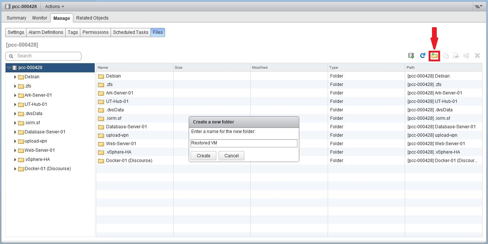
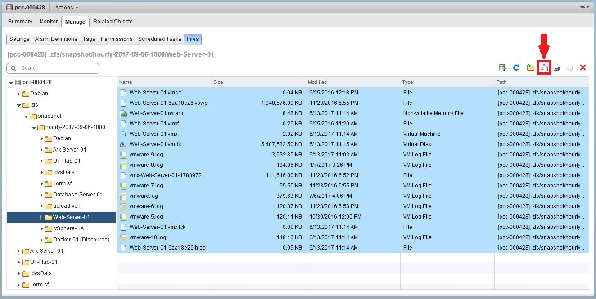
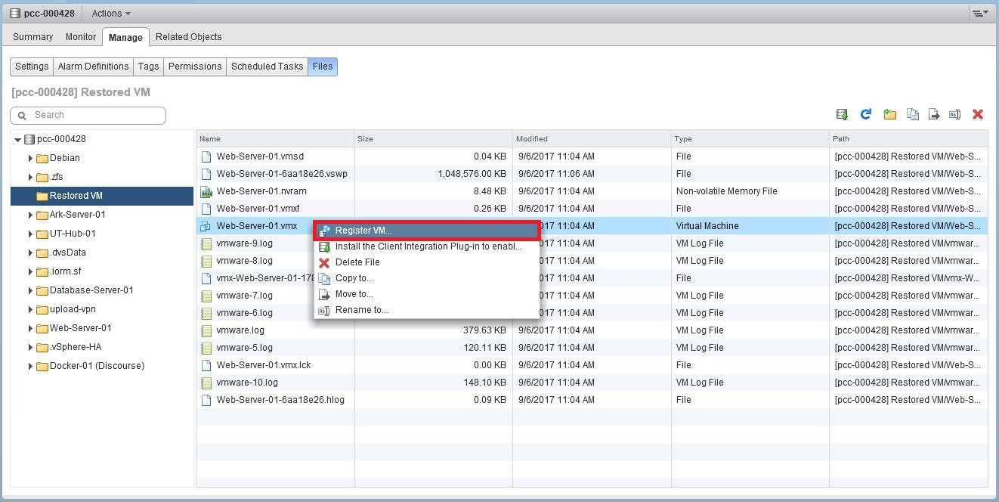

Afin de vous assurer une continuité de service et éviter la perte de données, OVH réalise automatiquement des snapshots de votre baie de stockage (datastore) toute les heures.

Vous avez la possibilité de récupérer le snapshot ZFS de la dernière heure (H-1) depuis le vSphere Web Client puisque celui-ci est directement stocké dans vos datastores tandis que les dernière 24 heures (jusqu'à H-24 donc) sont conservée sur une baie de stockage (datastore) à laquelle vous n'avez pas directement accès.

Et pour les snapshots au-delà de la dernière heure ?
----------------------------------------------------

OVH conserve les 23 autres snapshots horaires (jusqu'à H-24) sur une baie de stockage (datastore) à laquelle vous n'avez pas directement accès. Il est néanmoins possible via une demande d'intervention faite au support technique (facturée 80€ HT) de demander la restauration d'un snapshot (au delà de H-1 donc) pour une VM en particulier. Nous ne pourrons restaurer le snapshot demandé que sur le même datastore et cette restauration ne peut en aucun cas être garantie.

Il s'agit là d'une sécurité normalement à usage interne d'OVH, les snapshots horaires ne sont **PAS** un système de backup et ne sont **PAS** garantis, il s'agit d'une sécurité supplémentaire à usage interne mise en place sur les datastores ne devant servir qu'en dernier recours afin de prévenir une perte de donnée éventuelle.

Nous vous recommandons l'utilisation d'une solution complète de sauvegarde comme notre service [Veeam Backup]({legacy}2883711) ou tout autre système réalisant un backup complet de vos machines virtuelles.

Pour récupérer un snapshot de l'heure précédente****voici la démarche.

Depuis votre vSphere Web Client dirigez-vous sur le datastore comportant la machine virtuelle a restaurer.

*Depuis la page d'accueil → Storage → Shared Storage.*

Explorer le datastore en cliquant sur "Browse Files".

{.thumbnail}

Créez un dossier dans lequel vous allez plus tard copier les fichiers à restaurer.

{.thumbnail}

Dirigez-vous dans le dossier **".zfs"** puis dépliez l'arborescence jusqu'au dossier de la machine virtuelle a restaurer puis copiez l'ensemble des fichiers présents dans ce dossier vers le nouveau dossier crée à l'étape précédente.

{.thumbnail}

{.thumbnail}

Les fichiers sont présents maintenant il suffit d'ajouter cette machine dans votre **inventaire** en effectuant un clic droit sur le fichier **.vmx** et "**register VM"**.

{.thumbnail}

Il ne vous reste plus qu'à suivre l'assistant de création de VM afin de terminer la procédure.
