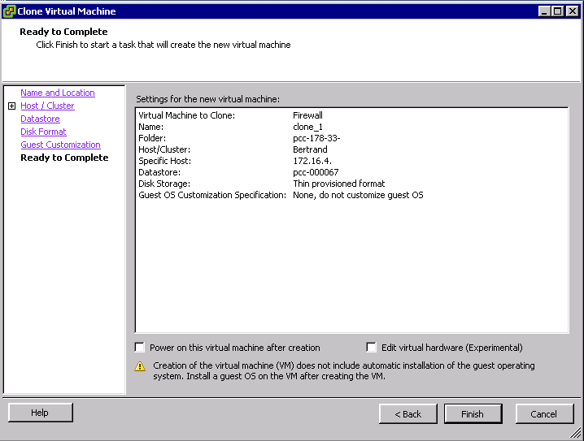

## Edellytys
Sinun täytyy käyttää vSphere Clientia joko omalta koneeltasi käsin tai RDP-yhteyden yli jonka tiedot sait sähköpostitse PCC:n aktivoinnin aikana.

Snapshot mahdollistaa virtuaalikoneen tilan kaappaamisen kun käynnistät sen. Tämä snapshot sisältää (valintasi mukaan)

- Virtuaalikoneen jokaisen levyn tilan.
- Virtuaalikoneen jokaisen muistin tilan.

Snapshotit ovat käteviä kun palvelin täytyy palauttaa useamman kerran samaan tilaan ilman useiden virtuaalikoneiden luontia. Snapshotien avulla voit luoda palautuspisteitä ja säilöä virtuaalikoneesi perustilan. Vaikka snapshotit tarjoavat "välittömän" tilan levystä jota voi käyttää varmuuskopioratkaisuna, emme suosittele snapshotia käytettävän omiin virtuaalikoneesi varmuuskopioihin.
Itse asiassa jos sinulla on suuri määrä varmuuskopioita, ne käyttävät paljon levytilaa ja eivät ole suojassa raudan hajoamiselta.

## Ota snapshot
Klikkaa oikealla virtuaalikonettasi, valitse "Snapshot" ja "Take a Snapshot":

{.thumbnail}
Sinun täytyy määritellä nimi jonka haluat antaa tälle varmuuskopiolle, sen kuvauksen ja jos haluat sisällyttää myös virtuaalikoneesi muistin snapshotiin.

Tässä sinulla on mahdollisuus ottaa snapshot joko VM:ssä käytetyn muistin kanssa tai ilman muistia.
Jos integroit muistin snapshotiin, tämä pidentää sen snapshot-operaation suoritusaikaa mutta toisaalta sinun ei tarvi bootata sen palautuksen aikana. Muussa tapauksessa, koska muisti (RAM) ei ole tallennettu, operaatio on nopeampi mutta VM:n bootti on tarpeen kun palautusoperaatiota tehdään.

{.thumbnail}

## Snapshot-hallinta
Voit nähdä kaikki VM:n snapshotit snapshot-hallinnassa.
Klikkaa oikealla hiirennapilla ja valitse "Snapshot" jonka jälkeen "Snapshot Manager":

{.thumbnail}

## Edellytys
Sinun täytyy käyttää vSphere Clientia joko omalta koneeltasi käsin tai RDP-yhteyden yli jonka tiedot sait sähköpostitse PCC:n aktivoinnin aikana.

## Kloonaa VM
Klikkaa oikealla hiirennapilla VM:ää ja valitse "Clone". Määrittele uuden virtuaalikoneesi nimi ja sen sijainti puussasi:

{.thumbnail}
Valitse klusteri johon tämä VM tukeutuu:

{.thumbnail}
Määrittele tämän VM:n pääasiallinen hosti:

{.thumbnail}
Nyt määrittele tiedostopalvelin jonne tämän VM:n käyttämä levytila tallennetaan. Valitse esimerkiksi VM:n kohde joka on (tai ei ole) samassa formaatissa kuin lähde. Voit käyttää:

- Same Format as Source: luotu VM on samanlainen kaikissa suhteissa lähteeseen (Source) verrattuna;
- Thin provisioned format: luo levy, mutta käytä vain levytila joka käytetään tiedostopalvelimella VM:n säilömiseen;
- Thick Format: käytä KOKO levytila vastaten VM:lle varattua tilaa, tiedostopalvelimella.

{.thumbnail}
Nyt konfiguroimme verkon tälle VM:lle. Sinulla on kaksi mahdollisuutta:

- Do not customize: tämä valinta ei tee muutoksia verkkokonfiguraatioon uudelle VM:lle;
- Customize using the Customization Wizard: Tämä vaihtoehto sallii uuden konfiguraation määrittelyn ja implementoinnin uudelle VM:lle.

{.thumbnail}

## VAROITUS!
Jos et tehnyt virtuaalikoneestasi Custom-muotoista, on kloonin konfiguraation muuttaminen tarpeellista ennen sen käynnistystä, IP-osoitteen ristiriitaisuuden vuoksi.
Tässä tapauksessa yksinkertaisesti ota verkkokortin valinta pois päältä virtuaalikoneesi asetuksissa:

{.thumbnail}

