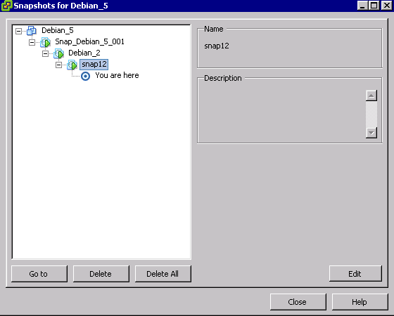
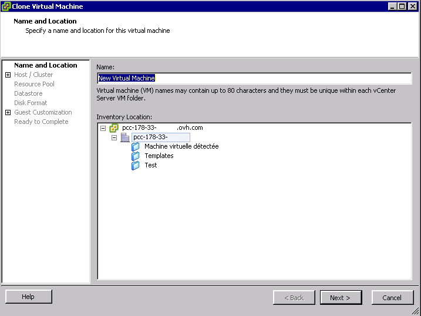

## Prerequisiti
È necessario utilizzare il client vSphere, o accedervi utilizzando il proprio client locale, oppure utilizzando la connessione RDP che ti abbiamo fornito al momento dell'attivazione del tuo PCC.

Lo snapshot ti permette di catturare lo stato della tu VM al momento in cui lo esegui. Questo snapshot comprende (secondo la tua scelta):

- Lo stato di tutti i dischi della macchina virtuale.
- Il contenuto della memoria della macchina virtuale.

Gli snapshot sono utili quando devi tornare più volte allo stesso stato, senza creare più macchine virtuali.
Con gli snapshots, crei punti di ripristino. Puoi così preservare lo stato di base di una VM prima di farla migrare verso un altro tipo di funzionamento. Benché gli snapshots forniscano un'immagine “istantanea" del disco, utilizzabile con le soluzioni di backup, ti sconsigliamo di usare gli snapshots per i tuoi backup della macchina virtuale. Infatti, se disponi di un gran numero di snapshot, questi mobiliteranno molto spazio-disco e non sono protetti in caso di guasto hardware.

## Cattura dello snapshot
Sulla tua VM, fai un click destro, poi seleziona "Snapshot" e infine "Cattura uno Snapshot":

{.thumbnail}
Devi ora indicare il nome che vuoi attribuire a questo snapshot, la sua descrizione, e se desideri che la memoria della VM sia anche inclusa nello snapshot.

Hai qui la possibilità di fare uno snapshot con o senza la RAM utilizzata per la VM.
Se integri la RAM allo snapshot, ciò allungherà il tempo d'esecuzione del compito, ma ciò ti permetterà di non dover fare un reboot nel ripristino di quest'ultimo. In caso contrario, dato che la RAM non viene salvata, il compito sarà più veloce, ma in caso di ripristino sarà necessario un riavvio della macchina virtuale.

{.thumbnail}

## Gestione dello snapshot
Puoi ritrovare l'insieme degli snapshots di una VM dentro il manager snapshot. Per effettuare questa operazione, fai clic destro, scegli "Snapshot" e infine "Snapshot Manager":

{.thumbnail}

## Prerequisiti
È necessario utilizzare il client vSphere, o accedervi utilizzando il proprio client locale, oppure utilizzando la connessione RDP che ti abbiamo fornito al momento dell'attivazione del PCC.

## Clonare una VM
Fai un clic destro sulla VM da clonare e poi seleziona "Clona".
Specifica il nome della tua nuova VM e la sua posizione nel tuo albero:

{.thumbnail}
Scegli il cluster da cui dipenderà questa VM:

{.thumbnail}
Specifica l'host principale di questa VM:

{.thumbnail}
Indica ora il filer dove sarà salvato lo spazio-disco di questa VM. Seleziona, nel nostro esempio, la VM di destinazione che possiede (o non) lo stesso formato come fonte. Puoi utilizzare:

- Same Format as Source: la VM creata sarà identica in tutti i punti alla fonte;
- Thin provisioned format : creerà il disco, ma utilizzerà soltanto lo spazio disco realmente usato sul filer
- Thick Format: utilizzerà tutto lo spazio disco corrispondente alla VM sul filer.

{.thumbnail}
Veniamo ora alla configurazione di rete da applicare a questa VM. Hai due scelte:

- Non personalizzare: ciò non apporterà alcun cambiamento sulla configurazione rete delle nuove VM rispetto alla fonte;
- Personalizzare usando Customization Wizard: questa opzione ti permetterà di specificare le nuove configurazioni che desideri implementare su questa nuova VM.

{.thumbnail}

## ATTENZIONE ! ! !
Se non hai fatto il Custom della macchina virtuale, è necessario modificare la configurazione del Clone prima di iniziare, a fine di evitare un conflitto di IP.
In questo caso è sufficiente deselezionare la scheda di rete nelle impostazioni della macchina virtuale:

{.thumbnail}

