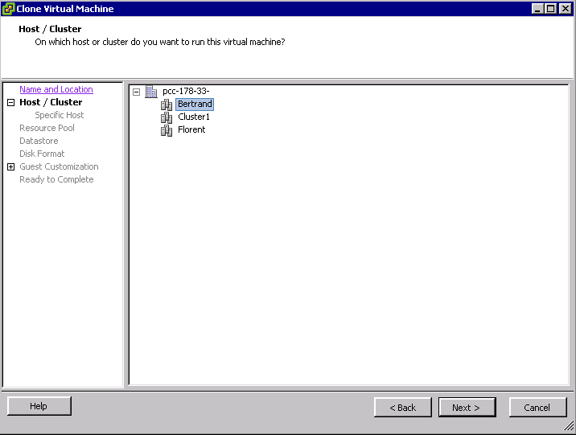

## Reikalavimai
vSphere klientinė programa, kurią galima įsidiegti lokaliai arba naudokite RDP jungtį, kurią suteikėme PCC aktyvavimo metu.

Momentinė kopija leidžia užfiksuoti jūsų VM būseną jos kopijos darymo metu. Momentinė kopija parodo (jūsų pasirinkimu):

- Visų virtualios mašinos diskų būseną.
- Virtualios mašinos atminties turinį.

Momentinės kopijos naudingos, kai keletą kartų turite grįžti į tą pačią būseną, nekurdami virtualių mašinų. Momentinės kopijos leidžia kurti atkūrimo taškus. Jūs taip pat galite išsaugoti pagrindinę VM būseną prieš perkeldami VM į kitą funkcionavimo tipą. Nors momentinės kopijos pateikia disko atvaizdą "tam tikru momentu" ir naudojamos išsaugojimo sprendimams, mes nepatariame jų naudoti virtualios mašinos rezervinėms kopijoms atlikti. Iš tikrųjų, jeigu turite labai daug momentinių kopijų, jos užims nemažai disko vietos ir techninio gedimo atveju nebus apsaugotos.

## Atlikti momentinę kopiją
Dešiniuoju pelės klavišu spragtelėkite VM, pasirinkite "Snapshot", paskui "Make Snapshot":

{.thumbnail}
Dabar turėtumėte pavadinti ir apibūdinti šią momentinę kopiją, taip pat ar pageidaujate, kad VM atmintis taip pat būtų įtraukta į šią momentinę kopiją.

Momentinę kopiją galite atlikti įtraukdami ar neįtraukdami VM naudojamą RAM.
Jeigu pageidaujate integruoti RAM į momentinę kopiją, užduotis bus vykdoma ilgiau, tačiau jums nereikės perkrauti VM, kai bus atliekamas atkūrimas. Priešingu atveju, užduotis bus įvykdyta greičiau, tačiau atkūrimo atveju reikės perkrauti VM.

{.thumbnail}

## Momentinių kopijų valdymas
Visas VM momentines kopijas galite matyti skiltyje "Snapshot Manager". Dešiniojo pelės klavišo spragtelėjimu pasirinkite "Snapshot", vėliau "Snapshot manager":

{.thumbnail}

## Reikalavimai
vSphere klientinėje programoje įjunkite lokalią pagalbą arba naudokite RDP jungtį, kurią suteikėme PCC aktyvavimo metu.

## VM klonavimas
Dešiniuoju pelės klavišu spragtelėkite VM, kurią pageidaujate klonuoti, ir pasirinkite "Clone".
Patikslinkite savo naujos VM pavadinimą ir jos vietą medyje:

{.thumbnail}
Pasirinkite klasterį, kuriam priklausys ši VM:

{.thumbnail}
Patikslinkite šios VM pagrindinį mazgą:

{.thumbnail}
Nurodykite failų saugyklą, kurioje bus šios VM diskas. Šiuo atveju pasirinkite pageidaujamą VM, kuri būtų to paties (arba ne) formato, kaip ir jos originalas. Jūs galite naudoti:

- "Same Format as Source": sukurta VM bus visais atžvilgiais identiška jos originalui;
- "Thin provisioned format": bus sukurtas diskas, tačiau bus naudojama tik realiai panaudota disko vieta failų saugykloje; 
- "Thick Format": bus naudojama visa disko vieta, atitinkanti VM naudojamą vietą failų saugykloje.

{.thumbnail}
Po to matysite tinklo konfigūraciją, kurią reikės pritaikyti šiai VM. Jūs galite rinktis:

- "Do not customize": naujos VM tinklo konfigūracija išliks nepakitusi originalo atžvilgiu;
- "Customize using the Customization Wizard": su šia parinktimi galite patikslinti konfigūraciją, kurias pageidaujate naudoti naujoje VM.

{.thumbnail}

## DĖMESIO!!!
Jeigu nekeitėte virtualios mašinos nuostatų, turite pakeisti klonuotos VM konfigūraciją prieš ją paleisdami, kad išvengtumėte IP konflikto.
Šiuo atveju pakanka atžymėti tinklo kortą virtualios mašinos nustatymuose:

{.thumbnail}

