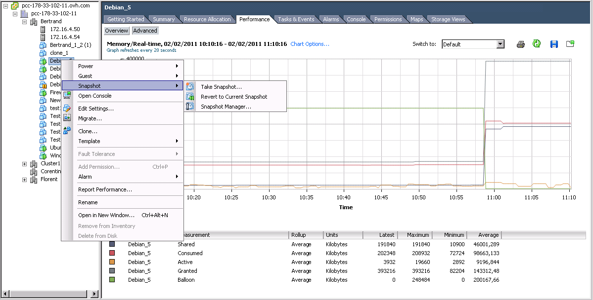

## Wymagania
Należy zalogować się do vSphere (poprzez program lokalny lub za pomocą połączenia RDP dostarczonego podczas aktywacji usługi Private Cloud).

Opcja snapshot pozwalana na wykonanie zrzutu stanu wirtualnej maszyny w momencie uruchomienia tej opcji. Zrzut ten zawiera (zgodnie z dokonywanym wyborem):

- Stan wszystkich dysków wirtualnej maszyny
- Zawartość pamięci wirtualnej maszyny

Zrzuty są przydatne, gdy trzeba wrócić wielokrotnie do tego samego stanu bez potrzeby tworzenia wielu wirtualnych maszyn. Dzięki zrzutom możesz przywracać dane, zabezpieczać stan bazy danych wirtualnej maszyny zanim zmienisz jej sposób działania. Snapshoty dostarczają « chwilowy » obraz dysku. Odradzamy jednak korzystania ze snapshotów do własnych kopii zapasowych wirtualnych maszyn. Jeśli będziesz miał dużą liczbę zrzutów, będą one wykorzystywały dużą przestrzeń dyskową i nie będą chronione w przypadku awarii sprzętowej.

## Pobieranie zrzutu
Kliknij prawym przyciskiem myszy na wirtualną maszynę, wybierz « Snapshot » i « Pobierz Snapshot »:

{.thumbnail}
Następnie należy podać nazwę tego zrzutu, jego opis i informację, czy pamięć VM ma zostać zawarta w zrzucie. 

Możesz wykonać zrzut z pamięcią RAM lub bez pamięci RAM wykorzystywanej przez VM. 
Jeśli wybierzesz opcję z pamięcią RAM, czas wykonania zadania będzie dłuższy, ale nie będziesz musiał wykonywać restartu podczas przywracania kopii. W drugim przypadku (bez kopii pamięci RAM), zadanie zostanie wykonane szybciej, ale konieczny będzie restart VM w przypadku przywracania danych.

{.thumbnail}

## Zarządzanie zrzutami
Wszystkie zrzuty są dostępne w managerze zrzutów. Kliknij prawym przyciskiem myszy na « Snapshot » i wybierz « Snapshot Manager »:

{.thumbnail}

## Wymagania
Należy zalogować się do vSphere (poprzez program lokalny lub za pomocą połączenia RDP dostarczonego podczas aktywacji usługi Private Cloud).

## Klonowanie wirtualnej maszyny
Kliknij prawym przyciskiem myszy na VM do sklonowania i wybierz « Clone ».
Wybierz nazwę dla nowej VM i jej lokalizację:

{.thumbnail}
Wybierz klaster dla wirtualnej maszyny:

{.thumbnail}
Podaj główny host tej wirtualnej maszyny:

{.thumbnail}
Wskaż filer, na którym zostanie umieszczona przestrzeń dyskowa dla tej VM. Wybierz VM docelową, która posiada (lub nie) taki sam format jak VM źródłowa. Możesz używać:

- Same Format as Source: utworzona wirtualna maszyna będzie identyczna w każdym punkcie z szablonem; 
- Thin Provisioned Format: rozmiar utworzonego dysku będzie mniejszy niż zadeklarowany, ale będzie on zwiększany dynamicznie do rozmiaru zdefiniowanego w razie potrzeby;
- Thick Format: utworzony dysk będzie zajmował całą zadeklarowaną przestrzeń.

{.thumbnail}
Następny krok to konfiguracja sieci dla tej VM. Masz dwie możliwości:

- Do not customize: brak zmian w konfiguracji sieci dla nowej VM w porównaniu z VM źródłową; 
- Customize using the Customization Wizard: ta opcja pozwala na wskazanie nowej konfiguracji dla nowej VM.

{.thumbnail}

## UWAGA!!!
Jeśli nie wybrałeś opcji Custom dla maszyny wirtualnej, należy zmienić konfigurację Klona przed jego uruchomieniem, aby uniknąć konfliktu IP.
W tym przypadku wystarczy odznaczyć kartę sieciową w parametrach wirtualnej maszyny:

{.thumbnail}

