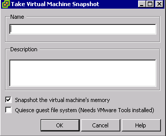
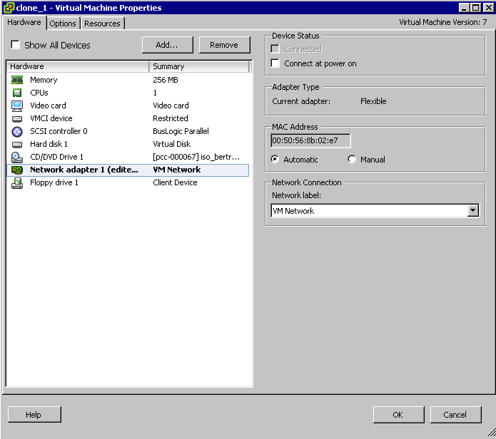

## Pré-requisitos
Deverá utilizar o cliente vSphere (instalado no seu PC ou através da ligação RDP que lhe foi fornecida aquando da ativação do serviço pCC).

O snapshot permite capturar o estado da sua VM no momento em que é criado. Este snapshot compreende (segundo as suas escolhas) :

- O estado de todos os discos da máquina virtual.
- O conteúdo da memória da máquina virtual.

Os snapshots são úteis quando deve voltar várias vezes ao mesmo estado, sem ter de criar múltiplas máquinas virtuais. Com os snapshots, cria pontos de restauro. Pode assim preservar o estado base de uma VM antes de a migra para um outro tipo de funcionamento. Se bem que as snapshots forneçam uma imagem "instantânea" do disco, imagens que serão utilizáveis pelas ferramentas de salvaguarda, desaconselhamos o emprego das snapshots para os seus backups das máquinas virtuais. Com efeito, se tem um grande número de snapshots, estas ocuparão uma largo espaço de disco e não estão protegidas em caso de falha de hardware.

## Criação de snapshot
Sobre a sua VM, faça um clique com o botão direito do rato e escolha « Snapshot » e por fim « Take Snapshot » :

{.thumbnail}
Deverá agora indicar o nome que deseja atribuir a este snapshot, a sua descrição e, se deseja ou não que a memória volátil da VM seja incluída neste snapshot.

Terá aqui a possibilidade de fazer um snapshot com ou sem a RAM utilizada pela VM.
Se integrar a RAM no snapshot, isso aumentará o tempo de execução da tarefa, mas permitirá não ter que efetuar um reboot à VM quando o snapshot for restaurado. No caso contrário, uma vez que o estado da RAM não foi guardado, a tarefa será mais célere, mas um rebbot da VM será necessário em caso de restauro do snapshot.

{.thumbnail}

## Gestão de snapshots
Poderá encontrar o conjunto de snapshots de uma VM no "snapshot Manager". Para encontrar essa opção, faça um clique com o botão direito do rato sobre a VM, escolha « Snapshot » e por fim « Snapshot Manager » :

{.thumbnail}

## Pré-requisitos
Deverá utilizar o cliente vSphere instalado no seu PC ou servir-se da ligação RDP que lhe foi fornecida aquando da ativação do serviço pCC.

## Clonar uma VM
Faça clique com o botão direito do rato sobre a VM que pretende clonar e selecione a opção « Clone ».
Especifique o nome da nova VM e a sua localização na "árvore hierárquica" :

{.thumbnail}
Especifique o cluster do qual esta VM dependerá :

{.thumbnail}
Especifique o host principal desta VM :

{.thumbnail}
Indique agora o filer onde será armazenado o espaço de disco da VM. Selecionaremos no nosso exemplo a VM de destino que possui o mesmo formato que a fonte. Poderá utilizar :

- Saame Format as Source : a VM será idêntica em todos os aspetos à VM de origem ;
- Thin Provisioned Format : criará o disco, mas utilizará apenas o espaço realmente ocupado pelos dados atuais no filer;
- Thick Format : utilizará todo o espaço de disco correspondente ao tamanho do disco da VM no filer.

{.thumbnail}
Chegamos agora à configuração de rede a aplicar a esta VM. tem duas escolhas :

- Do not customize : nenhuma alteração será efetuada na configuração de rede da nova VM em comparação com a VM de origem ;
- Customize using the Customization Wizard : esta opção irá permitir-lhe a especificação de novos parâmetros em função do desejado para a nova VM clonada.

{.thumbnail}

## ATENÇÃO !!!
Se não fez uma configuração "custom" da nova máquina virtual, é necessário modificar a configuração do clone antes de o iniciar a fim de evitar um conflito na utilização do endereço IP.
Neste caso, basta simplesmente desmarcar a placa de rede nos parâmetros da placa de rede para desativar a placa da máquina virtual :

{.thumbnail}

