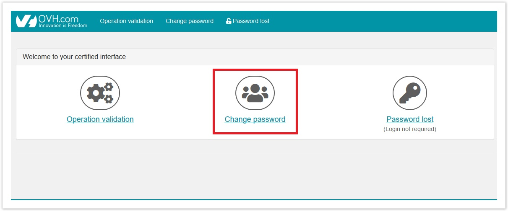
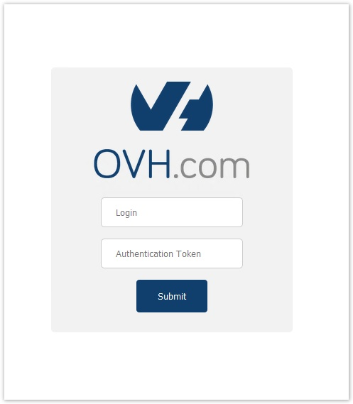

**Dernière mise à jour le 30 juin 2020**

## Objectif

La mise en place d'une double authentification permet de protéger l'accès à votre Private Cloud en réduisant les risques liés, par exemple, à un vol de mot de passe.

**Apprenez à mette en place la double authentification pour protéger votre infrastructure Private Cloud.**
 
## Prérequis

- Disposer d'une infrastructure [Private Cloud](https://www.ovhcloud.com/fr/enterprise/products/hosted-private-cloud/) avec l'option de [sécurité avancée](https://www.ovhcloud.com/fr/enterprise/products/hosted-private-cloud/safety-compliance/sddc/) (inclus dans les offres PCI-DSS et HDS).
- Disposer d'un smartphone et d'une application d'authentification (exemples : Google Authenticator, Authy, OTP Auth...).

## En pratique

### Activation de la double authentification

Afin de mettre en place la double authentification sur votre infrastructure, il est nécessaire de se connecter sur l'interface certifiée de votre Private Cloud.

Pour cela, vous avez deux possibilités :
	
- Via la passerelle de votre Private Cloud (https://pcc-xxx-xxx-xxx-xxx.ovh.com) : 

{.thumbnail}

- Directement via l'URL https://pcc-xxx-xxx-xxx-xxx.ovh.com/secure/ ( attention à ne pas oublier le "/" final de l'adrese).

Une fois connecté à l'interface de gestion, cliquez sur `Change Password`{.action}

{.thumbnail}

Au sein de l'interface, vous devez alors :
	
* Sélectionner  `Password and 2FA Shared Secret`{.action} ,
* Renseigner un nouveau mot de passe, 
* Scanner le QRcode avec l'application smartphone d'authentification de votre choix ,
* Confirmer le code obtenu.

{.thumbnail}

Une tâche se créera alors, et un token vous sera envoyé.

Rendez-vous dans la partie `Operation validation`{.action} , chargez l'opération reçue par SMS, et confirmez avec le token reçu dans ce même SMS.

> [!primary]
>
> Pour un mot de passe oublié, il est nécessaire de lancer d'abord la procédure de "Password lost" , durant laquelle la mise en place d'une double authentification vous sera proposée.
>

### Connexion

Connectez-vous à votre client *web* via le lien habituelle, vous arriverez alors sur la page suivante:

{.thumbnail}

Renseignez alors le token généré par l'application d'authentification installée sur votre smartphone avant de saisir votre mot de passe.

> [!warning]
>
> La double authentification sera active lors de la modification de mot de passe d'un des utilisateurs. Cela signifie que si un seul utilisateur modifie son mot de passe, l'ensemble des utilisateurs bénéficiera de la double authentification activée. 
>
> Ils devront de ce fait renouveler leur mot de passe, puis mettre en place la double authentification sur leurs utilisateurs, sous peine de voir ces utilisateurs perdre la possibilité de se connecter.
>
> Pour les clients disposant d'une infrastructure en version 6.0, l'accès au client vSphere (disponible uniquement sur Windows) ne sera plus possible. L'accès se fera alors exclusivement par le client vSphere web.
>

### Création d'un nouvel utilisateur

Lors de la création d'un nouvel utilisateur, vous choisissez d'attribuer ou non un rôle de *token validator*.

Dans les deux cas, il est nécessaire de modifier le mot de passe à travers l'interface certifiée en suivant la procédure précédente pour mettre en place la 2FA.

La seule différence sera l'autonomie ou non de l'utilisateur pour la validation du token.

### Autorisation d'application

Il est possible d'utiliser plusieurs applications tierces nécessitant la connexion au vCenter.

Ces applications doivent être préalablement autorisées au travers de la politique d'accès au vCenter qui est paramètrable dans votre [espace client](https://docs.ovh.com/fr/private-cloud/manager-ovh-private-cloud/#securite)

Ces applications vont alors pouvoir accéder à nos infrastructures, mais ne vont pas forcément gérer la double authentification.

Dans ce cas, il sera nécessaire de créer une *whitelist* spécifique au *bypass* de la double authentification.

Cette *whitelist* sera un complément de la liste principale régissant les accès au vCenter.

Pour ajouter les adresses IP publiques de vos applicatifs à cette seconde *whitelist*, vous devrez utiliser les appels API suivant : 

- Vérifier les adresses IP autorisées à ne pas tenir compte de la double authentification.

> [!api]
>
> @api {GET} /dedicatedCloud/{serviceName}/twoFAWhitelist
>

- Ajouter une adresse IP au *bypass* de la double authentification.

> [!api]
>
> @api {POST} /dedicatedCloud/{serviceName}/twoFAWhitelist
>

- Afficher les informations d'une adresse IP autorisée (nécessite un ID récupéré avec le premier appel).

> [!api]
>
> @api {GET} /dedicatedCloud/{serviceName}/twoFAWhitelist/{id}
>

- Supprimer une adresse IP de la liste d'autorisation.

> [!api]
>
> @api {DELETE} /dedicatedCloud/{serviceName}/twoFAWhitelist/{id}
>

- Modifier les informations d'une adresse IP autorisée.

> [!api]
>
> @api {POST} /dedicatedCloud/{serviceName}/twoFAWhitelist/{id}/changeProperties
>

## Aller plus loin

Échangez avec notre communauté d'utilisateurs sur <https://community.ovh.com>.
