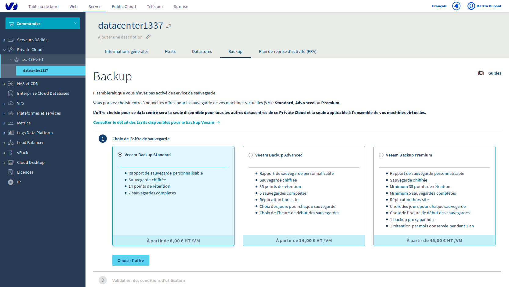
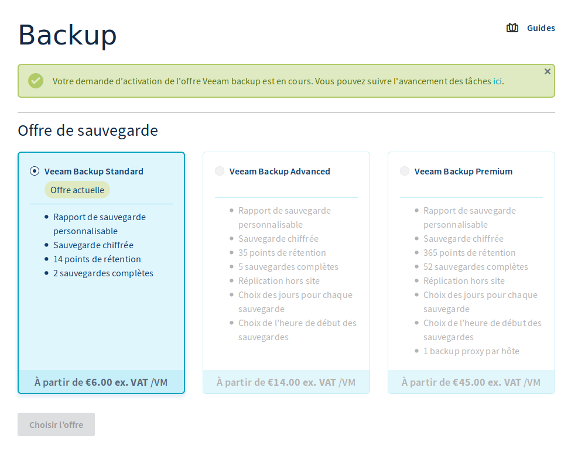
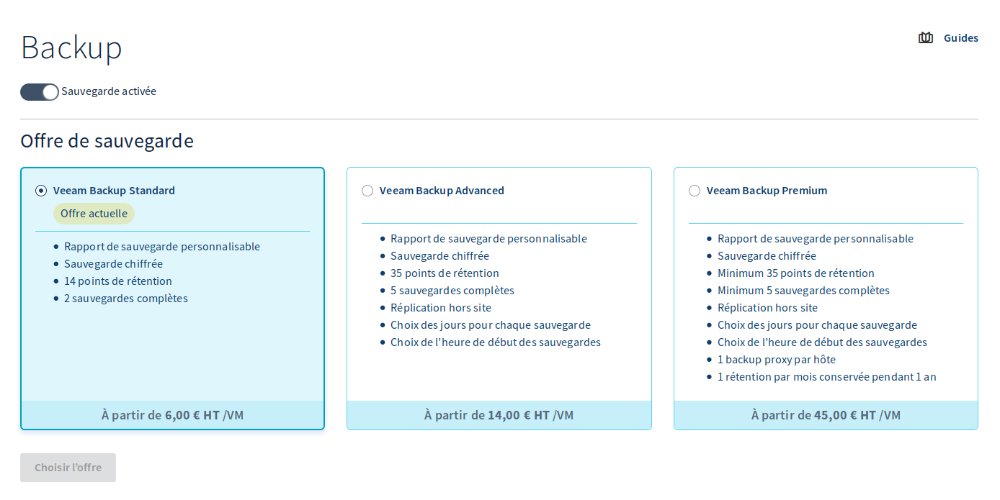
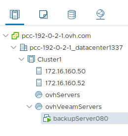
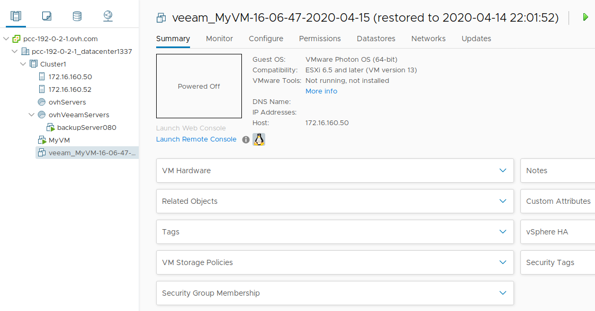

**Last updated Apr. 30th 2020**

## Objective

Veeam is a software editor in backup and disater recovery plan (DRP) solutions in virtualized environments. The Veeam Backup Managed is base on the Veeam Availability Suite software stack to provide you a on demand backup solution.

Backups are performed using a virtual machine (VM) within your [Hosted Private cloud](https://www.ovhcloud.com/en-ie/enterprise/products/hosted-private-cloud/){.external} infrastructure. The backed-up data is outsourced to an independent storage space at OVHcloud. Backups are performed during night, with a retention time depending on the offer level you choose.

**This guide explains how to deploy and use the Veeam Backup Managed option in minutes.**

## Requirements

* [Hosted Private cloud](https://www.ovhcloud.com/en-ie/enterprise/products/hosted-private-cloud/){.external}
* [Give the right "Add resources"](https://docs.ovh.com/gb/en/private-cloud/change-users-rights/){.external} for the right datacenter to the relevant user.
* Access to the vSphere management interface.
* Enabled [vSphere High Availability (HA)](https://docs.ovh.com/gb/en/private-cloud/vmware-ha-high-availability){.external}.
* Enabled [Distributed Resource Scheduler (DRS)](https://docs.ovh.com/gb/en/private-cloud/vmware-drs-distributed-ressource-scheduler){.external} sur le ou les clusters.
* Enabled Windows SPLA Licensing

## Instructions

### Enable Service

The first step is to enable the service from the [OVHcloud Manager](https://www.ovh.com/auth/?action=gotomanager){.external}. To do this, go to the `Hosted Private Cloud`{.action} section of the `Server`{.action} tab. Click the relevant vSphere infrastructure, and then click the data center that you want. Choose the `Backup`{.action} tab.

{.thumbnail}

Choose the level of the backup offer and continue by clicking `Choose Offer`{.action}.

Validate contracts by clicking `Enable backup`{.action}.

Une notification vous confirme la demande d'activation :

{.thumbnail}

Once the option is installed, a confirmation e-mail is sent to you and the activation of the backup will be indicated to you in the client area, with the reminder of the level of the chosen offer.

{.thumbnail}

The service can be used directly from vSphere.

On your vSphere infrastructure, you will see a virtual machine corresponding to the backup server:

{.thumbnail}

### Enable backup for desired virtual machines

Now that the service is in place, just complete the backup requests for each virtual machine identified as critical from the vSphere Web Client.

Select the Vmware data center, then the `Configure`{.action} tab and choose `Backup Management`{.action} from the OVHcloud section of the menu.

{.thumbnail}

From the list, select the VM for which you want to enable backup. On the right panel, click `Enable backup on this VM`{.action} to start the activation request.

{.thumbnail}

A confirmation window appears. Simply click `OK`{.action}.

{.thumbnail}

Veeam is informed of this new request and creates the virtual machine backup job. Every night, starting at 10 p.m. (default), a backup task will be scheduled according to the backup scheme defined by the offer.

Every day, an email containing the status of all the work performed is sent to the OVHcloud account email address.

> [!warning]
>
> Removing a virtual machine from your inventory or disk does not disable the backup job for that machine. This will be misplaced in the report.
>

### Restore Backup

Select the Vmware data center, then the `Configure`{.action} tab and choose `Backup Management`{.action} from the OVHcloud section of the menu.

From the list, select the VM for which you want to restore a backup (it must have a **backup state** to **Enabled**).

{.thumbnail}

On the right-hand panel, click `Restore Backup`{.action} to start the restore request.

{.thumbnail}

A new window opens to create the restore job. Check the machine name, select the backup date to restore, and choose the datastore (storage space used as the restore target). Click `Restore Backup`{.action} to start the restore.

{.thumbnail}

A window then confirms that the Veeam server is notified of this new request and that the virtual machine restore job has been created.

{.thumbnail}

The machine is restored next to the source machine.

{.thumbnail}

> [!warning]
>
> Note that the restored machine is connected to the network. If you start the source machine without turning off the source machine, there may be an IP address conflict.
>

{.thumbnail}

To perform these actions, you can select the data center in your inventory, click the tab `Configure`{.action}, then choose `OVH Backup Management`{.action}. On this page, you have access to the list of your backup jobs, with the number of backups and the last status of the job.

### Disable VM Backup

Select the Vmware data center, then the `Configure`{.action} tab and choose `Backup Management`{.action} from the OVHcloud section of the menu.

From the list select the VM for which you want to disable the backup.

{.thumbnail}

On the right-hand panel, click `Disable Backup on this VM`{.action} to disable the backup.

{.thumbnail}

Then confirm the deactivation by clicking `OK`{.action}.

{.thumbnail}

> [!warning]
>
> Backup can be reactivated at any time from the time the virtual machine is present in the infrastructure.
> 
> Please note that the backups performed remain available for recovery until the retention period expires.
>

> [!primary]
>
> Follow the same instructions to disable the backup of a deleted VM.
> It is also possible to disable the backup temporarily and reactivate it afterwards.
>

## Go further

Join our community of users on <https://community.ovh.com/en/>.