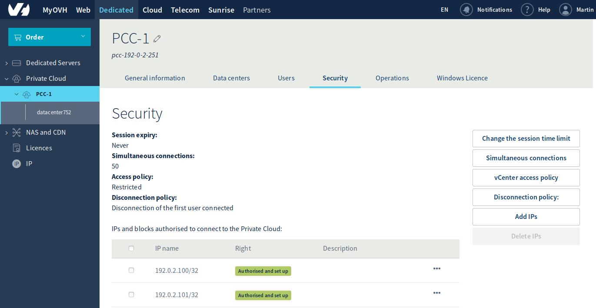
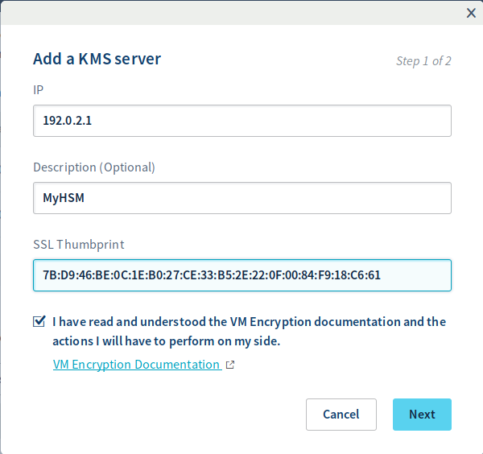
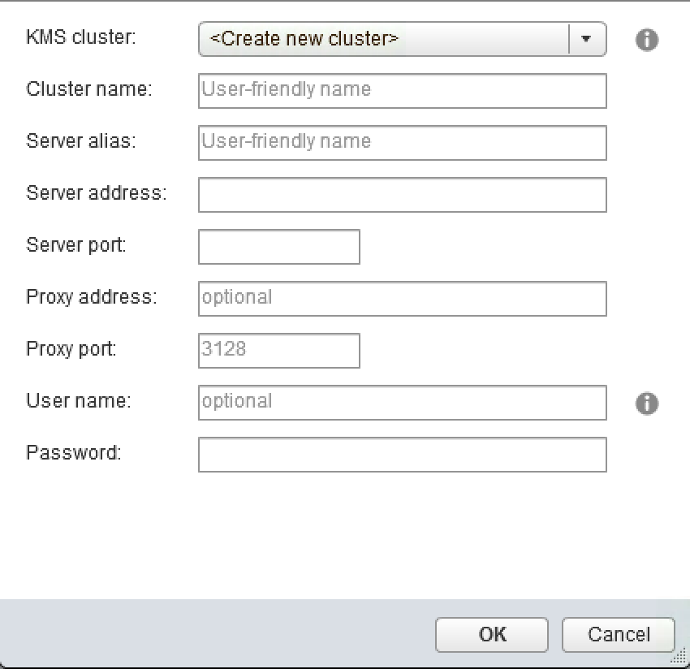
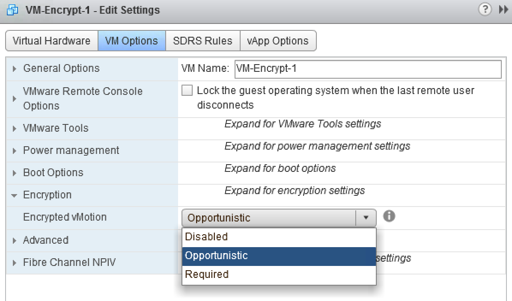
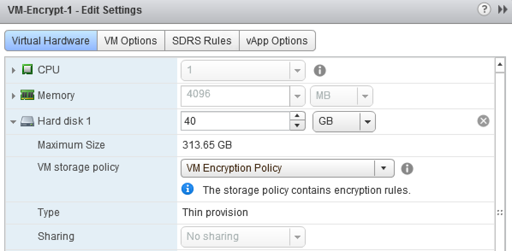

**Dernière mise à jour le 11/10/2018**

## Objectif

Ce guide à pour objectif expliquer les détails de la mise en oeuvre de VMencrypt sur le Private Cloud OVH, en utilisant une stratégie de stockage utilisant un KMS (Key Management Server) externe.

## Prérequis

- Posséder une offre [Private Cloud](https://www.ovh.com/fr/private-cloud/){.external}.
- Avoir un serveur de clé (KMS) externe compatible **[KMIP](https://en.wikipedia.org/wiki/Key_Management_Interoperability_Protocol_(KMIP)){.external} 1.1** et dans la [matrice de compatibilité](https://www.vmware.com/resources/compatibility/search.php?deviceCategory=kms&details=1&feature=293&page=1&display_interval=500&sortColumn=Partner&sortOrder=Asc){.external} VMware
- Accéder à l’interface de gestion vSphere.
- Avoir des machines virtuelles avec une version Hardware 13

## En pratique

### Récupérer l'empreinte du certificat du serveur de clé (KMS)

Suivant votre KMS pour pouvez vous connectez au serveur à l'aide du navigateur et naviguez jusqu'à → `View Certificate`{.action} → `Thumbprint`{.action}

{.thumbnail}

{.thumbnail}

Extraire la valeur de ligne `SHA1 Fingerprint`{.action}

Autre méthode avec OpenSSL :
```shell
openssl s_client -connect 192.0.2.1:5696 < /dev/null 2>/dev/null | openssl x509 -fingerprint -noout -in /dev/stdin
```

Ici il s'agit de la valeur à droite du signe égale :

> SHA1 Fingerprint=7B:D9:46:BE:0C:1E:B0:27:CE:33:B5:2E:22:0F:00:84:F9:18:C6:61

### Enregistrer votre serveur de clé (KMS)

#### Avec le Manager OVH

Dans le manager, ouvrir l'univers Dedicated puis dans la section `Private Cloud`{.action}, sélectionner votre service **PCC**.

Depuis la page principale du service, choisir `Security`{.action}.

{.thumbnail}

Plus bas dans la page, se trouve la section **Virtual Machine Encryption Key Management Servers**, cliquer sur `Add a new KMS Server`{.action}

{.thumbnail}

{.thumbnail}

Dans la nouvelle fenêtre, saisir les informations suivantes :

* l'addresse IP du KMS
* le SSLThumbprint du KMS Server précédament récupérer
* Cocher la bonne prise en compte de cette documentation

Puis valider avec `Next`{.action} 

{.thumbnail}

Une dernière fenêtre, affiche la progression de la tâche.

#### Avec l'API OVH

Les fonctions de chiffrement peuvent être activées à l'aide de l'API OVH

Récupérer votre serviceName :

> [!api]
>
> @api {GET} /dedicatedCloud
>

Vérifier que le chiffrement n'est pas encore activer :

> [!api]
>
> @api {GET} /dedicatedCloud/{serviceName}/vmEncryption
>

> {
>     "state": "disabled"
> }


Puis effectuer l'enregistrement du KMS :

> [!api]
>
> @api {POST} /dedicatedCloud/{serviceName}/kms
>

Vous devez vous munir des informations suivantes :

* le serviceName précédament récupérer
* l'addresse IP du KMS
* le SSLThumbprint du KMS Server précédament récupérer

### Ajouter votre serveur de clé (KMS) sur le vCenter

#### A propos de cette partie

**vCenter Server crée un cluster KMS lorsque vous ajoutez la première instance KMS.**

* Lorsque vous ajoutez le KMS, vous êtes invité à définir ce cluster par défaut. Vous pouvez modifier ultérieurement le cluster par défaut.
* Une fois que le vCenter a créé le premier cluster, vous pouvez ajouter des instances KMS du même fournisseur au cluster.
* Vous pouvez configurer le cluster avec une seule instance KMS.
* Si votre environnement prend en charge les solutions KMS de différents fournisseurs, vous pouvez ajouter plusieurs clusters KMS.
* Si votre environnement comprend plusieurs clusters KMS et que vous supprimez le cluster par défaut, vous devez en définir un autre. Voir définir le cluster KMS par défaut.

#### Procédure

- Connectez-vous au Private Cloud avec le client Web vSphere. 
- Parcourez la liste d'inventaire et sélectionnez le vCenter.
- Cliquer sur 'Gérer" puis "Key Management Servers".
- Cliquez sur Ajouter KMS, spécifiez les informations KMS dans l'assistant, puis cliquez sur OK.
- Faites confiance au certificat et cliquez sur Trust.

{.thumbnail}

Choisir les options suivantes :

* KMS cluster : Sélectionnez "Créer nouveau cluster" pour un nouveau cluster. Si un cluster existe, vous pouvez le sélectionner.
* Cluster name : Nom du cluster KMS. Vous pourriez avoir besoin de ce nom pour vous connecter au KMS si votre vCenter devient indisponible. Le nom de la grappe est très important pour être unique et garder une note de la même chose.
* Server alias : Alias pour le KMS. Vous pourriez avoir besoin de cet alias pour vous connecter au KMS si votre vCenter devient indisponible.
* Server address : Adresse IP ou FQDN du KMS.
* Server port : Port sur lequel le serveur vCenter se connecte au KMS. Le port standard KMIP est 5696. Il peut varier si le KMS d'un autre fournisseur est configuré sur un port spécifique.
* Proxy address : laisser vide
* Proxy port : laisser vide
* User name : Certains fournisseurs de KMS permettent aux utilisateurs d'isoler les clés de chiffrement utilisées par différents utilisateurs ou groupes en spécifiant un nom d'utilisateur et un mot de passe. Spécifiez un nom d'utilisateur uniquement si votre KMS prend en charge cette fonctionnalité et si vous avez l'intention de l'utiliser.
* Password : Certains fournisseurs de KMS permettent aux utilisateurs d'isoler les clés de chiffrement utilisées par différents utilisateurs ou groupes en spécifiant un nom d'utilisateur et un mot de passe. Spécifiez un mot de passe uniquement si votre KMS prend en charge cette fonctionnalité et si vous avez l'intention de l'utiliser.

#### Import du certificat KMS

La plupart des fournisseurs de KMS ont besoin d'un certificat pour faire [confiance](https://docs.vmware.com/en/VMware-vSphere/6.5/com.vmware.vsphere.security.doc/GUID-0212CEF2-7871-4E00-ADF2-0C71401D5E1A.html){.external} au vCenter.

Depuis le vCenter où nous avons ajouté le serveur KMS

* Sélectionnez le serveur KMS qui a été ajouté
* Toutes les options → Établir un lien de confiance avec KMS

> [!warning]
>
> Assurez-vous que le certificat n'est pas chiffré avec un mot de passe lorsque nous téléchargeons le certificat à partir du KMS. Exemple : Si vous créez un utilisateur, créez un utilisateur sans mot de passe et téléchargez le certificat pour l'utilisateur KMS et téléchargez le certificat.
> 

{.thumbnail}

#### Vérifier que le KMS est configuré

Vérifier que le **Connection Status** du KMS est **Normal** :

{.thumbnail}

#### Modifier la politique de stockage de "VM Encryption Storage"

Créer une machine virtuelle

Une fois la VM créée, cliquez avec le bouton droit de la souris sur la machine virtuelle et choisissez `VM Policies`{.action} → `Edit VM Storage Policies`{.action}.

{.thumbnail}

Sélectionnez les fichiers de la VM et les autres disques durs qui doivent être chiffrés.

{.thumbnail}

Assurez-vous que les tâches sont effectuées sans erreur.

> [!info]
>
> Si le KMS n'est pas configuré correctement et qu'il y a des problèmes avec l'échange de clés entre vCenter et KMS, il y aura une erreur RuntimeFault dans la tâche avec le message d'erreur **Cannot generate Key**.
>

#### vMotion chiffré

Pour le vMotion, le chiffrement fonctionne au niveau VM et pour la synchronisation, des clés de cryptage de 256 bits sont utilisées.

Le chiffrement du trafic vMotion fonctionne au niveau du noyau VM avec l'algorithme AES-GCM (Advanced Encryption Standard / Galois Counter Mode) largement utilisé.

Modifier la machine virtuelle et naviguer jusqu'à `VM Options`{.action}

Nous devons sélectionner les options explicitement si nous avons besoin de vMotion chiffré

Il y a 3 politiques pour du vMotion chiffré :
* Disabled : Eteint.
* Opportunistic : chiffrement uniquement s'il est pris en charge par l'hôte source et l'hôte cible ESXi, sinon vMotion ne sera pas chiffré.
* Required : le chiffrement sera utilisé.

{.thumbnail}

Le déplacement des machines entre les hôtes est réalisé par l'échange de clés uniques, qui sont générées et servies par le serveur vCenter, plutôt que par KMS.

#### Vérifications de la configuration

{.thumbnail}

{.thumbnail}

{.thumbnail}

## Aller plus loin

Échangez avec notre communauté d’utilisateurs sur <https://community.ovh.com/>.
