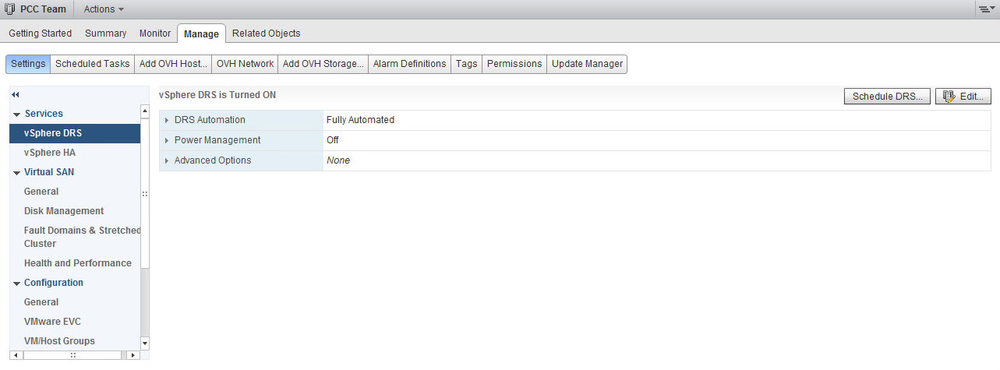

La Fonction **DRS** (Distributed Ressource Scheduler) est disponible dans un cluster **VMware**, cette fonction permet d'équilibrer la charge des hôtes grâce au déplacement des machines virtuelles de manière automatique (vMotion). Elle va répartir les VMs sur les différents Hosts du cluster en fonction de leurs utilisations et de leurs ressources.

En partant sur le fait que **DRS** nous permettra de mieux répartir les ressources il va procéder ou nous conseiller le déplacement des VMs sur un Host ou un Pool(mieux approprié) de notre cluster.

{.thumbnail}

Activation
----------

Pour activer **vSphere DRS** dirigez-vous sur votre **Cluster** (clic droit -&gt; Setting), sélectionner "**VSphere DRS**" dans le menu de gauche, puis cliquer sur le bouton "**Edit**" et cocher la case "**Turn on VSphere DRS**"

{.thumbnail}

L'automatisation
----------------

Vous avez 3 niveau différents.

1.  **Manual** : Suggestions des placements et migration des machines virtuelles.
2.  **Partially Automated** : Suggestions des migrations avec un placement automatique des machines virtuelles.
3.  **Fully Automated** : Plus aucune suggestion, l'enregistrement de la machine virtuelle ainsi que la migration se réalise automatiquement avec un niveau de pertinence de Conservative à Aggressive.

{.thumbnail}

Les règles DRS
--------------

1.  Keep Virtual Machines Together (Les machines virtuelles se situent sur le même hôte)
2.  Separate Virtual Machines (Séparation des VMs sur des hôtes distincts au sein d'un même Cluster)
3.  Virtual Machines to Hosts

{.thumbnail}

Règles individuels
------------------

Vous pouvez définir un **niveau d'automatisation** différent pour chaque **machine virtuelle**.

{.thumbnail}
