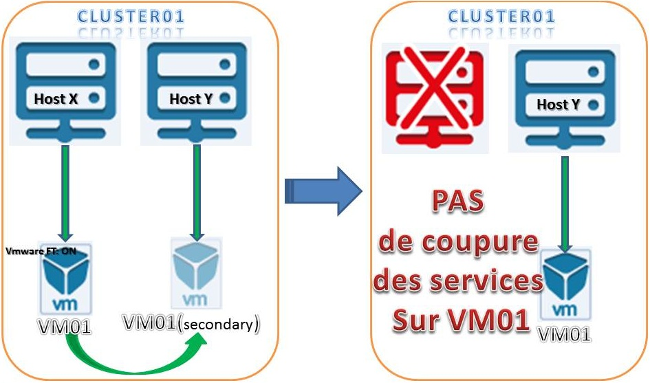

La fonctionnalité **Fault Tolerance** (FT) de VMware vSphere permet de protéger une machine virtuelle des défaillances matérielles en clonant la machine sur deux hôtes distincts.

{.thumbnail}

Les pré-requis

- Activation vSphere HA.
- Réservation de ressource égal à 100 % de la mémoire.
- VMware Tools installés.
- Processeurs de même génération (attention à la génération de CPU sur les infrastructures 2011/2013)
- 1 seul vCpu maximum. (incompatible SMP actuellement)
- Thick Provisionning.

L'activation de **Fault Tolerance** se réalise en effectuant un clic droit sur une machine virtuelle éteinte, **Fault Tolerance** et **Turn OnFault Tolerance**.

{.thumbnail}

Lors de l'activation **Fault Tolerance** paramétre votre machine virtuelle en**Thick Provisionning** et non plus en **Thin Provisionning**.

{.thumbnail}

Nous démarrons la machine virtuelle en effectuant un **Power On**.

{.thumbnail}

Votre machine virtuelle est maintenant **protégée** par **Fault Tolerance**.

{.thumbnail}

Le mode [résilience]({legacy}7766742) de OVH est un bon moyen de tester la très haute disponibilité de votre machine virtuelle en **Fault Tolérance**.
