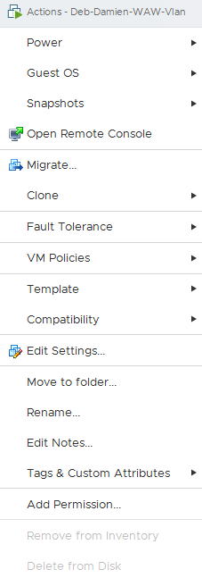
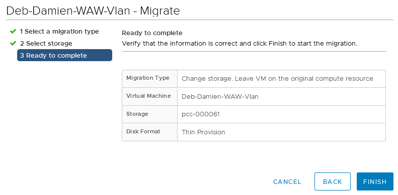

Storage vMotion
---------------

Le Storage vMotion permet de modifier l'emplacement de stockage des fichiers de la machine virtuelle et cela en conservant la machine virtuelle sous tension. Il est possible de déplacer la VM complètement ou disque par disque.

Déplacer le disque d'une VM
---------------------------

Pour déplacer les fichiers d'une machine virtuelle vers un autre datastore, il vous suffit de faire un clic droit sur la machine virtuelle allumée puis de sélectionner le menu "Migrate..."

{.thumbnail}

Choix du type de vMotion
------------------------

Le menu nous proposes plusieurs options de Vmotion, l'option "Change Compute" permet de migrer la VM sur un autre host, dans notre exemple nous désirons uniquement migrer la VM sur un autre datastore, il faut donc sélectionner "Change Storage only".

{.thumbnail}

 {#section}

Choix du datastore
------------------

Choisir vers quel stockage migrer les données.Dans le cas ou vous avez plusieurs disques virtuels sur la même machine, il est possible de ne migrer qu'un seul disque de la VM en utilisant le bouton "Advanced".

{.thumbnail}

Finaliser le vMotion
--------------------

Cliquez sur Finish pour lancer la procédure de migration.

{.thumbnail}

Suivit du vMotion
-----------------

Dans les tâches récentes, vous aurez l'état de la migration, celle-ci prends plus ou moins de temps cela dépend de la taille de la VM, les accès IO et la bande passante utilisées.

{.thumbnail}
