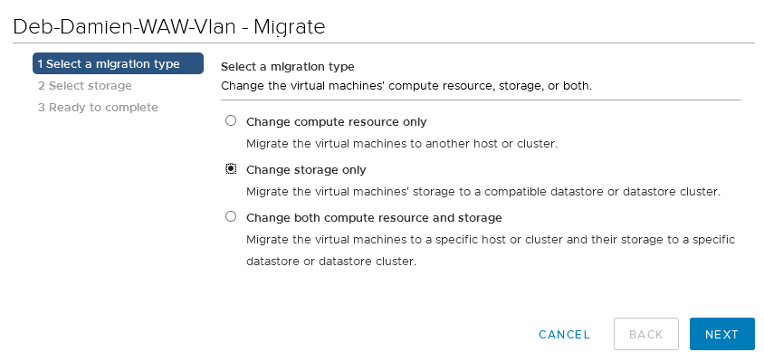

**Ultimo aggiornamento: 30/06/2020**

## Obiettivo

**Storage vMotion** è una funzionalità che consente di modificare la localizzazione dei file di storage della macchina virtuale, mantenendo la VM in esecuzione. La macchina virtuale può essere spostata completamente oppure disco per disco.

**Questa guida ti mostra come effettuare questa operazione.**

## Procedura

### Spostare il disco di una macchina virtuale

Per migrare i file di una macchina virtuale verso un altro datastore, è sufficiente cliccare con il tasto destro sulla VM in uso e selezionare `Migrate...`

{.thumbnail}

### Scegli il tipo di vMotion

Il menu propone diverse opzioni di **vMotion**. Nel nostro esempio, migreremo semplicemente la macchina virtuale su un altro datastore. Per eseguire questa operazione è necessario selezionare “Change storage only”.

L’opzione “Change compute resource only” permette invece di migrare la VM su un altro host.  

Questa operazione, chiamata **vMotion**, è ciò che descriveremo in [questa guida](../vmware-vmotion-new/).

{.thumbnail}

### Scegli il datastore

Per prima cosa è necessario scegliere su quale storage migrare i dati.

Durante questa operazione è anche possibile modificare la politica di storage e, ad esempio, applicare le regole esistenti per uno [storage vSAN](../vmware-vsan/) o l’opzione [VMencryption](../vm-encrypt/).

{.thumbnail}

Nel caso in cui sulla stessa macchina siano presenti più dischi, è possibile migrarne solo uno utilizzando il pulsante `Advanced`{.action}.

Visualizzi questa interfaccia:

{.thumbnail}

### Completa il vMotion

Clicca su `FINISH `{.action} per avviare il processo di migrazione.

{.thumbnail}

### Monitora il vMotion

Nella sezione “Recent Tasks” è possibile seguire lo stato di avanzamento della migrazione. Il tempo necessario per completare l’operazione varia in base alla dimensione della VM, alla velocità di I/O e alla banda passante utilizzata.

{.thumbnail}

## Per saperne di più

Contatta la nostra Community di utenti all’indirizzo <https://community.ovh.com/en/>.
