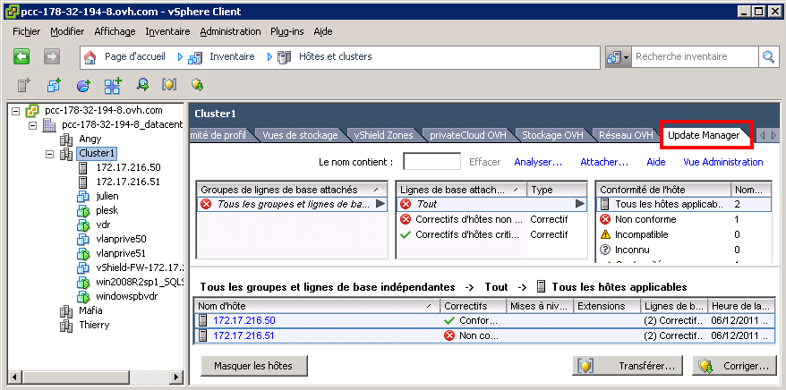
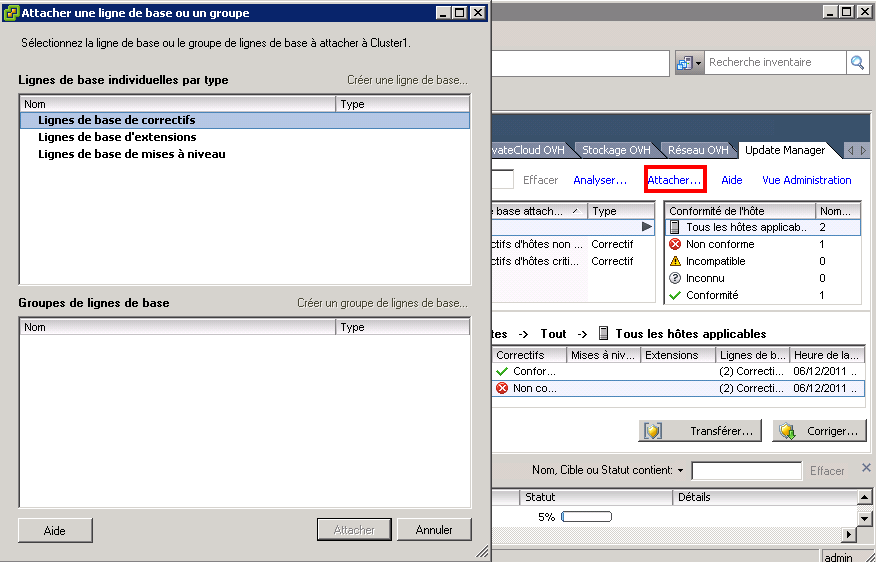
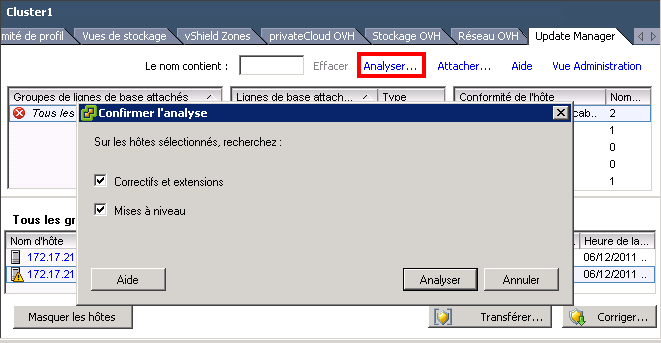

## Wymagania
Poniżej przedstawimy instalacje wtyczki Update Manager na vSphere Client.

Najpierw należy zainstalować panel vSphere Client:

- [Instalacja vSphere client]({legacy}600)

## WAŻNE!!!
Jeśli używasz połączenia RDP dostarczonego podczas tworzenia konta, nie musisz wykonywać instalacji Update Manager.

## 
Do instalacji Update Manager niezbędna jest instalacja wtyczki dostępnej w panelu vSphere:

{.thumbnail}
Następnie otworzy się okno z wtyczkami. Update Manager będzie widoczny w dolnej części tego okna. Możesz kliknąć na "Download and install". 

Po wykonaniu tego etapu pojawi się nowa zakładka :

{.thumbnail}
Następnie należy kliknąć na przycisk "Attach..." i wybrać typ aktualizacji, którą ma zostać przeprowadzona:

{.thumbnail}
Po dokonaniu wyboru będziesz mógł wykonać skan poprawek i aktualizacji:

{.thumbnail}
Otrzymasz tabelę z podsumowaniem dostępnych poprawek i aktualizacji oraz statystyki dotyczące zaktualizowanych hostów. 
Jeśli chcesz pobrać aktualizacje bez wykonywania instalacji, skorzystaj z przycisku "Stage". Jeśli chcesz wykonać instalację, skorzystaj z przycisku "Remediate":

{.thumbnail}

