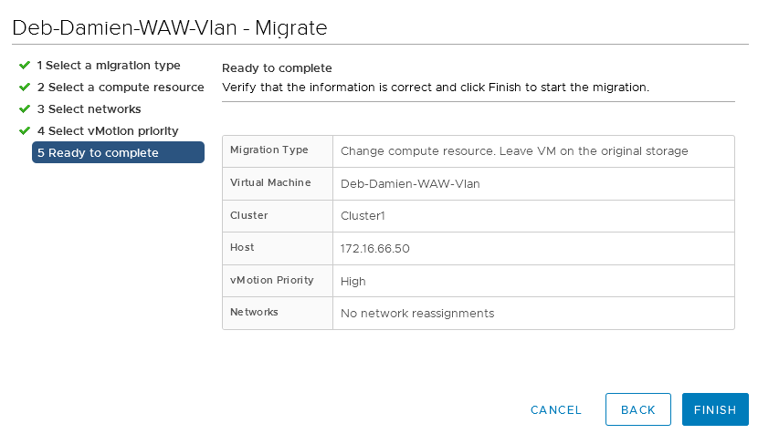

**vMotion** est une migration à **chaud** d'une machine virtuelle (en exécution) depuis un hôte vers un autre host, un ressource pools ou une Vapp, au sein du même **Cluster**.

Voici un exemple de **migration** en utilisant **vMotion** du hôte .51 au .50

Déplacer une VM sur une autre ressource
---------------------------------------

Pour déplacer une Vm sur une autre ressource, il vous suffit de faire un clic droit sur la machine virtuelle allumée puis de sélectionner le menu "Migrate..."

{.thumbnail}

Choix du type de vMotion
------------------------

Le menu nous proposes plusieurs options de Vmotion, l'option "Change storage" permet de migrer la VM sur un autre datastore, dans notre exemple nous désirons uniquement migrer la VM sur un autre ressource il faut donc sélectionner "Change compute ressource only".

{.thumbnail}

Choix de la ressource
---------------------

Choisir vers quel ressource migrer la VM.Il est possible de migrer la VM sur un host, un cluster, un ressource pool ou une Vapp, dans notre exemple nous allons la migrer sur le host .50.

{.thumbnail}

Choix du réseau
---------------

Lors de cette étape, il vous est possible de choisit le réseau affecté à la VM, dans notre exemple nous laissons la VM sur son VLAN d'origine.

{.thumbnail}

Choix de la priorité
--------------------

Nous vous recommandons d'effectuer la migration en priorité haute, pour se faire sélectionnez "Schedule vMotion high priority"

{.thumbnail}

Finaliser le vMotion
--------------------

Cliquez sur "Finish" pour lancer la procédure de migration.

{.thumbnail}

Suivit du vMotion
-----------------

Dans les tâches récentes, vous aurez l'état de la migration, celle-ci prends plus ou moins de temps cela dépend de la taille de la VM, les accès IO et la bande passante utilisées.

{.thumbnail}
