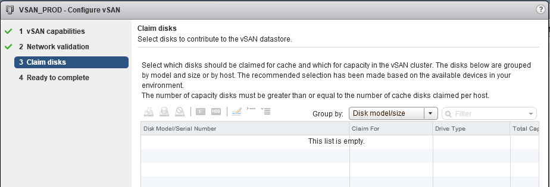
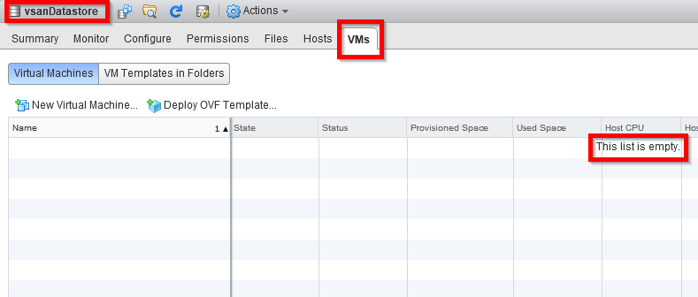

**Dernière mise à jour le 25/10/2018**

## Objectif

VSAN est une solution de stockage qui agrège un ensemble de disques situés sur des hôtes Vmware d'un cluster et les présentent comme un datastore unique utilisable pour les machines virtuelles. Ce type d'architecture qui utilisé les capacités de traitement et de stockage, distribuées sur un ensemble d'hôtes physiques est également appelée "architecture hyperconvergée". 

Comme ce datastore est une construction virtuelle gérée par le logiciel VSAN, on emploie également le terme de Software Defined Storage ou SDS. Un des avantages de VSAN est d'être completement intégré à vSphere et géré directement depuis vCenter.

Ce guide a pour objectif d’expliquer les concepts et les détails de la mise en oeuvre de vSan sur l’offre Private Cloud d’OVH.

**Découvrez comment mettre en oeuvre la puissance de l'hyper-convergence pour vos machines virtuelles avec vSan.**

## Prérequis

* Posséder une offre [Private Cloud](https://www.ovh.com/fr/private-cloud/){.external}.
* Avoir ajouté aux minimums 3 hôtes vSAN
* Accéder à l’interface de gestion vSphere.

## En pratique

### vSan les Concepts clés

#### Protection des données

Afin d'assurer la protection des données en cas de défaillance matérielles (que ce soit au niveau des disques ou au niveau des hôtes) il est nécessaire de définir les niveaux de redondances attendus

##### Redondance des hôtes

Le premier niveau de redondance est le nombre de défaillance d'hôte que le cluster VSAN doit pouvoir supporter. Cette valeur est appelée "Niveau de panne primaireà tolérer"  ou "Failure To Tolerate" (que nous abrégerons par commodité en "FTT") qui peut aller de 0 (aucune redondance) à 3 (niveau maximum).  En fonction du niveau "n" attendu, VSAN va créer des copies des  blocs de données et les distribuer sur chacun des hôtes afin qu'en cas défaillance, les machines virtuelles continuent d'être accessible. Logiquement plus le niveau de redondance attendu est élevé, plus le nombre d'hôtes requis augmente :

* FTT=1 :  3 hôtes minimum
* FTT=2 :  5 hôtes minimum
* FTT=3 :  7 hôtes minimum

##### Redondance des disques

En complément de la redondance des hôtes VSAN assure la redondance au niveau des disques, par le biais d'un mécanisme appelé Erasure Coding. Ce mécanisme fonctionne de manière analogue aux grappes RAID utilisées par les contrôleurs de disques durs., mais protège directement les blocs de données.

VSAN propose 3 niveau de redondance:

* RAID 1 : C'est le niveau par défaut, chaque bloc de donnée est écrit en double sur 2 hôtes différents (miroir).
* RAID 5 : Chaque bloc est découpé en 3 blocs de données et un 4eme blocde parité est calculé. Il permet de retrouver les données manquantes en cas de perte d'un des blocs). Donc logiquement pour écrire 4 blocs, il faut donc bien 4 hôtes.  A parti de  5 hôtes on peut absorber la perte de 2 hôtes, puisqu’on est sur qu’il nous reste au moins 3 blocs de données, ou 2 blocs de données et un bloc de parité.
* RAID 6 : Chaque bloc est découpé en 4 blocs de data et 2 blocs de parité. Ils permettent de recalculer deux  morceaux manquants. Là encore pour écrire 6 blocs et assurer la redondance, il faut donc bien 6 hôtes.

### Activer vSan

#### Déactivation du mode de Haute Disponibilité (vSphere HA)

vSAN s'appuie sur les fonctionnalités de haute disponibilité du cluster, avant toute opération il est donc nécessaire que HA soit désactivé.

Pour ce faire, il faut se rendre dans les propriétés du cluster sur lequel VSAN doit être activé à la rubrique "Disponibilité vSphere" puis décocher la case correspondante :

{.thumbnail}

#### Paramétrage VSAN

Nous allons nous concentrer sur les fonctions essentielles de VSAN, on peut donc utiliser les options par défaut qui sont sont parfaitement adaptées :

{.thumbnail}

La seule option que nous allons activer est la déduplication et la compression. Ces deux fonctions vont permettre d’optimiser le stockage des données en ne stockant qu’une seule fois les données qui se répètent .

Ce processus est rendu possible par l’usage de disques Flash haute performance en remplacement des disques à plateaux traditionnels.

{.thumbnail}

Les cartes réseau pour le trafic VSAN sont automatiquement proposées.

Cliquez ensuite sur `Suivant`{.action} pour sélectionner les disques à utiliser pour le stockage VSAN. Dans le cadre d’une première activation, les disques sont détectés automatiquement :

{.thumbnail}

> [!primary]
>
> Si les disques ont déjà été initialisés  par un déploiement VSAN précédent, ils n’ont pas besoin d’être re-sélectionnés, l’écran de sélection est vide, mais permet quand même de passer à l’étape suivante...
>
> {.thumbnail}
>

Le dernier écran permet de vérifier que les paramètres sont corrects avant de lancer l'initialisation

{.thumbnail}

L’activation de VSAN peut prendre quelques minutes. Une fois l’activation terminée, les informations de configuration sont disponibles dans l’onglet VSAN :

{.thumbnail}

> [!warning]
>
> Il est important de réactiver les fonctions HA du cluster !
>

### Désactiver vSAN

#### Evacuer le datastore

A l’aide d’un Storage vMotion évacuer toutes les machines virtuelles résidant sur le datastore VSAN, ou supprimer celles qui ne servent plus.

Dans l'onglet Datastore, vérifier que plus aucune VM ne réside sur le datastore VSAN

{.thumbnail}

#### Suppression des groupes de disques

Si on veut supprimer toutes les informations de configuration VSAN des disques on peut effacer le groupe de disque qui est crée par VSAN lors de l’activation.

Pour cela, il faut sélectionner l’onglet VSAN dans les propriétés du cluster, rubrique "Gestion des disques"

{.thumbnail}

Il faut alors sélectionner pour chacun des hôtes le groupe de disques cliquer sur l’icône de suppression qui se trouve au-dessus

Une confirmation est demandée :

{.thumbnail}

Les deux premières options sont utiles lorsque l'on souhaite retirer un hôte du cluster en préservant le fonctionnement du datastore VSAN.

Comme nous allons supprimer le datastore complètement, il n’est pas nécessaire de migrer les données, on peut donc sélectionner la dernière option "Ne pas évacuer les données".

La suppression prend quelques instant.

Il suffit de répéter l’opération sur chacun des nœuds du cluster, jusqu’à ce que le groupe de disque ait été complétement supprimé :

{.thumbnail}

Des messages d'erreurs concernant la sante du groupe de disque peuvent apparaitre, ils peuvent être ignoré sans souci.

#### Désactivation HA

Comme pour l'activation, il est nécessaire de désactiver HA au niveau du cluster avant d'arrêter VSAN

Il faut se rendre dans les propriétés du cluster, rubrique "Disponibilité vSphere"

{.thumbnail}

Et décocher la case "Activer vSphere HA"

#### Désactivation vSan

Une fois HA désactivé, il est possible d’arrêter VSAN.

Toujours les propriétés du cluster, cliquez sur le bouton "Modifier"

{.thumbnail}

Puis décocher la case "Activer VSAN"

{.thumbnail}

Une demande de confirmation s’affiche, confirmez :

{.thumbnail}

> [!primary]
>
> Si HA n’a pas été correctement désactivé, un message d’erreur vous le signalera :
>
> {.thumbnail}
>

Une fois l’opération terminée, un message de confirmation s’affiche :

{.thumbnail}

> [!warning]
>
> Si nécessaire, il faut réactiver  les fonctions HA après cette manipulation si le cluster continue d’héberger des machines virtuelles stockées sur des datastore externes.
>

## Aller plus loin

Échangez avec notre communauté d’utilisateurs sur <https://community.ovh.com/>.
