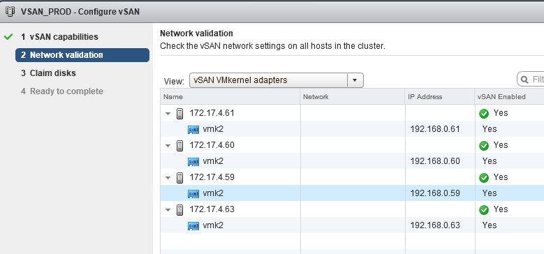
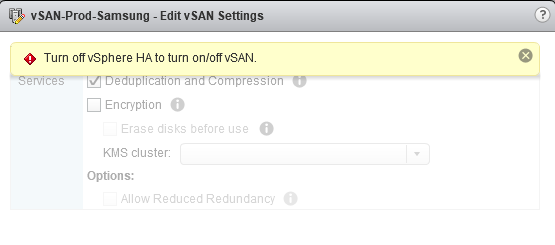

**Dernière mise à jour le 25/10/2018**

## Objectif

vSAN est une solution de stockage qui agrège un ensemble de disques situé sur les hôtes VMware d'un cluster et les présente comme un datastore unique utilisable pour les machines virtuelles. Cette architecture, qui utilise des capacités de traitement et de stockage distribués sur un ensemble d'hôtes physiques, est également appelée « architecture hyperconvergée ». 

Comme ce datastore est une construction virtuelle gérée par le logiciel vSAN, on emploie également le terme de *Software Defined Storage* (SDS). L'un des avantages de vSAN est d'être complètement intégré à vSphere et géré directement depuis vCenter.

Ce guide a pour objectif d’expliquer les concepts et les détails de la mise en oeuvre de vSAN sur Private Cloud.

**Découvrez comment mettre en oeuvre la puissance de l'hyperconvergence pour vos machines virtuelles avec vSAN.**

## Prérequis

* Posséder une offre [Private Cloud](https://www.ovh.com/fr/private-cloud/){.external}.
* Avoir ajouté au minimum trois hôtes vSAN.
* Pouvoir accéder à l’interface de gestion vSphere.

## En pratique

### vSAN : les concepts clés

#### Protection des données

Afin d'assurer la protection des données en cas de défaillance matérielle au niveau des disques ou des hôtes, il est nécessaire de définir les niveaux de redondance attendus.

##### Redondance des hôtes

Le premier niveau de redondance concerne le nombre de défaillances d'hôtes que le cluster vSAN doit pouvoir supporter. Cette valeur est appelée « Niveau de panne primaire à tolérer » (*Failure To Tolerate* ou FTT) qui peut aller de 0 (aucune redondance) à 3, le niveau maximum. Selon le niveau « n » attendu, vSAN va créer des copies des blocs de données et les distribuer sur chacun des hôtes. Ainsi, en cas défaillance, les machines virtuelles continuent d'être accessibles. Plus le niveau de redondance attendu est élevé, plus le nombre d'hôtes requis augmente :

* FTT=1 :  3 hôtes minimum ;
* FTT=2 :  5 hôtes minimum ;
* FTT=3 :  7 hôtes minimum.

##### Redondance des disques

En complément de la redondance des hôtes, vSAN assure celle des disques, grâce à un mécanisme appelé Erasure Coding. Ce mécanisme fonctionne de manière analogue aux grappes RAID utilisées par les contrôleurs de disques durs, mais il protège directement les blocs de données.

VSAN propose trois niveaux de redondance :

* RAID 1 : il s'agit du niveau par défaut. Chaque bloc de données est écrit en double sur deux hôtes différents (miroir) ;
* RAID 5 : chaque bloc est découpé en trois blocs de données et un quatrième bloc de parité est calculé. Il permet de retrouver les données manquantes en cas de perte d'un des blocs. Pour écrire quatre blocs, il faut donc bien quatre hôtes. À partir de cinq hôtes, il est possible d'absorber la perte de deux hôtes, puisqu’on est sûr qu’il nous reste au moins trois blocs de données, ou deux blocs de données et un bloc de parité ;
* RAID 6 : chaque bloc est découpé en quatre blocs de données et deux blocs de parité. Ils permettent de recalculer deux morceaux manquants. Là encore, pour écrire six blocs et assurer la redondance, il faut donc bien autant d'hôtes.

### Activer vSAN

#### Désactivation du mode de haute disponibilité (vSphere HA)

vSAN s'appuie sur les fonctionnalités de haute disponibilité du cluster. Avant toute opération, il est donc nécessaire que ce mode soit désactivé.

Pour ce faire, rendez-vous dans les propriétés du cluster sur lequel le vSAN doit être activé, dans la rubrique « Disponibilité vSphere », puis décochez la case correspondante :

{.thumbnail}

#### Paramétrage VSAN

Ce guide porte sur les fonctionnalités essentielles de vSAN. Nous utiliserons par conséquent les options par défaut, parfaitement adaptées à ce type d'usage :

{.thumbnail}

Les seules options que nous allons activer sont la déduplication et la compression. Celles-ci vont vous permettre d’optimiser le stockage des données en ne stockant qu’une seule fois celles qui se répètent.

Ce processus est rendu possible par l’usage de disques flash haute performance en remplacement des disques mécaniques traditionnels.

{.thumbnail}

Les cartes réseau pour le trafic vSAN vous sont automatiquement proposées.

Cliquez ensuite sur `Suivant`{.action} pour sélectionner les disques à utiliser pour le stockage vSAN. Dans le cadre d’une première activation, les disques sont détectés automatiquement.

{.thumbnail}

> [!primary]
>
> Si les disques ont déjà été initialisés par un précédent déploiement vSAN, ils n’ont pas besoin d’être sélectionnés de nouveau. L’écran de sélection est vide, mais vous permettra quand même de passer à l’étape suivante.
>
> {.thumbnail}
>

Le dernier écran vous permet de vérifier que les paramètres sont corrects avant de lancer l'initialisation du processus.

{.thumbnail}

L’activation de vSAN peut prendre quelques minutes. Une fois celle-ci terminée, les informations de configuration seront disponibles en cliquant sur l’onglet « vSAN » :

{.thumbnail}

> [!warning]
>
> Il est important de réactiver la fonction de haute disponibilité de votre cluster.
>

### Désactiver vSAN

#### Évacuer le datastore

À l’aide d’un Storage vMotion, vous devez évacuer toutes les machines virtuelles résidant sur le datastore vSAN, ou supprimer celles qui ne vous servent plus.

Cliquez sur l'onglet « Datastore » et vérifiez qu'aucune machine virtuelle n'est installée sur le datastore vSAN.

{.thumbnail}

#### Suppression des groupes de disques

Si vous souhaitez supprimer toutes les informations de configuration vSAN de vos disques, vous pouvez effacer le groupe de disques créé par vSAN lors de l’activation.

Pour cela, sélectionnez l’onglet « vSAN » dans les propriétés du cluster, rubrique « Gestion des disques ».

{.thumbnail}

Pour chacun de vos hôtes, sélectionnez le groupe de disques concerné et cliquez sur l'icône de suppression qui se trouve juste au-dessus.

Une confirmation vous est ensuite demandée.

{.thumbnail}

Les deux premières options sont utiles si vous souhaitez retirer un hôte du cluster tout en préservant le fonctionnement du datastore vSAN.

Comme vous allez supprimer l'intégralité du datastore, il n’est pas nécessaire de migrer vos données. Vous pouvez donc sélectionner la dernière option « Ne pas évacuer les données ».

La suppression prend quelques instants.

Il suffit de répéter l’opération sur chacun des nœuds du cluster, jusqu’à la suppression totale du groupe de disques :

{.thumbnail}

Si des messages d'erreur concernant la santé du groupe de disques apparaissent, vous pouvez les ignorer.

#### Désactivation de la haute disponibilité

Comme pour l'activation, vous devez désactiver la haute disponibilité au niveau du cluster avant d'arrêter vSAN. Pour cela, rendez-vous dans les propriétés du cluster, rubrique « Disponibilité vSphere », puis décochez la case « Activer vSphere HA ».

{.thumbnail}

#### Désactivation de vSan

Une fois la haute disponibilité désactivée, il est possible d’arrêter VSAN.

Toujours situé dans les propriétés du cluster, cliquez sur le bouton « Modifier ».

{.thumbnail}

Décochez ensuite la case « Activer VSAN ».

{.thumbnail}

Confirmez enfin la demande qui s'affiche :

{.thumbnail}

> [!primary]
>
> Si la haute disponibilité n’a pas été correctement désactivée, un message d’erreur vous le signalera :
>
> {.thumbnail}
>

Une fois l’opération terminée, un message de confirmation s’affiche :

{.thumbnail}

> [!warning]
>
> Si nécessaire, il faut réactiver les fonctions de haute disponibilité après cette manipulation si le cluster continue d’héberger des machines virtuelles stockées sur des datastores externes.
>

## Aller plus loin

Échangez avec notre communauté d’utilisateurs sur <https://community.ovh.com/>.
