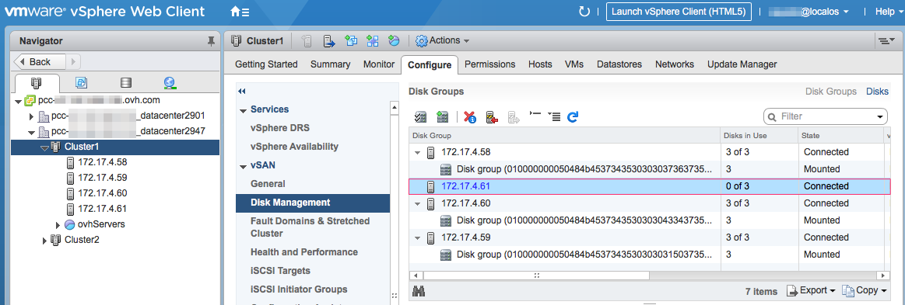
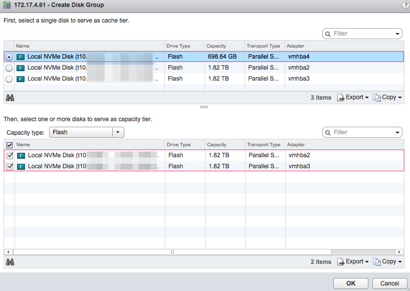
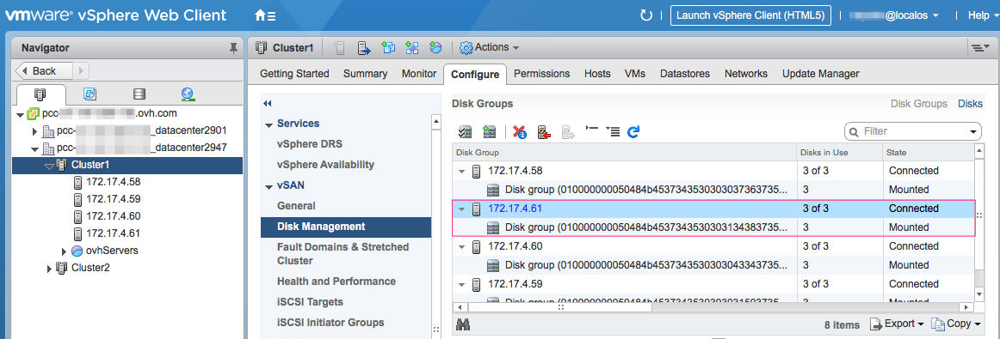

**Last updated 18/09/2020**

## Objective

This guide explains how to add an ESXi server to an existing vSAN cluster. You can add a host when you order a new server, or when you replace a faulty server.

## Requirements

- a [Hosted Private Cloud infrastructure](https://www.ovhcloud.com/en-gb/enterprise/products/hosted-private-cloud/)
- access to the vSphere management interface
- an ESXi server available and integrated into a vSAN cluster

## Instructions

Since OVHcloud servers are automatically preconfigured on delivery, adding a host to a vSAN cluster simply specifies which disks will be integrated into the datastore.

Once connected to vCenter, go to the `Hosts and Clusters`{.action} menu, select the concerned cluster, click on the `Configure`{.action} tab and select the `vSAN`{.action} menu and then `Disk Management`{.action}.

In the `Disk Groups`{.action} table, select the new ESXi server and ensure that no disk is assigned to the vSAN datastore (the `Disks in Use` column should be 0 of X).

{.thumbnail}

Click on the icon with a green `+`{.action}. In the `Create Disk Group` window, select the cache disk and capacity disk(s) and click `OK`{.action}.

> [!primary]
>
> Please refer to the server hardware configuration to determine which disks are for cache or capacity.
>

{.thumbnail}

You can track the progress of the disk group creation task in the `Recent Tasks` window.

{.thumbnail}

Once the task is complete, the `Disks in Use` column should indicate that all disks on the server are integrated into the cluster.

{.thumbnail}

The ESXi server is now fully integrated into the vSAN cluster, and its disks are usable by the datastore.

## Go further

Join our community of users on <https://community.ovh.com/en/>.
