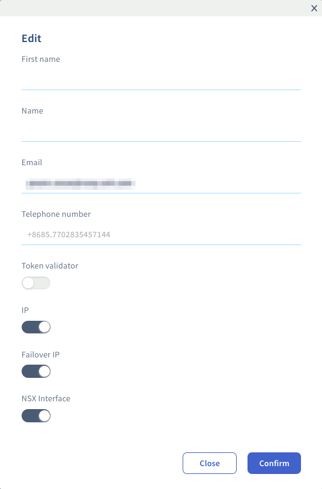

**Última actualización: 06/07/2020**

## Objetivo

Es posible asociar un nombre, un apellido, un número de teléfono y una dirección de correo electrónico a un usuario vSphere de Hosted Private Cloud. Asociar una dirección de correo electrónico permite activar la validación por token.

**Esta guía explica cómo asociar una dirección de correo electrónico a un usuario vSphere**.

## Requisitos

- Tener una solución [Hosted Private Cloud](https://www.ovhcloud.com/es/enterprise/products/hosted-private-cloud/){.external}.
- Haber iniciado sesión en el [área de cliente de OVHcloud](https://ca.ovh.com/auth/?action=gotomanager).

## Procedimiento

Conéctese al [área de cliente de OVHcloud](https://ca.ovh.com/auth/?action=gotomanager) y acceda a la sección `Servidores`. En la barra de servicios de la izquierda, haga clic en `Private Cloud` y seleccione la infraestructura correspondiente.

{.thumbnail}

En la pestaña `Usuarios`{.action}, haga clic en el icono con tres puntos (`...`) que aparece en la línea correspondiente al usuario y haga clic en `Editar`{.action}. 

{.thumbnail}

Será redirigido a la siguiente ventana:

{.thumbnail}

Desde ahí podrá introducir su nombre, apellido, número de teléfono y dirección de correo electrónico.

Asimismo, podrá agregar permisos de edición a la dirección **IP**, **IP Failover**, **InterfaceNSX** y el permiso **Token validator** necesario para confirmar acciones sensibles en aquellas infraestructuras con la opción de **Seguridad avanzada** activada.

Haga clic en `Aceptar`{.action} para confirmar los cambios.

## Más información

Interactúe con nuestra comunidad de usuarios en [https://community.ovh.com/en/](https://community.ovh.com/en/){.external}.
