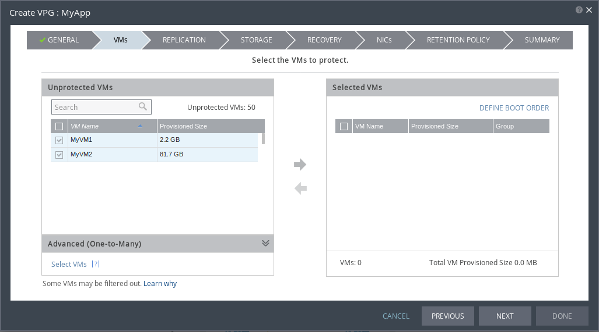
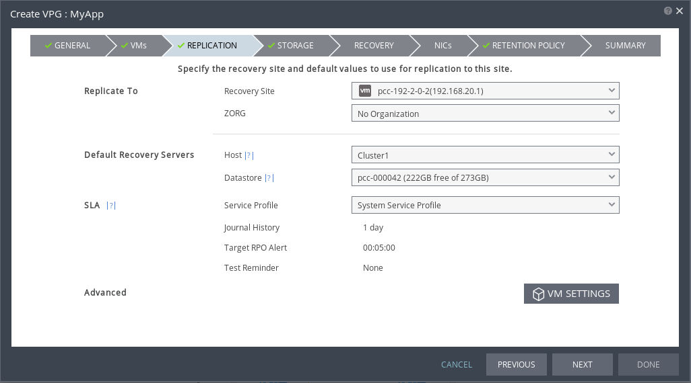
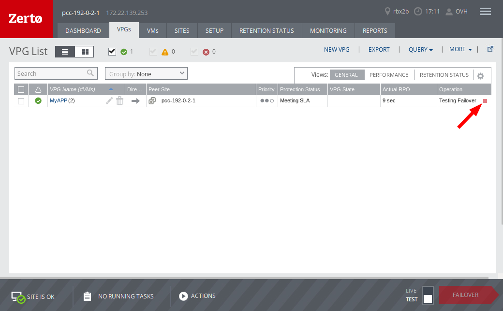
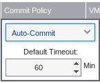

**Last updated 30/08/2019**

## Goal
This guide will present the concepts and steps required to setup Zerto Virtual Replication on the Private Cloud platform
Ce guide a pour objectif d’expliquer les concepts et les détails de la mise en oeuvre de Zerto Virtual Replication sur Private Cloud.

**excerpt: Discover how to set up Zerto Virtual Replication between your Private Cloud platforms**

## Prerequisites 

* Having 2 Private Cloud Platforms [Private Cloud](https://www.ovh.ie/sddc/){.external} on 2 different datacenters
* In each Datacenter, a free public IP must be available

###  Zerto Virtual Replication Concepts

Zerto Virtual Replication is a disaster recovery solution for vSphere. It enables replication virtual machines between Private Cloud platforms by capturing and propagating all disk operations to secondary site.
It allows  automation and orchestration of actual fail-over or fail-over tests between sites.  

#### Virtual Replication Appliance (VRA)
Zerto works by deploying specific virtual machines on each hypervisor called Virtual Replication Appliance.
They have a predefined configuration: 

* vCPU : 1
* RAM : 2 GB
* Stockage : 36 GB

All VRA are stored on a specific datastore, provided by OVH.

#### Sites
During deployement, VRA are deployed on source and destination sites, and then are paired together to start replication.
Since Zerto does not encrypt the dialog between VRA, OVH automatically deploys a VPN tunnel between the VRA through the L2VPN appliance, to protect in-flight data.

#### Virtual Protection Group (VPG)
Before starting the replication, VMs must be grouped in a logical container called Virtual Protection Group, on which all replication parameters will be defined.
It allows to apply consistent parameters accross a group of VM that share the same replication requirements, (typically VMs that belong to the same function or application)
 
VPGs can be prioritized to make the most efficient usage of available bandwidth.

## Step by step

### Service Activation

#### From OVH dashboard

From your OVH Manager, go to "Server/Private Cloud". Select your primary site, then go to "Disaster Recovery" tab.

{.thumbnail}

Select **Between two OVH Private Cloud solutions** then click `Activate Zerto DRP`{.action},

{.thumbnail}
Selection of the primary **Private Cloud** and **datacenter** is done automatically depending where you are connecting from.
From the drop-down menu, select a **free**  public IP from the IP range attached to the **Private Cloud**. It will be used to setup the VPN tunnel between the 2 platforms.
Click `Next`{.action},

{.thumbnail}
Secondary site selection must be done from available **Private Cloud** in the drop-down menu.
Please note that list will show only Private Clouds meeting all the following requirements:

* Being located in another geographical area.
* Not already involved in a Zerto replication.

Then select the **datacenter** from the secondary **Private Cloud** in the drop-down menu.
Select an **unused**  IP address from the public IP range attached to the secondary **Private Cloud**. It will be used for the secondary VPN endpoint.

Click `Next`{.action},

{.thumbnail}
Activation request confirmation, as shown on screen, deployment can take up to one hour, if all provided informations are correct (for example if the IPs given in the wizard are already in use, the activation will fail).

{.thumbnail}
Once the activation has successfully completed, you will receive an email summary of the configuration and the links to the Zerto interface of both sites.

> [!primary]
> Bonjour,
> 
> Vous venez d'activer la solution de PRA Zerto entre 2 de vos Private Cloud.
> 
> Vous pouvez vous connecter au site principal à l'adresse suivante :
> 
>   * URL        : https://zerto.pcc-192-0-2-1.ovh.com/
> 
> Vous pouvez vous connecter au site secondaire à l'adresse suivante :
> 
>   * URL        : https://zerto.pcc-192-0-2-2.ovh.com/
> 
> Vous pourrez vous authentifier avec vos comptes administrateurs de la même > façon que pour vSphere.
> 

#### From OVH API

###  Zerto Replication Interface

Interface is reachable both from primary and secondary platforms through:
* URL : https://zerto.pcc-x-x-x-x.ovh.com/ (insert PCC URL)

> [!warning]
>
> Like indicated in the summary email, you can login with your PCC account.
>

Once logged in, you arrive on Zerto dashboard:
{.thumbnail}

You will find there :

* A status of VPGs health
* Key indicators for the Zerto platform.
* Network and IO consumptions figures
* An alerts and messages log

### Configure a Virtual Protection Group (VPG)

From  `Actions`{.action}, select `Create VPG`{.action}

{.thumbnail}

{.thumbnail}

First Step **General** :

* Enter a name for the new VPG
* Except specific requirements, you can leave the Priority set to **Medium**

Click `NEXT`{.action}

{.thumbnail}

In the next step you need to select the VMs that will be in the VPG

> [!warning]
>
> A VM can only belong to a single VPG.
> 

* You can filter the VMs by name through the  **Search** dialog box
* tick the box of all VM to be added

{.thumbnail}

* Click on the arrow pointing to the right to place VMs in the VPG

Click `NEXT`{.action}

{.thumbnail}

Next step is the selection of the secondary site :

* **Recovery Site** : select the remote site (the primary site will be tagged as (Local)) 
* **ZORG** : scroll down and select **No Organization**. The other values are present for backwards compatibility but will trigger an error messsage if selected.

Now you must define the default recovery resources :

* **Hosts** : Select a  vSphere Resource Pool, a DRS Cluster or a specific host in it  .(Cluster1 in our example)
* **Datastore** : Likewise you can select a specific datastore or datastore cluster in the drop-down list.

You can keep the default values for the other settings.
Click `NEXT`{.action}

{.thumbnail}

In this step you can override the default recovery resources for specific VMs.
If it is not necessary, you can click. `NEXT`{.action}

{.thumbnail}

Now you need to define the default network to use during test fail-overs and actual fail-overs
* **Failover/Move Network** : Choose the default vSphere portgroup for an actual fail-over
* **Failover Test Network** : Choose the default vSphere portgroup for a test fail-over
* **Recovery Folder** : If you want to regroup the failed over VMs on the secondary site, you can select a folder or just / to place the VMs at the root of the vSphere inventory.

> [!primary]
> **Pre-recovery Script** and  **Post-recovery Script** are locked down, these features are not enabled
> 

Click `NEXT`{.action}

{.thumbnail}

In this second step, you have the possibility to override the default recovery networks for each VMs, and specify the IP adresses to use in case of a test or an actual fail-over. :

{.thumbnail}

> [!warning]
>
> The modification of the IP adress during fail-over is only possible for supported OSes with functioning VMware Tools
> 

click `NEXT`{.action}

{.thumbnail}

Long term retention is disabled, click `NEXT`{.action}

{.thumbnail}

The last screen summarize the settings for the new VPG 
If everything is OK, click `DONE`{.action}

{.thumbnail}

On the dashboard, you will see the new VPG with a status "Initializing"

### Start a fail-over 

After having configured your VPG and once the initial replication has completed, you can now test Zerto fail-over features
> [!warning]
>
> A fail-over test has **NO** impact on the production site, you only need to make sure that the VM that are being failed-over are are starting in an isolated network and/or different IPs to avoid network conflicts
> All the VMs instantiated during de fail-over test are fully managed by Zerto, you should not remove of modifiy them, they will be removed automatically at the end of the fail-over test.
> The replication keeps running during the fail-over tests and is not impacted in any way.
>

{.thumbnail}

From the interface, click on bottom right button `FAILOVER`{.action} (the togle is by default on **TEST**).
if the button is greyed out, it's because there is no available VPG to perform a test (initialization is not finished or there is an issue with the VPG).

{.thumbnail}

The fail-over wizard appears with eligible VPGs, their replication direction (in or out), destination site and service level status (**Meeting SLA**).

You can either 
1. Select the VPGs itself to perform the test, failing over all the VMs within.
2. Click on the square icon on the left of the VPG name to display all the VMs in the VPG. You can then choose to fail-over only the selected VMs within the VPG.

Click `NEXT`{.action}

{.thumbnail}

In this case we have chosen to do a full VPG fail-over.

You can now check the settings for the fail-overs:
* Replication direction
* Remote site
* Si une séquence de démarrage des VM a été définie
* Si des scripts Pre ou Post bascule sont présent (fonctionnalité non disponible)

Continuer avec `NEXT`{.action}

{.thumbnail}

Dernier écran de récapitulatif sur une vue des différents sites avec le nombre de VPG pour le test.

Confirmer le lancement du test avec `START FAILOVER TEST`{.action}

Le test de bascule se lance immédiatement avec les actions sur le vCenter du site distant.

Il ne vous reste plus qu'à contrôler si tout fonctionne correctement sur le site distant.

{.thumbnail}

Quand vous avec fini de vérifier le bon fonctionnement des machines basculées.
Cliquer sur le petit carré rouge à droite du **Testing Failover**

{.thumbnail}

Dans la nouvelle fenêtre, il est possible d'indiquer si le test s'est déroulé de manière satisfaisante et de rajouter un commentaire.

Confirmer la fin du test avec `STOP`{.action}

Le démantèlement du test se lance immédiatement avec les actions sur le vCenter du site distant.

### Lancer une reprise d'activité

En cas d'incident majeur sur le site principal ou dans le cadre d'un exercice en condition réelle, le lancement de la bascule s'effectue logiquement depuis le site secondaire (de reprise).

> [!warning]
>
> Le failover en mode **LIVE** sur Zerto Replication se fait en considérant le site principal comme indisponible, il faut donc avoir fait attention à la configuration réseaux de pour éviter tout conflit d'adressage IP et autre.
>
> L'ensemble des ressources qui seront démarrées sur le site secondaire vont devenir active au niveau du traitement de données 
>
> À noter que la réplication entre les deux sites est modifiée ou couper (voir plus loin).
>

{.thumbnail}

Pour cela se connecter à l'interface Zerto Replication, basculer le sélecteur en bas à droite de l'interface sur **LIVE** (noter le changement de couleur du bandeau pour pour signaler que vous allez faire des actions qui peuvent avoir un impact sur la production) et cliquer sur `FAILOVER`{.action}.

{.thumbnail}

Immédiatement, un écran apparait avec les VGP disponibles, le sens de réplication, le site de destination et si le niveau de protection est correct (**Meeting SLA**).

Vous allez alors plusieurs choix :

1. Cocher la case pour sélectionner le VPG et donc l'ensemble des VMs de celui-ci pour la bascule.
2. Cliquer sur l'icône à droite du nom du VPG pour faire apparaitre la liste des VM du VPG. Vous avez alors la possibilité de choisir quelles VM du VPG vont faire partie de la bascule.

Valider et passer à l'étape suivante avec `NEXT`{.action}

{.thumbnail}

Nous sommes partis sur le choix un (1) à savoir test sur un VPG.

À cette étape on retrouve un résumé des actions lié au VPG :
* Sens de réplication
* Site distant
* Le **Checkpoint** : il s'agit de la date à laquelle seront restaurées les données. L'écart entre le point choisi et la date courante déterminera le **RPO**
* La **Commit Policy** : voir après.
* **VM Shutdown** : détermine le comportement à adopter sur le site primaire, pas de coupure des VM, extinction, extinction forcée.
* **Reverse Protection** : indique si la réplication du VPG doit être configurée en sens inverse à l'issue du failover pour pouvoir éventuellement procéder plus tard au failback.
* Si une séquence de démarrage des VM a été définie
* Si des scripts Pre ou Post bascule sont présent (fonctionnalité non disponible)

{.thumbnail}

Au niveau de la **Commit Policy**, vous avez trois (3) options :
* Auto-Rollback : sans action de votre part, le retour en arrière est déclenché au bout du temps prévu
* Auto-Commit : sans action de votre part, la validation des données sur la plateforme secondaire est déclenchée au bout du temps prévu (il n'est plus possible de revenir simplement sur la plateforme principale)
* None : les actions de **Rollback** ou de **Commit** doivent être validées par votre part.

{.thumbnail}

Au niveau des options **Auto** la temporisation par défaut est de soixante (60) minutes.

Continuer avec `NEXT`{.action}

{.thumbnail}

Dernier écran de récapitulatif sur une vue des différents sites avec le nombre de VPG pour la bascule.

> [!warning]
>
> Il est fortement recommandé de bien lire le résumé ainsi que les avertissements pour 
>

Lancer la bascule avec `START FAILOVER`{.action}

{.thumbnail}

Si vous avez choisi une **Commit Policy** de type **Auto**, un message d'avertissement vous rappelle l'impact de celui-ci.

Confirmer le lancement avec `START FAILOVER`{.action}

La bascule se lance immédiatement avec les actions sur le vCenter du site distant.

Il ne vous reste plus qu'à contrôler si tout fonctionne correctement sur le site distant.

{.thumbnail}

Après avoir lancé la bascule, vous pouvez voir une alerte au niveau de l'interface Zerto Replication.
Celle-ci est liée à la **Commit Policy** et temps que le commit n'est pas confirmé ou annulé.

Les actions sont à faire le cas échéant via les icônes à droite du VPG

{.thumbnail}

Au moment de la validation du commit, vous pouvez automatiquement configurer le VPG en sens inverse (appeler **Reverse Protection**).

Valider avec `COMMIT`{.action}

{.thumbnail}

Au niveau du VPG, vous pouvez noter que la direction (via la flèche) de réplication a été changée.

### Préparer et effectuer un retour en arrière

Suivant comment a éfé fait le **Failover**, l'éventuel retour sur le site principal (cela n'est pas une obligation) peut nécessiter plusieurs actions.

Si vous avez basculé avec du **Reverse Protection**, le retour arrière consiste à faire un **Failover Live** (se reporter à la partie idoine pour les actions à faire).

Si vous avec basculer **sans** du **Reverse Protection**, le retour arrière consiste à créer un VPG **puis** faire un **Failover Live** (se reporter aux sections précédentes pour les actions à faire).

## Aller plus loin

Échangez avec notre communauté d’utilisateurs sur <https://community.ovh.com/>.
