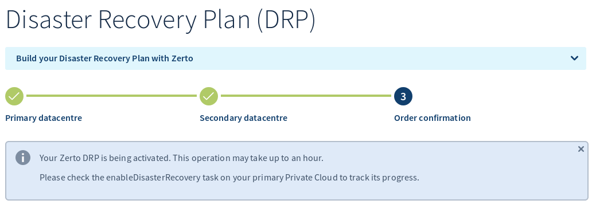
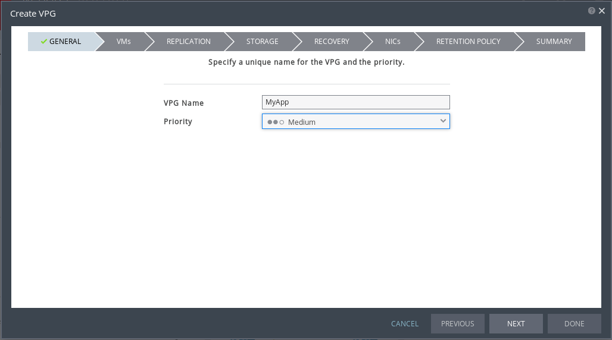
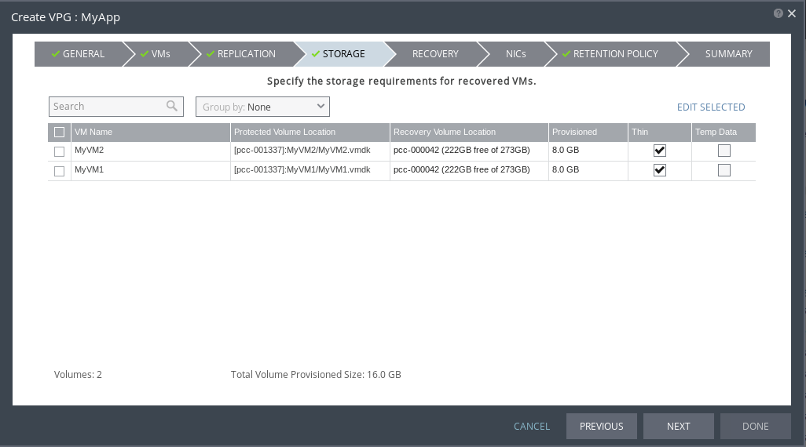
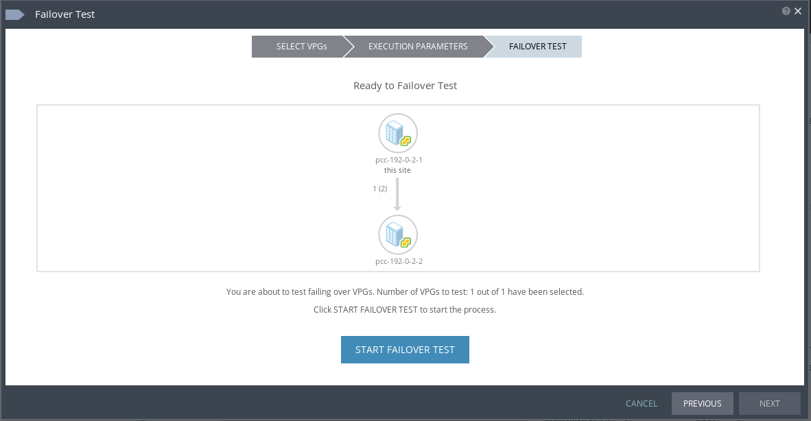
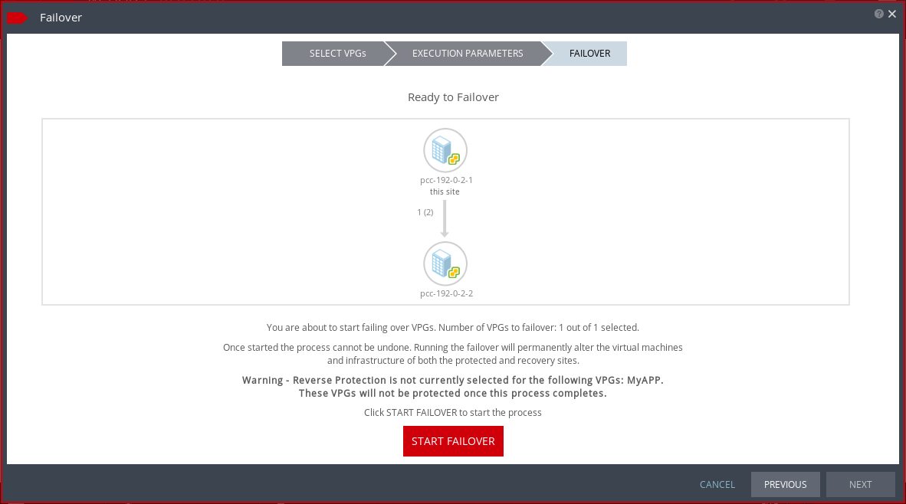

**Last updated 30/08/2019**

This guide will present the concepts and steps required to setup Zerto Virtual Replication on the Private Cloud platform

**Discover how to set up Zerto Virtual Replication between your Private Cloud platforms**

## Prerequisites 

* Having 2 Private Cloud Platforms [Private Cloud](https://www.ovh.ie/sddc/){.external} on 2 different datacenters
* In each Datacenter, a free public IP must be available

###  Zerto Virtual Replication Concepts

Zerto Virtual Replication is a disaster recovery solution for vSphere. It enables replication virtual machines between Private Cloud platforms by capturing and propagating all disk operations to secondary site.
It allows  automation and orchestration of actual fail-over or fail-over tests between sites.  

#### Virtual Replication Appliance (VRA)
Zerto works by deploying specific virtual machines on each hypervisor called Virtual Replication Appliance.
They have a predefined configuration: 

* vCPU : 1
* RAM : 2 GB
* Stockage : 36 GB

All VRA are stored on a specific datastore, provided by OVH.

#### Sites
During deployement, VRA are deployed on source and destination sites, and then are paired together to start replication.
Since Zerto does not encrypt the dialog between VRA, OVH automatically deploys a VPN tunnel between the VRA through the L2VPN appliance, to protect in-flight data.

#### Virtual Protection Group (VPG)
Before starting the replication, VMs must be grouped in a logical container called Virtual Protection Group, on which all replication parameters will be defined.
It allows to apply consistent parameters accross a group of VM that share the same replication requirements, (typically VMs that belong to the same function or application)
 
VPGs can be prioritized to make the most efficient usage of available bandwidth.

## Step by step

### Service Activation

#### From OVH dashboard

From your OVH Manager, go to "Server/Private Cloud". Select your primary site, then go to "Disaster Recovery" tab.

{.thumbnail}

Select **Between two OVH Private Cloud solutions** then click `Activate Zerto DRP`{.action},

{.thumbnail}
Selection of the primary **Private Cloud** and **datacenter** is done automatically depending where you are connecting from.
From the drop-down menu, select a **free**  public IP from the IP range attached to the **Private Cloud**. It will be used to setup the VPN tunnel between the 2 platforms.
Click `Next`{.action},

{.thumbnail}
Secondary site selection must be done from available **Private Cloud** in the drop-down menu.
Please note that list will show only Private Clouds meeting all the following requirements:

* Being located in another geographical area.
* Not already involved in a Zerto replication.

Then select the **datacenter** from the secondary **Private Cloud** in the drop-down menu.
Select an **unused**  IP address from the public IP range attached to the secondary **Private Cloud**. It will be used for the secondary VPN endpoint.

Click `Next`{.action},

{.thumbnail}
Activation request confirmation, as shown on screen, deployment can take up to one hour, if all provided informations are correct (for example if the IPs given in the wizard are already in use, the activation will fail).

{.thumbnail}
Once the activation has successfully completed, you will receive an email summary of the configuration and the links to the Zerto interface of both sites.

> [!primary]
>Dear Customer,
>
>You have just enabled the Zerto DRP solution between 2 of your Private Cloud solutions.
>
>You can log in to the main website via the following address:
>
>  * URL: https://zerto.pcc-x-x-x-x.ovh.com/ 
>
>You can log in to the secondary website via the following address:
>
>  * URL: https://zerto.pcc-x-x-x-x.ovh.com/ 
>
>You can authenticate with your administrator accounts the same way as you do for
>vSphere.

#### From OVH API

###  Zerto Replication Interface

Interface is reachable both from primary and secondary platforms through:
* URL : https://zerto.pcc-x-x-x-x.ovh.com/ (insert PCC URL)

> [!warning]
>
> Like indicated in the summary email, you can login with your PCC account.
>

Once logged in, you arrive on Zerto dashboard:
{.thumbnail}

You will find there :

* A status of VPGs health
* Key indicators for the Zerto platform.
* Network and IO consumptions figures
* An alerts and messages log

### Configure a Virtual Protection Group (VPG)

From  `Actions`{.action}, select `Create VPG`{.action}

{.thumbnail}

{.thumbnail}

First Step **General** :

* Enter a name for the new VPG
* Except specific requirements, you can leave the Priority set to **Medium**

Click `NEXT`{.action}

{.thumbnail}

In the next step you need to select the VMs that will be in the VPG

> [!warning]
>
> A VM can only belong to a single VPG.
> 

* You can filter the VMs by name through the  **Search** dialog box
* tick the box of all VM to be added

{.thumbnail}

* Click on the arrow pointing to the right to place VMs in the VPG

Click `NEXT`{.action}

{.thumbnail}

Next step is the selection of the secondary site :

* **Recovery Site** : select the remote site (the primary site will be tagged as (Local)) 
* **ZORG** : scroll down and select **No Organization**. The other values are present for backwards compatibility but will trigger an error messsage if selected.

Now you must define the default recovery resources :

* **Hosts** : Select a  vSphere Resource Pool, a DRS Cluster or a specific host in it  .(Cluster1 in our example)
* **Datastore** : Likewise you can select a specific datastore or datastore cluster in the drop-down list.

You can keep the default values for the other settings.
Click `NEXT`{.action}

{.thumbnail}

In this step you can override the default recovery resources for specific VMs.
If it is not necessary, you can click. `NEXT`{.action}

{.thumbnail}

Now you need to define the default network to use during test fail-overs and actual fail-overs
* **Failover/Move Network** : Choose the default vSphere portgroup for an actual fail-over
* **Failover Test Network** : Choose the default vSphere portgroup for a test fail-over
* **Recovery Folder** : If you want to regroup the failed over VMs on the secondary site, you can select a folder or just / to place the VMs at the root of the vSphere inventory.

> [!primary]
> **Pre-recovery Script** and  **Post-recovery Script** are locked down, these features are not enabled
> 

Click `NEXT`{.action}

{.thumbnail}

In this second step, you have the possibility to override the default recovery networks for each VMs, and specify the IP adresses to use in case of a test or an actual fail-over. :

{.thumbnail}

> [!warning]
>
> The modification of the IP adress during fail-over is only possible for supported OSes with functioning VMware Tools
> 

click `NEXT`{.action}

{.thumbnail}

Long term retention is disabled, click `NEXT`{.action}

{.thumbnail}

The last screen summarize the settings for the new VPG 
If everything is OK, click `DONE`{.action}

{.thumbnail}

On the dashboard, you will see the new VPG with a status "Initializing"

### Start a fail-over 

After having configured your VPG and once the initial replication has completed, you can now test Zerto fail-over features
> [!warning]
>
> A fail-over test has **NO** impact on the production site, you only need to make sure that the VM that are being failed-over are are starting in an isolated network and/or different IPs to avoid network conflicts
> All the VMs instantiated during de fail-over test are fully managed by Zerto, you should not remove of modifiy them, they will be removed automatically at the end of the fail-over test.
> The replication keeps running during the fail-over tests and is not impacted in any way.
>

{.thumbnail}

From the interface, click on bottom right button `FAILOVER`{.action} (the togle is by default on **TEST**).
if the button is greyed out, it's because there is no available VPG to perform a test (initialization is not finished or there is an issue with the VPG).

{.thumbnail}

The fail-over wizard appears with eligible VPGs, their replication direction (in or out), destination site and service level status (**Meeting SLA**).

You can either 
1. Select the VPGs itself to perform the test, failing over all the VMs within.
2. Click on the square icon on the left of the VPG name to display all the VMs in the VPG. You can then choose to fail-over only the selected VMs within the VPG.

Click `NEXT`{.action}

{.thumbnail}

In this case we have chosen to do a full VPG fail-over.

You can now check the settings for the fail-overs:
* Replication direction
* Remote site
* Boot order (locked down)
* Pre/Post scripts (locked down)

Click `NEXT`{.action}

{.thumbnail}

The summary screen is displayed, if everything is OK you can start the test by clicking  `START FAILOVER TEST`{.action}

You can log on on the remote site vCenter and see the VMs starting.
You can then check if everything is working correctly on the remote site.

{.thumbnail}

When all checks have been performed, you can stop the test by clicking on the little red box right accross **Testing Failover** 

{.thumbnail}

At this stage, you can add a result of the test for futur reference.

Confirm the end of the test by clicking `STOP`{.action}

Cleanup operation are launched right away on remote site

### Launch a actual fail-over

You can launch a full fail-over from the secondary site, in case the primary site has been rendered unusable by a disaster.

> [!warning]
> If you trigger an actual fail over when the primary site is still available, you have the possibility to properly shutdown the VM on the primary site.
> If you don't, be careful with the network configuration to make sur to prevent IP conflicts between primary and secondary instances of VMs
>
> Please note that, contrary to what happens during a test fail-over, replication operation are stopped during an actual fail-over
>

{.thumbnail}

To start  a complete fail-over, you need to set the toggle on **LIVE** before pushing the fail-over button (the banner at the bottom of the page becomes red to warn you that going further may have an impact on your VMs) 
Click `FAILOVER`{.action}.

{.thumbnail}

Immédiatement, un écran apparait avec les VPG disponibles, le sens de réplication, le site de destination et si le niveau de protection est correct (**Meeting SLA**).
You can decide on the fail-over parameters, just like during a test fail-over: which VPGs to fail-over, the replication direction, VPGs status (**Meeting SLA**).

1. You can select one or several VPGs
2. If you want to partially migrate some VPGs, you can click on the little square icon and select which VMs to fail over

Click `NEXT`{.action}

{.thumbnail}

We have decided to fail-over a single VPG

We have a summary of the fail-over parameters :
* Replication direction
* Remote site
* The  **checkpoint** to use: what version should use Zerto to restart from. Usually the latest version will minimze the data loss and improve **RPO**
* what **commit policy** to use : see further down the page.
* **VM Shutdown** : what should Zerto do with the VMs on the primary site if they are still running, leave them running, shutdown, forced shutdown.
* **Reverse Protection** : After the fail-over, should the replication enabled again to allow a fail-back or be left as-is

{.thumbnail}

There are 3 **Commit Policy** settings :
* Auto-Rollback : If no action is taken, the rollback starts automatically after the timer is elapsed
* Auto-Commit : If no action is taken, data changed on the secondary site is now commited on VMs, and to be able to fail back, a reverse replication needs to be setup.
* None : **Rollback** or  **Commit** have to be launched manually

{.thumbnail}

For all automatic actions, the default timer is 60 minutes.
Click `NEXT`{.action}

{.thumbnail}

Summary screen

> [!warning]
>
> Please read the summary carefully and all associated warnings
>

click `START FAILOVER`{.action}

{.thumbnail}

If you have selected an **Automatic Policy**, you received a warning about its impact.

Confirm with `START FAILOVER`{.action}

Fail-over starts, you can follow the actions from the secondary vCenter.
Validate the succesfull start of VMs on secondary platform

{.thumbnail}

After the fail-over has completed, you'll see an pending task as long as you haven't committed or failed back the operation (through the small icons neart the VPG name)

{.thumbnail}

When you commit the data on the secondary site, you can automatically setup the protection (**Reverse Protection**).

Validate with `COMMIT`{.action}

{.thumbnail}

If you check the VPG, you will see that the replication direction has changed.

### Prepare and trigger the fail-back

Depending on fail-over options, the fail-back (if needed) may require differents steps.
If you have selected **Reverse Protection** during the fail-over, the failback is just a  **Failover Live** (refer to the relevant part of this guide).

If you have not enabled **Reverse Protection**, you need to create a new VPG, do a full sync and then do a **Failover Live** (refer to the relevant part of this guide).

## Go further 

Discuss with other Zerto users on <https://community.ovh.com/>.
