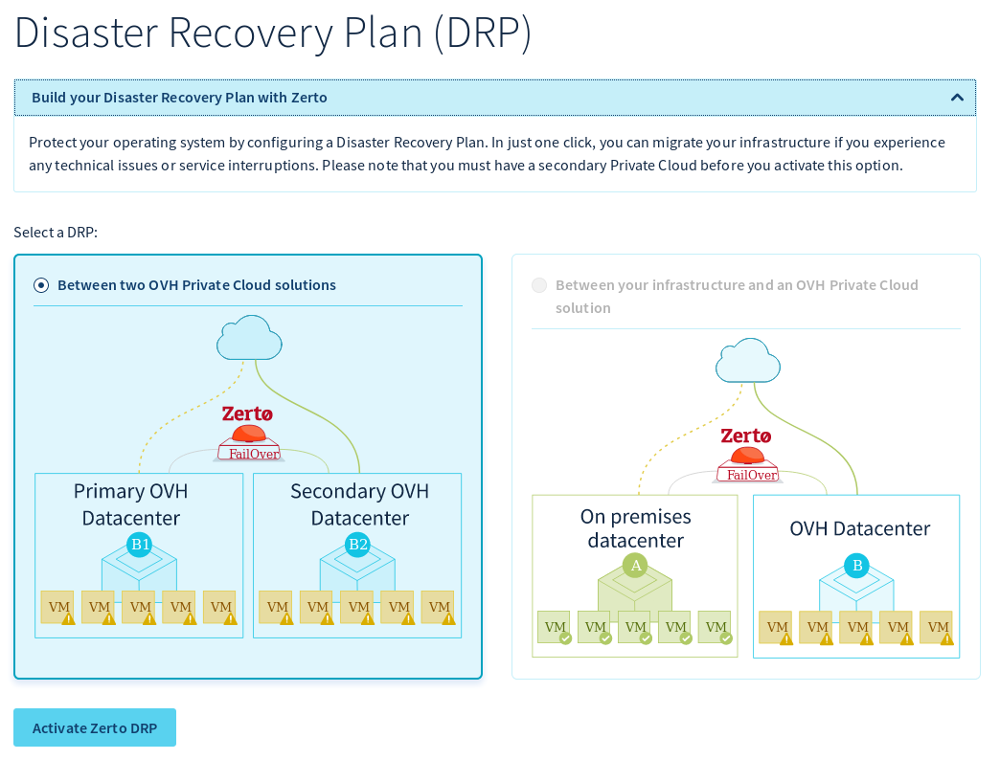
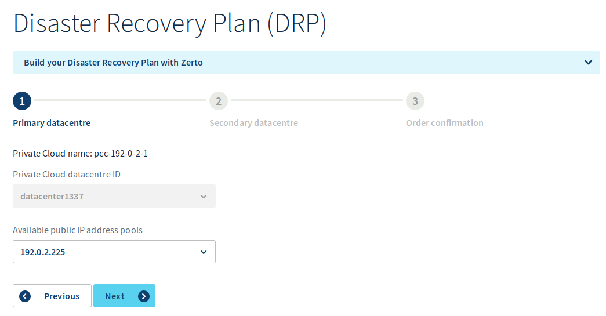
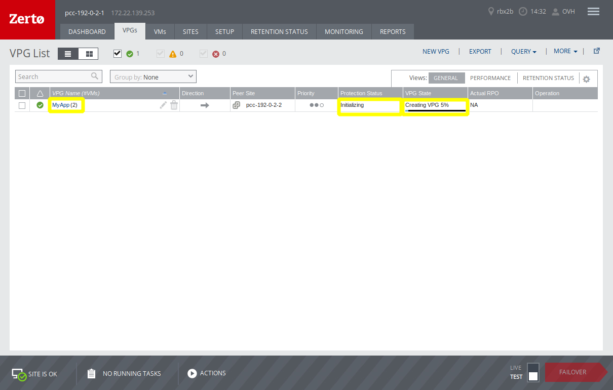
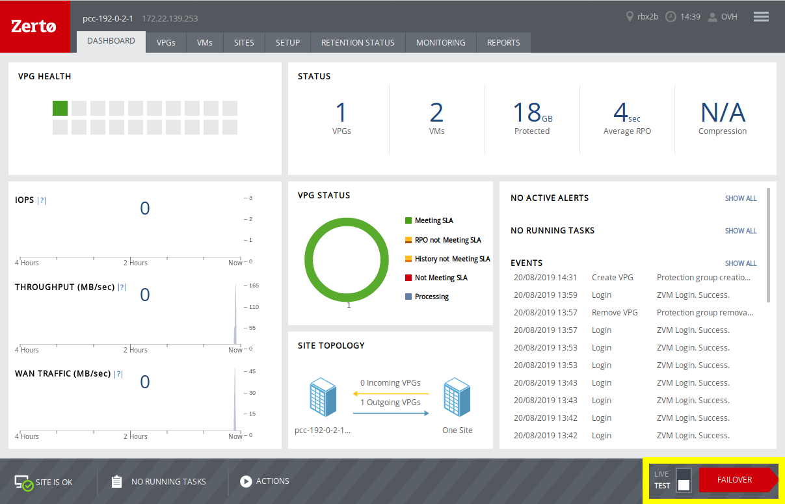
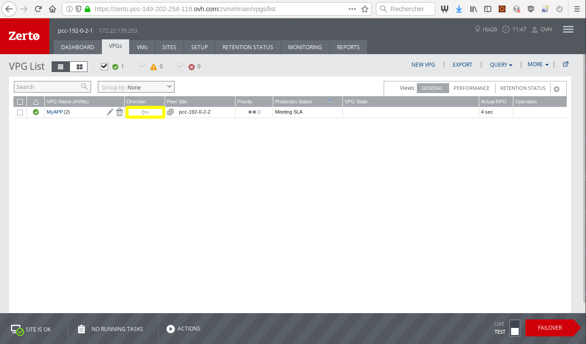

**Última atualização: 28/08/2020**

## Objetivo

Este guia explica os conceitos e os pormenores da implementação da Zerto Virtual Replication numa Private Cloud.

**Saiba como implementar a Zerto Virtual Replication para o seu Plano de Recuperação de Desastres (DRP) entre dois serviços Private Cloud.**

## Requisitos

* Dispor de dois serviços [Private Cloud](https://www.ovhcloud.com/pt/enterprise/products/hosted-private-cloud/){.external} em dois datacenters diferentes.
* Ter, em cada um deles, um endereço IP público livre.

### Conceitos da Zerto Virtual Replication

A Zerto Virtual Replication é uma solução técnica que permite replicar dados entre infraestruturas de virtualização ou cloud. Para isso, recorre aos hipervisores da plataforma ao implementar máquinas virtuais (MV) chamadas Virtual Replication Appliance (VRA), que se encarregam de copiar os dados nas unidades de armazenamento e de os transmitir para um site remoto de modo a serem guardados.

#### Virtual Replication Appliance (VRA)

As VRA, implementadas em cada hipervisor, vão consumir recursos para efetuar a replicação:

* vCPU: 1
* RAM: 2 GB
* Armazenamento: 36 GB

Note-se que, relativamente ao armazenamento, a OVHcloud disponibiliza gratuitamente um datastore dedicado para o conjunto das VRA.

#### Sites

A replicação dos dados é feita entre dois sites emparelhados. Dessa forma, as VRA podem estabelecer o tráfego de replicação em ambos os lados.

De forma predefinida, o tráfego de replicação Zerto não se encontra encriptado, mas, como a segurança é uma das prioridades da OVHcloud, implementamos entre os dois sites um túnel encriptado (via IPSec) por meio de uma appliance de rede chamada L2VPN.

#### Grupo de replicação (VPG)

A ativação e o controlo da replicação das MV são feitos através de um grupo de replicação (VPG).
Este último permite juntar de forma lógica um grupo de MV correspondentes a uma mesma necessidade empresarial ou operacional (por exemplo, uma aplicação com a sua base de dados), a fim de configurar o objetivo máximo de perda de dados admissível (**RPO**), a ordem de inicialização (a base antes da aplicação) e as configurações de rede para os exercícios ou para um caso real. 

Também é possível definir um nível de prioridade entre os VPG, de modo a dar primazia à transferência de dados em caso de problemas em termos de largura de banda de rede.

## Instruções

### Ativar o serviço

#### A partir da Área de Cliente OVHcloud

Na Área de Cliente OVHcloud, aceda à secção `Server` -> `Private Cloud`. > Selecione a plataforma Private Cloud primária. > Selecione
o datacenter desejado. >E clique no separador `Disaster Recovery Plan (DRP)`{.action}.

{.thumbnail}

Escolha **Between two OVH Private Cloud solutions** e clique em `Activate Zerto DRP`{.action}.

{.thumbnail}

A seleção da **Private Cloud** primária, bem como do **datacenter**, é feita automaticamente, isto é, com base na infraestrutura pela qual se dá o acesso.

Selecione no menu suspenso um endereço IP público **livre** pertencente ao bloco de IPs públicos associado à **Private Cloud**.  Ele será utilizado na criação do túnel protegido entre as infraestruturas.

Clique em `NEXT`{.action}.

{.thumbnail}

Deve selecionar o site secundário entre as **Private Clouds** presentes no menu suspenso. 

Só se exibem os sites elegíveis. Para o serem, devem responder aos critérios seguintes:

* estar fisicamente noutra localização;
* não dispor de outra replicação Zerto.

De seguida, selecione no menu suspenso o **datacenter** da **Private Cloud** de destino.

Escolha no menu suspenso um endereço IP público **livre** pertencente ao bloco de IPs públicos associado à **Private Cloud**.  Ele será utilizado na criação do túnel protegido entre as infraestruturas.

Clique em `NEXT`{.action}.

{.thumbnail}

Depois de enviado o pedido de ativação, esta última pode tardar no máximo uma hora, sob condição de as informações fornecidas estarem corretas (sobretudo se o endereço IP já estiver a ser utilizado por uma das máquinas virtuais; se for o caso, a ativação não terá lugar).

{.thumbnail}

Uma vez realizada a ativação, receberá por e-mail uma configuração de instalação, bem como os links de acesso à interface Zerto de cada infraestrutura.

> [!primary]
> Estimado/a Cliente,
> 
> Acabou de ativar o serviço Zerto DRP entre duas das suas Private Clouds.
> 
> Pode aceder ao site principal pelo seguinte endereço:
> 
>   * URL        : https://zerto.pcc-192-0-2-1.ovh.com/
> 
> Pode aceder ao site secundário pelo seguinte endereço:
> 
>   * URL        : https://zerto.pcc-192-0-2-2.ovh.com/
> 
> Poderá autentificar-se com as suas contas de administrador, à semelhança do que faz com o vSphere.
> 

#### A partir da API OVHcloud

### Interface Zerto Replication

A interface encontra-se acessível a partir das duas infraestruturas pelo endereço:

* URL : https://zerto.pcc-x-x-x-x.ovh.com/ (a modificar em função das plataformas)

> [!warning]
>
> Como indicado no corpo do e-mail, os dados de acesso são os mesmos que utiliza para aceder à interface vSphere.
>

Depois de se identificar, chegará a um ecrã com o painel de controlo:

{.thumbnail}

Neste ecrã, vai encontrar:

* um panorama do estado de saúde dos VPG;
* o estado global da Zerto Replication, com quatro indicadores;
* um quadro com os dados de desempenho da Zerto Replication;
* um panorama do estado dos VPG;
* uma lista dos últimos alertas, ações e acontecimentos relativos à Zerto Replication.

### Configurar um grupo de replicação (VPG)

No menu `Ações`{.action}, escolha `Create VPG`{.action}.

{.thumbnail}

{.thumbnail}

No primeiro ecrã:

* Introduza um nome para o VPG, idealmente com um sentido operacional.
* Salvo necessidades especiais, a prioridade definida em **Medium** deve ser mantida.

Para avançar, clique em `NEXT`{.action}.

{.thumbnail}

A etapa seguinte consiste em selecionar as MV que vão fazer parte do VPG.

> [!warning]
>
> Uma MV não pode estar em vários VPG.
> 

* Filtre as MV por nome através do campo **Search**.
* Assinale as caixas à esquerda das MV correspondentes.

{.thumbnail}

* Clique na seta a apontar para a direita para as passar para o VPG.

Para avançar, clique em `NEXT`{.action}.

{.thumbnail}

A seguir vem a etapa da seleção do site remoto:

* **Recovery Site**: escolha na lista o site remoto (o que não se chame «Local»). 
* **ZORG**: escolha na lista **No Organization**. Outras escolhas provocarão um erro no momento de passar à fase seguinte.

Depois é preciso definir os recursos remotos:

* **Hosts**: Selecione o recurso de cálculo, que pode ser um **Host específico** (indicado pelo seu endereço IP e precedido do nome do cluster entre aspas, conforme os casos), uma **Ressource Pool** (com as letras «RP» seguidas do nome do cluster e do nome da Ressource Pool) ou um **Cluster** (através do seu nome). Só pode escolher uma **Ressource Pool** ou um **Cluster** (aqui, Cluster1).
* **Datastore**: Escolha o recurso de armazenamento, que pode ser um **Datastore específico** (indicado pelo seu nome e precedido do nome do **Storage Cluster** entre aspas, conforme os casos) ou um **Storage Cluster** (através do seu nome).

Deixe os outros campos como estão, a menos que tenha necessidades avançadas.

Para avançar, clique em `NEXT`{.action}.

{.thumbnail}

Na etapa seguinte, é possível afinar a configuração de armazenamento.

Deixe os outros campos como estão, a menos que tenha necessidades avançadas.

Para avançar, clique em `NEXT`{.action}.

{.thumbnail}

Então chega uma parte importante: a primeira etapa da configuração de rede.

* **Failover/Move Network**: escolha o portgroup predefinido para o failover.
* **Failover Test Network**: escolha o portgroup para os testes de failover.
* **Recovery Folder**: escolha a pasta (ou então «/», a raiz) à qual serão adicionadas as MV em failover para o site.

> [!primary]
> As opções **Pre-recovery Script** e **Post-recovery Script** não são utilizáveis.
> 

Para avançar, clique em `NEXT`{.action}.

{.thumbnail}

Chega a segunda etapa da configuração de rede:

* Para cada MV, vai poder escolher o portgroup para os testes ou o failover.
* Também será possível alterar a configuração IP das MV relativamente a cada um dos casos.

{.thumbnail}

> [!warning]
>
> A modificação de IP só é possível em MV com um sistema operativo compatível e nas que tenham as **VMware Tools** em funcionamento.
> 

Para avançar, clique em `NEXT`{.action}.

{.thumbnail}

Para avançar, clique em `NEXT`{.action}.

{.thumbnail}

No último ecrã, encontrará uma recapitulação do conjunto dos elementos configurados.

Depois de os verificar, valide a criação clicando em `DONE`{.action}.

{.thumbnail}

Na lista vai encontrar o VPG recém-criado, bem como o seu estado (que começa por ser **Initializing**).

### Lançar um exercício de recuperação de desastres 

Depois de ter configurado a replicação e de ter deixado esta última realizar-se ao longo de vários dias, pode testar se o DRP funciona corretamente com as ações geridas pela Zerto Replication.

> [!warning]
>
> O teste de failover na Zerto Replication realiza-se **sem** corte do site principal. Assim, é muito importante configurar adequadamente as redes de teste, a fim de evitar conflitos de endereçamento IP e impactos sobre a produção durante o exercício.
>
> Os recursos a serem inicializados no site secundário pelo teste não devem ser modificados nem eliminados manualmente. O conjunto do teste será desmantelado pela Zerto Replication no final da operação.
>
> Tenha em mente que, durante um teste, a replicação continua a realizar-se entre os dois sites.
>

{.thumbnail}

Para isso, aceda à interface Zerto Replication e clique em `FAILOVER`{.action} (o seletor à esquerda aparece de forma predefinida em **TEST**).

Se o texto do botão estiver a cinzento, isso significa que não há um VPG elegível para o teste (é possível que a inicialização ainda não se tenha concluído).

{.thumbnail}

De imediato, surgirá um ecrã com os VPG disponíveis, o sentido de replicação, o site de destino e a correção do nível de proteção (**Meeting SLA**).

Nesse ponto, terá as seguintes opções:

1. Assinale a caixa para selecionar o VPG e, portanto, o conjunto das suas MV para realizar o teste.
2. Clique no ícone à direita do nome do VPG para exibir a lista das MV do VPG. De seguida, poderá escolher as MV do VPG que vão fazer parte do teste.

Valide e passe à etapa seguinte clicando em `NEXT`{.action}.

{.thumbnail}

O nosso exemplo baseia-se na primeira opção, isto é, o teste de um VPG.

Neste ponto, encontrará um resumo das ações ligadas ao VPG:

* Sentido de replicação
* Site remoto
* Se foi definida uma sequência de inicialização
* Se estão presentes scripts Pre ou Post Failover (funcionalidade indisponível)

Para avançar, clique em `NEXT`{.action}.

{.thumbnail}

Aparecerá um último ecrã de recapitulação, com um panorama dos diferentes sites e o número de VPG para o teste.

Confirme o início do teste clicando em `START FAILOVER TEST`{.action}.

O teste de failover tem início imediatamente, com as ações sobre o vCenter do site remoto.

Agora já só resta controlar o normal funcionamento do site remoto.

{.thumbnail}

Quando tiver acabado de verificar as máquinas sujeitas a failover, clique no quadrado vermelho à direita de **Testing Failover**.

{.thumbnail}

A janela que se abrir vai indicar se o teste foi bem-sucedido e sugerir que adicione um comentário.

Confirme o fim do teste clicando em `STOP`{.action}.

O desmantelamento do teste é iniciado de imediato, com as ações sobre o vCenter do site remoto.

### Executar uma Recuperação de Desastres

Na eventualidade de um incidente grave no site principal, ou no quadro de um exercício em condições reais, a execução do failover realiza-se logicamente a partir do site secundário (de recuperação).

> [!warning]
>
> Na Zerto Replication, o failover em modo **LIVE** é feito com base no princípio de que o site principal se encontra indisponível. Assim, é importante verificar a configuração de rede de modo a evitar, por exemplo, conflitos de endereçamento IP.
>
> Os recursos inicializados no site secundário vão ativar-se ao nível do tratamento de dados.
>
> Atenção: a replicação entre os dois sites será modificada ou interrompida (ver mais adiante).
>

{.thumbnail}

Aceda à interface Zerto Replication, altere o seletor em baixo à direita para **LIVE** (a cor vai alterar-se e indicar que se vão realizar ações de grande impacto) e clique em `FAILOVER`{.action}.

{.thumbnail}

De imediato, surgirá um ecrã com os VPG disponíveis, o sentido de replicação, o site de destino e a correção do nível de proteção (**Meeting SLA**).

Terá duas escolhas:

1. Assinalar a caixa para selecionar o VPG e, portanto, o conjunto das suas MV para realizar o failover.
2. Clicar no ícone à direita do nome do VPG para exibir a lista das MV do VPG. De seguida, poderá escolher as MV do VPG que vão fazer parte do failover.

Valide e passe à etapa seguinte clicando em `NEXT`{.action}.

{.thumbnail}

Como exemplo, selecionámos a primeira opção, o teste num VPG.

Neste ponto, encontrará um resumo das ações ligadas ao VPG:

* O sentido de replicação.
* O site remoto.
* O **Checkpoint**: data em que os dados serão restaurados. A distância entre o ponto escolhido e a data atual vai determinar o **RPO**.
* A **Commit Policy**: ver mais à frente.
* O **VM Shutdown**: determina o comportamento a adotar no site primário - deixar as MV em funcionamento, desativá-las ou desativá-las à força.
* A **Reverse Protection**: indica se a replicação do VPG deve ser configurada em sentido inverso no final do failover, a fim de eventualmente se proceder ao failback.
* Se foi definida uma sequência de inicialização
* Se estão presentes scripts Pre ou Post Failover (funcionalidade indisponível)

{.thumbnail}

Ao nível da **Commit Policy**, dispõe de três opções:

* Auto-Rollback: sem ação da sua parte, o processo de reversão das alterações é desencadeado ao fim do tempo previsto.
* Auto-Commit: sem ação da sua parte, a validação dos dados na plataforma secundária é desencadeada ao fim do tempo previsto (deixa de ser possível voltar simplesmente à plataforma principal).
* None: as ações de **Rollback** ou de **Commit** devem ser validadas por si.

{.thumbnail}

Ao nível das opções **Auto**, a temporização predefinida é de 60 minutos.

Para avançar, clique em `NEXT`{.action}.

{.thumbnail}

O último ecrã apresenta uma recapitulação, com um panorama dos diferentes sites e o número de VPG para o failover.

> [!warning]
>
> Recomendamos-lhe que leia atentamente o resumo e as advertências.
>

Lance o failover clicando em `START FAILOVER`{.action}.

{.thumbnail}

Se tiver escolhido uma **Commit Policy** de tipo **Auto**, uma mensagem de aviso vai chamar-lhe a atenção para o impacto resultante.

Confirme a operação clicando em `START FAILOVER`{.action}.

O failover tem início imediatamente, com as ações sobre o vCenter do site remoto.

Agora já só resta controlar o normal funcionamento do site remoto.

{.thumbnail}

Depois de lançado o failover, encontrará um alerta na interface Zerto Replication.
Esse alerta está associado à **Commit Policy** e não desaparecerá enquanto o commit não for confirmado ou anulado.

Tais ações devem ser realizadas através dos ícones à direita do VPG.

{.thumbnail}

Quando validar o commit, pode configurar automaticamente o VPG em sentido inverso (**Reverse Protection**).

Para avançar, clique em `COMMIT`{.action}.

{.thumbnail}

Ao nível do VPG, reparará pela seta que a direção de replicação foi alterada.

### Preparar e executar uma reversão

Em função da forma como o failover foi realizado, o eventual regresso ao site principal (não obrigatório) pode exigir várias ações.

Se o failover foi feito com a **Reverse Protection**, o processo de reversão consiste em executar um **Failover Live** (consultar a secção correspondente para ver as ações necessárias).

Se o failover foi feito **sem** a **Reverse Protection**, o processo de reversão consiste em criar um VPG e **depois** executar um **Failover Live** (consultar as secções anteriores  para ver as ações necessárias).

## Quer saber mais?

Fale com a nossa comunidade de utilizadores em <https://community.ovh.com/en/>.
