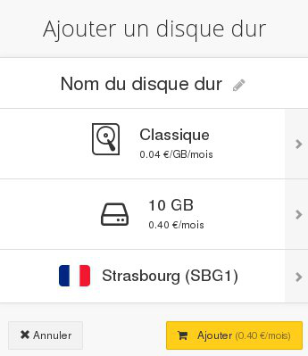
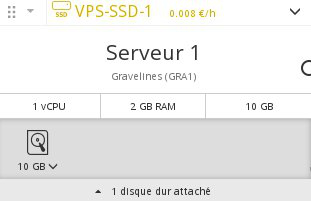

## Preambule
Il est possible de créer des disques additionnels pour vos instances Public Cloud. Cela peut être utile dans le cas où :

- Vous souhaitez augmenter votre capacité de stockage sans pour autant changer de modèle d'instance.
- Vous souhaitez disposer d'un espace de stockage hautement disponible et performant.
- Vous souhaitez pouvoir déplacer votre espace de stockage ainsi que les données contenues sur une autre instance.

Ce guide vous explique comment créer un disque supplémentaire puis le configurer sur l'une de vos instance.

### Prérequis
- Une instance

## Création du disque
- Se connecter à [l'espace client
OVH](https://www.ovh.com/manager/cloud/){.external}
- Cliquer sur le bouton "Ajouter" et sélectionner "Ajouter un disque"

{.thumbnail}

Vous pouvez, depuis ce nouveau menu :

- Nommer votre disque
- Sélectionner le type de disque :

|---|---|
|Classique|200 IOPS garanties|
|Haute performance|Jusqu'à 3000 IOPS|

**Classique**

- Choisir la capacité du disque : à partir de 10GB
- Choisir la région de votre disque
- Valider la création du disque

Une nouvelle fenêtre apparaitra avec votre disque :

{.thumbnail}

Vous pouvez ensuite attacher votre disque supplémentaire à une instance :

- En faisant un glisser/déposer de votre disque sur votre instance.
- En cliquant sur la flèche en bas à droite de votre disque et sélectionner "Attacher à un serveur".

Une fois cela fait, celui-ci apparaitra juste en-dessous de votre instance :

{.thumbnail}

## Montage du disque

### Depuis une instance sous Linux
- Lister les disques

> [!success]
>
> VDA correspond généralement au disque de votre instance, VDB sera donc le
> disque supplémentaire
> 

- Créer une partition
- Formater la partition
- Monter la partition
- Vérification du montage

> [!success]
>
> Pour un montage de disque persistant, il faudra modifier le fichier /etc/fstab :
> - 
> Récupérer l'ID du bloc
> - 
> Ajouter votre disque dans le fichier /etc/fstab :
> 
> 

### Depuis une instance sous Windows
- Accéder au l'outil de gestion de disque

{.thumbnail}

- Formater le disque

{.thumbnail}

Attention : Si le message "offline (the disk is offline because of policy set by an administrator)" apparaît, il faudra modifier les attributs des disques en effectuant un clic droit sur votre disque, puis sélectionner "Online" puis "Initialize" ou en utilisant Diskpart :

- Lancer Powershell ou une invite de commande
- Vérification de la stratégie appliquée :
- Changer la stratégie :
- Application de la stratégie sur le disque supplémentaire :
- Initialiser le disque depuis le gestionnaire de disques puis procéder au formatage du disque.

Une fois le disque formaté, vous pourrez y accéder simplement depuis votre explorateur de fichiers.

{.thumbnail}