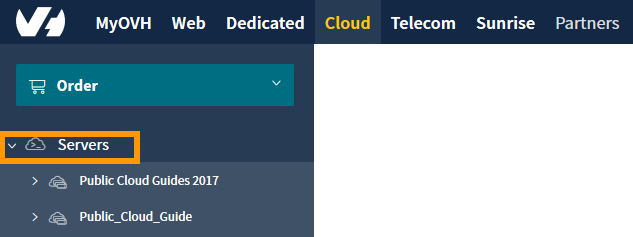
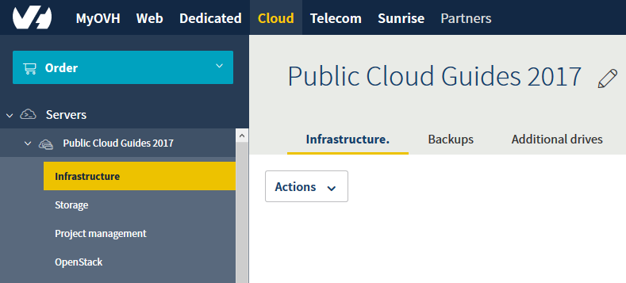
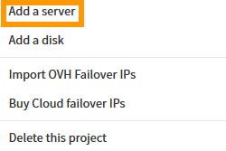
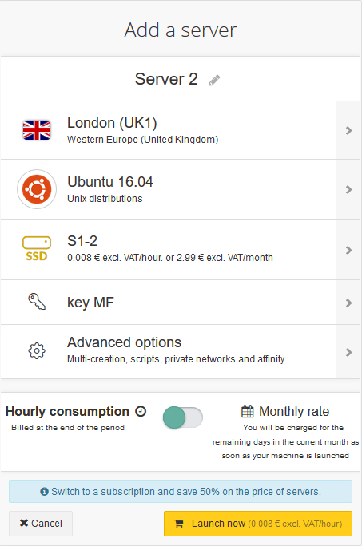
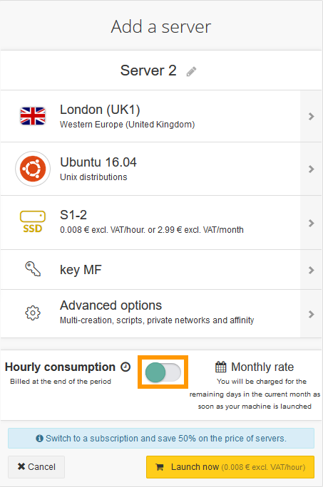
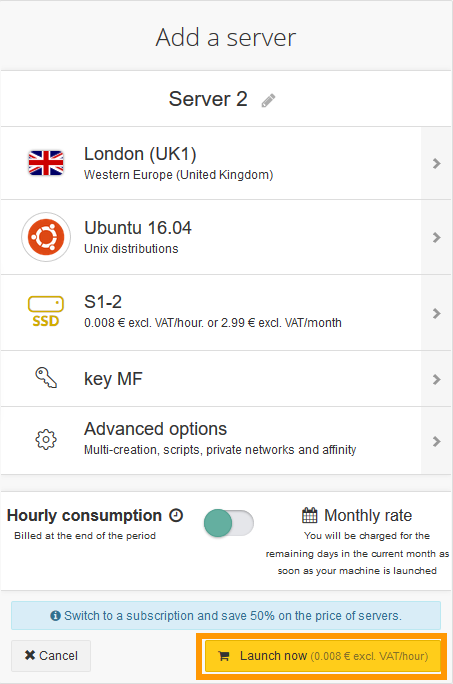
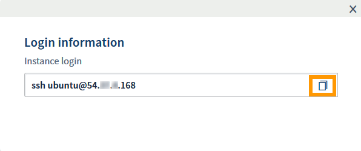
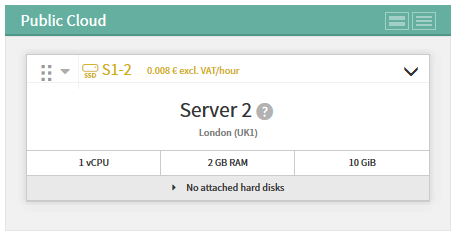

**Dernière mise à jour le 25/10/2018**

## Objectif

Notre offre [Public Cloud](https://www.ovh.com/fr/public-cloud/instances/){.external} vous permet de créer des instances en quelques clics, des serveurs privés virtuels par exemple, rapidement et facilement.

**Ce guide vous montre comment créer une instance sur Public Cloud.**

## Prérequis

* Avoir accès à votre [espace client OVH](https://www.ovh.com/auth/?action=gotomanager){.external}.
* Posséder un projet [Public Cloud](https://www.ovh.com/fr/public-cloud/instances/){.external} créé sur votre compte OVH.
* Disposer d'une clé SSH créée sur votre compte OVH.

## En pratique

> [!primary]
>
> Ce guide suppose que vous avez défini la « vue » de votre projet cloud sur `Infrastructure`{.action}. Vous pouvez modifier celle-ci avec le bouton situé sur le côté droit de la page, comme illustré ci-dessous :
>

{.thumbnail}

### Ajouter une instance

Tout d’abord, connectez-vous à votre [espace client OVH](https://www.ovh.com/auth/?action=gotomanager){.external} et cliquez sur le menu `Cloud`{.action}.

{.thumbnail}

Cliquez sur `Serveurs`{.action} dans la barre de services à gauche, puis choisissez le projet cloud concerné.

{.thumbnail}

Après avoir sélectionné votre projet, cliquez sur l'option `Infrastructure`{.action}.

{.thumbnail}

Cliquez maintenant sur le bouton `Actions`{.action}.

{.thumbnail}

Ensuite, cliquez sur le bouton `Ajouter un serveur`{.action}.

{.thumbnail}

### Configurer l’instance

Après avoir cliqué sur le bouton `Ajouter un serveur`{.action}, les paramètres de configuration apparaissent comme indiqué ci-dessous.

{.thumbnail}

Ces paramètres vous permettent de configurer :

* le datacenter et la région où l'instance sera hébergée ;
* le système d'exploitation du serveur ;
* le modèle du serveur ;
* une clé SSH pour la sécurité (non nécessaire pour les serveurs Windows) ;
* plusieurs options avancées.

> [!primary]
>
> Veuillez noter que pour les serveurs Windows, l'authentification est basée sur un mot de passe. Les clés SSH ne sont donc pas utilisées.
>

Une fois que vous avez configuré les options souhaitées, vous devez choisir la facturation de votre service à l'heure ou au mois.

{.thumbnail}

Enfin, cliquez sur le bouton `Lancer maintenant`{.action} pour créer l'instance.

{.thumbnail}

Votre instance va maintenant être créée et peut nécessiter quelques minutes pour être finalisée.

Une fois la création effectuée, vos informations de connexion seront affichées. Vous pourrez les copier dans le presse-papier de votre ordinateur en cliquant sur l'icône de copie.

{.thumbnail}

L'instance nouvellement créée sera désormais visible dans votre espace client.

{.thumbnail}

> [!warning]
>
> Lorsque vous créez une instance et que vous optez pour le paiement mensuel, vous devez conserver celle-ci au moins jusqu'à la fin du mois en cours.
>

## Aller plus loin

Échangez avec notre communauté d'utilisateurs sur <https://community.ovh.com/en/>.