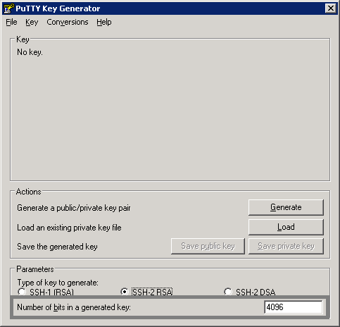

## Preamble
When you create an instance, you won't receive an email with your credentials. To securely connect, you will need to configure an SSH key before creating an instance. This makes it possible to connect:

- Without having to remember a password
- In more secure manner than using a passwords

This guide details the steps to be taken to configure your key.


## Linux &amp; Mac

### Creating the key
<a name="CLESSHLINUX"></a>
- Open  terminal
- Enter the following command to enable the generation of a 4096 bit SSH key:

```bash
ssh-keygen -b 4096
```

- The following result is obtained, the command prompts you to change the location of the private key:

```bash
Generating public/private rsa key pair.
Enter file in which to save the key (/home/user/.ssh/id_rsa):
```


> [!success]
>
> The private part of the key should be kept safe, and its access
> should be limited to only people authorized to use it.
> 

- The following step consists in configuring a passphrase for your key SSH key:


> [!alert]
>
> Setting a passphrase to protect the key is recommended,
> do not hesitate to enter a secure password (upper/ lower case /
> numbers/special character and a minimal length of 8 characters).
> 


```bash
Your identification has been saved in /home/user/.ssh/id_rsa.
Your public key has been saved in /home/user/.ssh/id_rsa.pub.
The key fingerprint is:
0a:3a:a4:ac:d1:40:6d:63:6d:fd:d9:fa:d6:b2:e0:36 user@host
The key's randomart image is:
+---[RSA 4096]----+
|      .          |
|                 |
| .               |
|. . . .          |
|. .=.o .S.       |
| =o.o. ..   .    |
|o +   .  . o ..  |
|.. .      oEoo . |
|o.        .o+oo  |
+-----------------+
```

- Read and display the public key using the following command:

```bash
cat .ssh/id_rsa.pub
```

- In our example:

```bash
cat /home/user/.ssh/id_rsa.pub
ssh-rsa AAAAB3NzaC1yc2EAAAADAQABAAABAQC8teh2NJ42qYZV98gTNhumO1b6rMYIkAfRVazl
k6dSS3xf2MXJ4YHsDacdjtJ+evXCFBy/IWgdkFtcvsGAMZ2N1RdvhDyQYcy6NDaJCBYw1K6Gv5fJ
SHCiFXvMF0MRRUSMneYlidxU3U2q66yt/wPmw1yRsQagtNKHAzFUCSOB1nFz0RkqvqgARrHTY0bd
aS0weA//aK9f6z+Y4THPbcCj4xPH4iGikFMPrFivP8Z6tidzVpAtbr1sXmJGZazYWrU3FoK2a1sF
i4ANmLy7NULWK36yU0Rp9bFJ4o0/4PTkZiDCsK0QyHhAJXdLN7ZHpfJtHIPCnexmwIMLfIhCWhO5
 user@host
```


## On Windows

### Using Putty
[Putty](https://www.chiark.greenend.org.uk/~sgtatham/putty/){.external} is the most popular SSH client for Windows

- Download the software [puttygen](https://the.earth.li/~sgtatham/putty/latest/w64/puttygen.exe){.external} allowing to generate the key
- Run the software to generate the key
- At the level of 'Number of bits in a generated key', specify the value 4096

{.thumbnail}

- Click on `Generate`{.action} (move the mouse in the grey frame during the action)
- Specify a passphrase to password protect the key
- Save the private key by clicking on `Save private key`{.action}, name this file (key.rsa for example)
- Copy the public key displayed in the frame

{.thumbnail}

- Start Putty
- In the list on the left, click on `Connection`{.action}, then on `SSH`{.action}, and `Auth`{.action}
- At the level of the 'Private key file for authentication' line, click on `Browse`{.action}, select the private key, validate.

{.thumbnail}

- Click on `Open`{.action} in Putty.


### Using CygWin
Cygwin suggests an alternative approach, and enables the installation, on Windows, of many GNU libraries.

- Download the [32-bit](https://www.cygwin.com/setup-x86.exe){.external} or [64-
bit software](https://www.cygwin.com/setup-x86_64.exe){.external}
- Start the installation


> [!success]
>
> Choosing the nearest mirror to you is recommended
> (.fr domain or European ISP)
> 

- At the Select Packages step, in the Search field, specify SSH
- In the Net tree, click on the line `openssh`{.action} The OpenSSH server and client programs
- Click on `Next`{.action}
- Start the CygWin software
- The rest of the procedure is identical to that necessary on [Linux/Mac OS](#CLESSHLINUX){.external}.