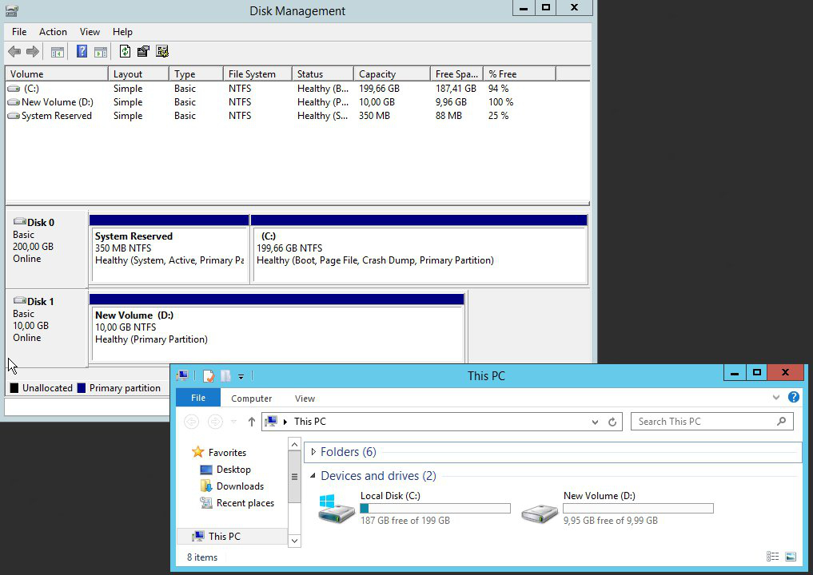

## Preamble
You have probably [created a new additional volume](../guide.en-au.md){.ref}, or an additional disk.

This guide will explain how to create an additional disk, and then how to attach it to one of your instances.


### Prerequisites
- An [instance](../guide.en-au.md){.ref}
- An [additional volume](../guide.en-au.md){.ref} attached


## Disk mount

### From an instance on Linux
- List disks

```bash
sudo fdisk -l /dev/vd*
```


> [!success]
>
> /dev/vda generally corresponds to the disk of your instance, /dev/vdb
> will thus be the first additional volume.
> Some operating systems recognize disks using
> another driver. In this case, they appear as /dev/sd*.
> 

- Create a partition with parted

```bash
sudo parted /dev/vdb
mktable gpt
mkpart primary ext4 512 100%
quit
```

- Format the partition

```bash
sudo mkfs.ext4 /dev/vdb1
```

- Mount the partition

```bash
sudo mount /dev/vdb1 /mnt
```

- Checking the mount

```bash
mount /dev/vdb1
```


> [!success]
>
> For a persisting disk mount, you will need to change the
> /etc/fstab file:
> - Retrieve the block ID
> - Add your disk in the /etc/fstab file:
>


### From an instance on Windows
- Access the disk management tool

{.thumbnail}

- Format the disk

{.thumbnail}


Please note:

If the message "offline" appears (the disk is offline because of policy set by an administrator), you will need to change the disk attributes by right-clicking your disk, and then selecting "Online" and "Initialize" or by using Diskpart:

- Launch Powershell or the command prompt
- Checking the strategy followed
- Change the strategy
- Applying the strategy on the additional disk
- Initialize the disk from the disk manager and then format the disk.

Once the disk is formated, you can easily access it from your file explorer.


{.thumbnail}