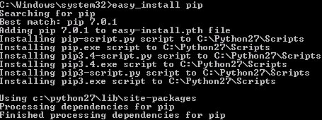

## Préambule
Afin de pouvoir gérer vos services Public Cloud à l'aide d'un terminal, vous pouvez installer les clients OpenStack sous Python. Cela vous permettra notamment de gérer l'Object Storage, mais aussi d'automatiser les différentes actions que vous pouvez effectuer à l'aide de ces clients.

Ce guide vous explique la procédure à suivre afin d'installer les clients OpenStack.


## Pour Linux

### Sous Debian
- Ouvrir un terminal, ou une connexion SSH vers l'environnement à configurer
- [Passer root]({legacy}1786){.ref}
- Mettre à jour le cache des paquets :

```bash
root@vps187763:~# apt-get update
```

- Installer les clients pour Nova (compute) et glance (image service)

```bash
root@vps187763:~# apt-get install python-glanceclient python-novaclient -y
```


> [!success]
>
> Une fois cette étape passée, Il est conseillé de créer un utilisateur
> spécifique, pour ne pas travailler avec l'utilisateur root.
> 

- Pour consulter l'aide des CLI nova et glance, procéder ainsi :

```bash
admin@vps187763:~$ nova help
```


```bash
admin@vps187763:~$ glance help
```

- La documentation exhaustive liée à l'API OpenStack est proposée [ici](http://docs.openstack.org/cli-reference/content/){.external}


### Sous CentOS
- Ouvrir un terminal, ou une connexion SSH vers l'environnement à configurer
- [Passer root]({legacy}1786){.ref}
- Mettre à jour le cache des paquets :

```bash
[root@vps187769 ~]# yum update -y
```

- Installer le rpm rdo-release :

```bash
[root@vps187769 ~]# yum install -y https://rdoproject.org/repos/rdo-release.rpm
```

- Installer nova

```bash
[root@vps187769 ~]# yum install -y python-novaclient
```

- Installer glance

```bash
[root@vps187769 ~]# yum install -y python-glanceclient
```


Source : [https://www.rdoproject.org/Quickstart](https://www.rdoproject.org/Quickstart){.external}


> [!success]
>
> Une fois cette étape passée, Il est conseillé de créer un utilisateur
> spécifique, pour ne pas travailler avec l'utilisateur root.
> 

- Pour consulter l'aide des CLI nova et glance, procéder ainsi :

```bash
[root@vps187769 ~]# nova help
```


```bash
[root@vps187769 ~]# glance help
```

- La documentation exhaustive liée à l'API OpenStack est proposée [ici](http://docs.openstack.org/cli-reference/content/){.external}


## Pour Windows
- Télécharger et installer la version [2.7.10 de
Python](https://www.python.org/downloads/release/python-2710/){.external}
- Lancer une invite de commande
- Installer PIP grâce a easy_install :


{.thumbnail}

- Installer Swift


{.thumbnail}

- Il est possible de consulter l'aide du CLI grâce a la commande :