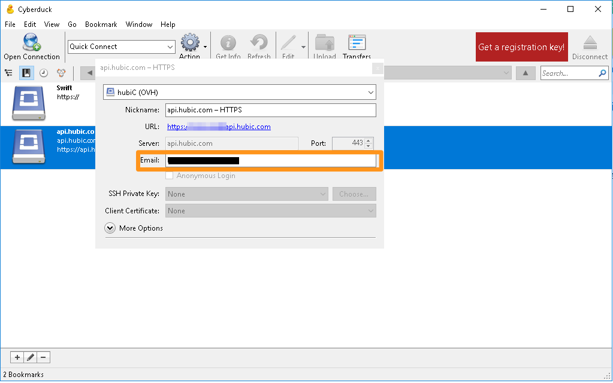
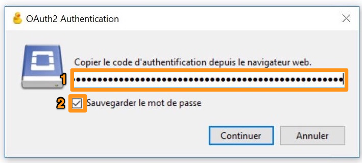
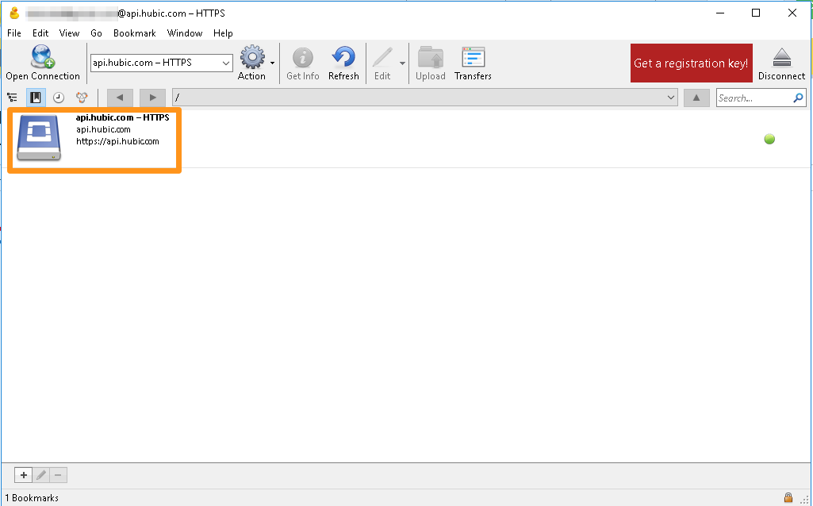
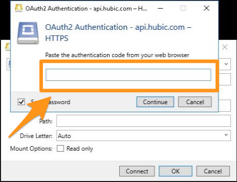
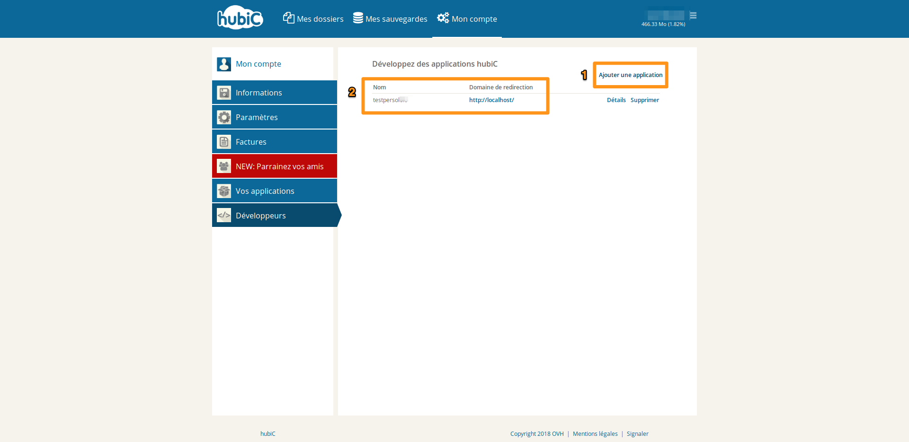

## Wprowadzenie 

Usługa hubiC opiera się na klastrach przestrzeni dyskowej OpenStack Swift. Możesz się do niej zalogować różnymi metodami. Rekomendujemy logowanie przez stronę hubic.com, ale możesz również korzystać z usługi po zalogowaniu się za pomocą zewnętrznych narzędzi. 

**Dowiedz się, jak się zalogować do klastra hubiC, używając jednej z trzech dostępnych metod: Cyberduck (klient Swift), Mountain Duck (dysk sieciowy) lub montowanie svfs.**

> [!warning]
> Tutorial przedstawia zastosowanie jednego lub kilku rozwiązań OVH w powiązaniu z zewnętrznymi narzędziami i opisuje operacje, jakie należy wykonać w danym przypadku. Wybierz odpowiednie dla Ciebie rozwiązanie. 
>
Jeśli napotkasz trudności podczas przeprowadzania tych operacji, skontaktuj się z wyspecjalizowanym dostawcą usług administracyjnych i/lub zadaj pytanie na forum [społeczności OVH](https://community.ovh.com/en/). Niestety OVH nie jest w stanie udzielić Ci wsparcia w tym zakresie. 
>

## Wymagania początkowe

### Powinieneś umieć:

- Zainstalować aplikację na Twojej lokalnej maszynie (dla rozwiązań Cyberduck i Mountain Duck)
- Połączyć się z serwerem za pomocą SSH (aby zamontować svfs)

### Powinieneś posiadać:

- Aktywne konto hubiC 
- Komputer z systemem operacyjnym Windows, macOS lub GNU/Linux
- Połączenie z Internetem
- Ważną licencję na korzystanie z płatnego, prawnie zastrzeżonego oprogramowania (na przykład: Mountain Duck)


## W praktyce 


### Wybierz metodę najlepiej dopasowaną do Twojego przypadku

Wybór może zależeć od systemu operacyjnego lub Twojej wiedzy i umiejętności. 

- Jeśli chcesz użyć rozwiązania dla systemu Windows lub macOS do samodzielnej konfiguracji, zapoznaj się z sekcją tego tutoriala [Logowanie do klastra hubiC przez Cyberduck](./#logowanie-do-klastra-hubic-przez-cyberduck) i połącz się z klastrem hubiC za pośrednictwem klienta Swift.  

- Jeśli chcesz użyć, za pomocą dysku sieciowego, gotowego rozwiązania dla systemu Windows lub macOS wymagającego bardzo niewielkiej liczby ustawień, zapoznaj się z sekcją tego tutoriala [Logowanie do klastra hubiC przez Mountain Duck](./#logowanie-do-klastra-hubic-przez-mountain-duck) i połącz się z klasterem hubiC za pośrednictwem płatnego oprogramowania.

- Jeśli używasz dystrybucji GNU/Linux, zapoznaj się z sekcją tego tutoriala [Logowanie do klastra hubiC przez svfs](./#logowanie-do-klastra-hubiC-przez-svfs) i połącz się z klastrem hubiC za pośrednictwem montowania svsf.


## Logowanie do klastra hubiC przez Cyberduck

Możesz zalogować się do klastra hubiC, używając klienta Swift. W tym tutorialu użyjemy klienta Cyberduck dla platform Windows i macOS. 


### Etap 1: pobranie i instalacja Cyberduck

Pobierz najnowszą wersję Cyberduck kompatybilną z Twoim systemem operacyjnym (Windows lub macOS). W tym celu kliknij [link](https://cyberduck.io/download/){.external}. 

Jest to darmowa aplikacja i może być używana bez ograniczeń. Po zakończeniu instalacji, uruchom oprogramowanie, aby sprawdzić, czy operacja przebiegła poprawnie, następnie **zamknij oprogramowanie**.


### Etap 2: Uzyskanie danych uwierzytelniających 

Aby zalogować się do hubiC za pomocą Cyberduck, uzyskaj dane i wypełnij profil logowania.

Profil ten ma postać pliku, który można pobrać [tutaj](https://svn.cyberduck.io/trunk/profiles/hubiC.cyberduckprofile){.external}.

Otwórz plik, czynność ta uruchomi Cyberduck i otworzy okno konfiguracji.


### Etap 3: zezwolenie klientowi Cyberduck na logowanie do konta hubiC

W otwartym wcześniej oknie wprowadź adres e-mail umożliwiający logowanie do Twojego konta hubiC.

{.thumbnail}

W aplikacji Cyberduck kliknij dwukrotnie ikonkę w postaci dysku twardego, przy którym umieszczony jest Twój adres e-mail.  

Otworzy się strona WWW, gdzie zostaniesz poproszony o wprowadzenie danych logowania do hubiC. Wprowadź dane, po czym kliknij przycisk `Accept`{.action}. Dzięki temu Cyberduck będzie mógł łączyć się z usługą hubiC.

{.thumbnail}

Po wykonaniu tego działania otrzymasz kod autoryzacyjny zezwalający na dostęp.

{.thumbnail}

Skopiuj kod i wklej go do Cyberduck w części „Kod autoryzacyjny”, a następnie kliknij `Continue`{.action}. 

{.thumbnail}

Po zamknięciu okna kliknij `Login`{.action}.

### Etap 4: logowanie do konta hubiC przez Cyberduck

Kiedy ponownie otworzysz program Cyberduck, możesz w dowolnym momencie połączyć się z przestrzenią hubiC, klikając dwukrotnie ikonkę w postaci dysku twardego.

{.thumbnail}

Znajdziesz tam Twoje pliki i foldery. 

{.thumbnail}

Kiedy klikniesz prawym przyciskiem na plik lub folder, uzyskasz dostęp do różnych opcji: `download` umożliwia pobranie pliku lub folderu, `delete` jego usunięcie.

> [!warning]
> 
> W żadnym wypadku nie usuwaj części *Default* ani *Default_segments*, gdyż stracisz zapisane dane i konto hubiC stanie się bezużyteczne.
>

## Logowanie do klastra hubiC przez Mountain Duck

Mountain Duck to oprogramowanie kompatybilne z systemem Windows i macOS. Pozwala zalogować się do niektórych usług przechowywania danych, takich jak hubiC. Będą one widoczne jako dyski sieciowe w Twoim komputerze i jako takich będziesz mógł ich używać. 

> [!primary]
>
> Mountain Duck jest płatną aplikacją. Dostępna jest **wersja próbna (*Trial version*), ale nie pozwala ona na nawiązanie połączeń dłuższych niż dziesięć minut**.

### Etap 1: pobranie i instalacja Mountain Duck

Pobierz najnowszą wersję Mountain Duck kompatybilną z Twoim systemem operacyjnym. W tym celu kliknij [link](https://mountainduck.io/){.external}. Uruchom proces instalacji, następnie wprowadź klucz rejestracyjny, który otrzymałeś w momencie zakupu licencji.

### Etap 2: Uzyskanie danych uwierzytelniających 

Aby zalogować się do hubiC za pomocą Mountain Duck, uzyskaj dane i wypełnij profil logowania.

Profil ten ma postać pliku, który można pobrać [tutaj](https://svn.cyberduck.io/trunk/profiles/hubiC.cyberduckprofile){.external}.

Otwórz plik. Czynność ta spowoduje dodanie hubiC do listy wspieranych usług.

### Etap 3: otwarcie sieciowego dysku twardego hubiC

Sprawdź, czy Mountain Duck działa poprawnie, następnie kliknij prawym przyciskiem odpowiednią ikonkę na pasku zadań. 

{.thumbnail}

Otworzy się wówczas okno konfiguracyjne. Wybierz `hubiC (OVH)`{.action} z rozwijanego menu.

{.thumbnail}

W nowym oknie, które się pojawi wprowadź w odpowiednim polu adres e-mail Twojego konta hubiC, a następnie kliknij `Connect`{.action}.

### Etap 4: zezwolenie klientowi Mountain Duck na logowanie do konta hubiC

Otworzy się strona WWW, gdzie zostaniesz poproszony o wprowadzenie danych logowania do hubiC. Wprowadź dane, po czym kliknij przycisk `Accept`{.action}. Dzięki temu Mountain Duck będzie mógł łączyć się z usługą hubiC.

{.thumbnail}

Otworzy się strona, na której znajdziesz kod autoryzacyjny zezwalający na dostęp.

{.thumbnail}

Skopiuj kod i wklej go w odpowiednim oknie.

{.thumbnail}

Po wprowadzeniu kodu do Mountain Duck Twoja przestrzeń hubiC będzie dostępna jako dysk sieciowy na Twoim komputerze. 

{.thumbnail}

## Logowanie do klastra hubiC przez svfs

Jeśli korzystasz z komputera z dystrybucją GNU/Linux (w Twoim przypadku Debian), możesz połączyć się z przestrzenią hubiC przez punkt montowania svfs (*Swift Virtual File System*). Więcej informacji o svfs znajdziesz w [repozytorium GitHub projektu](https://github.com/ovh/svfs).

### Etap 1: instalacja svfs

Połącz się z serwerem za pomocą SSH i pobierz pakiet svfs kompatybilny z hubiC przy użyciu komendy:

```sh
wget https://github.com/ovh/svfs/releases/download/v0.9.1/svfs_0.9.1_amd64.deb
```

Następnie rozpocznij instalację svfs:

```sh
dpkg -i svfs_0.9.1_amd64.deb
```

W pierwszej fazie instalacji mogą wystąpić błędy kompatybilności. Większość z nich możesz usunąć za pomocą komendy (w Debianie i systemach pochodnych):

```sh
apt --fix-broken install
```

Będziesz mógł wtedy ponownie uruchomić instalację, która powinna teraz przebiec bezproblemowo.

### Etap 2: konfiguracja punktu montowania

Zaloguj się do [hubic.com](https://hubic.com). Kliknij `My account`{.action}, `Developers`{.action}, a następnie `Add application`{.action}. Nadaj jej nazwę, po czym wskaż na nią w „Redirect domain”:

```sh
http://localhost
```

{.thumbnail}

Po prawej stronie utworzonej aplikacji kliknij `Details`{.action} i pobierz informacje z pól: „Client ID” i „Secret client”.

{.thumbnail}

Połącz się przez SSH i wprowadź komendę:

```ssh
hubic-application
```

Następnie wpisz informacje: 

| Nazwa pola              | Dane do uzupełnienia               |
|---------------------------|----------------------------------------|
| Aplikacja Redirect URL  | http://localhost/                      |
| Aplikacja Client ID     | Wcześniej pobrany Client ID     |
| Aplikacja Secret client | Wcześniej pobrany Secret client |

Teraz uzupełnij następujące elementy:

```
1. Setting scope ... OK ~> Email: /votre mail hubic/ ~> Password: /mot de passe hubic/
2. Granting access ... OK
3. Getting refresh token ... OK == Your mount options == ~> hubic_auth=xxxxxxxx ~> hubic_token=xxxxxxxx
```

### Etap 3: utworzenie punktu montowania

Po wprowadzeniu wszystkich elementów możesz utworzyć punkt montowania svfs przy użyciu uzyskanych elementów.

```
# sudo mount -t svfs hubic /mountpoint -o hubic_auth=<hubic_auth>,hubic_token=<hubic_token>,container=default
```

## Podsumowanie

Teraz możesz już logować się do przestrzeni hubiC, nie używając oficjalnej aplikacji czy strony hubic.com (aplikacja internetowa). 

Przypominamy jednak, że dostęp do danych za pośrednictwem hubic.com pozostaje w dalszym ciągu rekomendowaną przez nas metodą. Niestety OVH nie może udzielić Ci wsparcia w zakresie opisanych wyżej operacji.

## Sprawdź również 

Przyłącz się do społeczności naszych użytkowników na stronie [https://community.ovh.com/en/](https://community.ovh.com/en/)