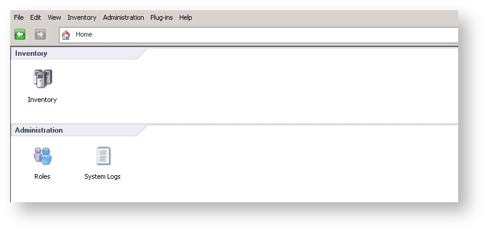
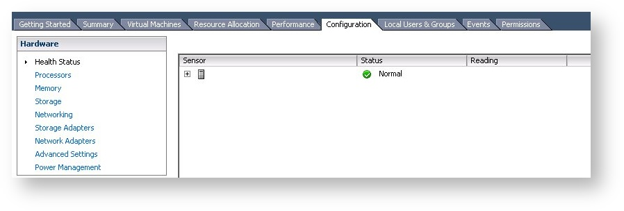
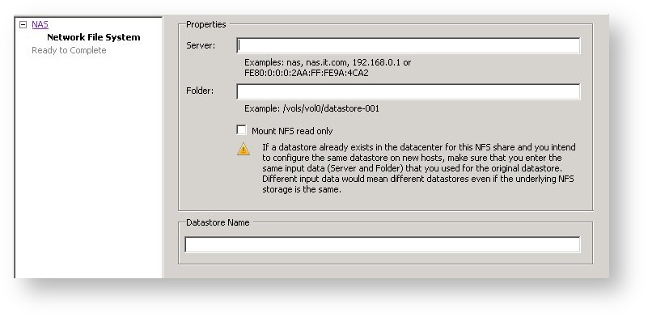

**Ultimo aggiornamento: 05/08/2019**

## Prerequisiti

Questa guida mostra come utilizzare il protocollo di rete Network File System (NFS) per eseguire il mount di un NAS sulle distribuzioni più diffuse.

Per il mount di una cartella condivisa NFS è necessario disporre di:

- un NAS OVH
- una macchina che utilizza la rete OVH (server dedicato, VPS, istanza...)
- una distribuzione compatibile con NFS


### Linux

Compatibilità: Debian 6/7/8 e Ubuntu 12/13/14

Per il mount di una cartella condivisa NFS su Linux:

- accedi al server via SSH
- installa il pacchetto “nfs-client” tramite il comando:


```sh
aptitude install nfs-client
```

A questo punto, utilizza il comando:


```sh
mount -t nfs -o _netdev,mountproto=tcp IP_NAS:/PERCORSO_NFS /CARTELLA_MOUNT
```

|Argomento|Descrizione|
|---|---|
|IP_NAS|Nome o IP del NAS.|
|PERCORSO_NFS|Percorso della cartella condivisa sul server NFS (esempio: “nas-000YY/miapartizione”).|
|CARTELLA_MOUNT|La directory locale in cui verrà eseguito il mount della cartella condivisa NFS.|


> [!primary]
>
> Per abilitare il mount del NAS all'avvio del sistema, aggiungi al file `/etc/fstab` questa riga di comando:
> 
> ```
> IP_NAS:/PERCORSO_NFS /CARTELLA_MOUNT nfs rw,_netdev,mountproto=tcp 0 0
> ```
>

Esempio:

```sh
mount -t nfs -o _netdev,mountproto=tcp 10.16.XXX.YYY:zpool-999888/PartitionName /media/NasHA -v
```

|Argomento|Descrizione|
|---|---|
|IP_NAS|10.16.XXX.YYY|
|PERCORSO_NFS|zpool-999888/PartitionName|
|CARTELLA_MOUNT|/media/NasHA -v|

### CentOS

Compatibilità: CentOS 6

Per il mount di una cartella condivisa NFS su CentOS 6:

- accedi al server via SSH
- installa i pacchetti “nfs-utils” e “rpcbind” tramite il comando:


```sh
yum install nfs-utils rpcbind
```

Riavvia il servizio `rpcbind` con il comando:


```sh
/etc/init.d/rpcbind start
```

A questo punto, utilizza il comando:

```sh
mount -t nfs -o _netdev,mountproto=tcp IP_NAS:/PERCORSO_NFS /CARTELLA_MOUNT
```

|Argomento|Descrizione|
|---|---|
|IP_NAS|Nome o IP del NAS.|
|PERCORSO_NFS|Percorso della cartella condivisa sul server NFS (esempio: “nas-000YY/miapartizione”)|
|CARTELLA_MOUNT|La directory locale in cui verrà eseguito il mount della cartella condivisa NFS.|


> [!primary]
>
> Per abilitare il mount del NAS all'avvio del sistema, aggiungi al file `/etc/fstab` questa riga di comando:
> 
> ```
> IP_NAS:/PERCORSO_NFS /CARTELLA_MOUNT nfs rw,_netdev,mountproto=tcp 0 0
> ```
>

### Gentoo

Per il mount di una cartella condivisa NFS su Gentooo:

- accedi al server via SSH
- installa il pacchetto “nfs-client” tramite il comando:


```sh
emerge nfs-utils
```

Avvia il servizio NFS con il comando:

```sh
/etc/init.d/nfs start
```

A questo punto, utilizza il comando:


```sh
mount -t nfs IP_NAS:/PERCORSO_NFS /CARTELLA_MOUNT
```

|Argomento|Descrizione|
|---|---|
|IP_NAS|Nome o IP del NAS.|
|PERCORSO_NFS|Percorso della cartella condivisa sul server NFS (esempio: “nas-000YY/miapartizione”)|
|CARTELLA_MOUNT|La directory locale in cui verrà eseguito il mount della cartella condivisa NFS.|


> [!primary]
>
> Per abilitare il mount del NAS all'avvio del sistema, aggiungi al file `/etc/fstab` questa riga di comando:
> 
> ```
> IP_NAS:/PERCORSO_NFS /CARTELLA_MOUNT nfs rw 0 0
> ```
> 
> Poi attiva il servizio “nfsmount” al boot con questo comando:
> 
> ```
> rc-update add nfsmount default
> ```
>

### Proxmox

Compatibilità: Proxmox 3.X

Per il mount di una cartella condivisa NFS su Proxmox:

- accedi all’interfaccia di gestione di Proxmox
- clicca sulla scheda `Storage`{.action}


{.thumbnail}

- clicca su `Add`{.action} e seleziona `NFS`{.action}


{.thumbnail}


|Argomento|Descrizione|
|---|---|
|ID|Nome assegnato alla cartella condivisa NFS.|
|Server|Nome del NAS.|
|Export|Percorso della cartella condivisa sul server NFS.|
|Contenuto|Tipo di contenuto della cartella condivisa NFS (valore possibile: Images, ISO, Template, Backup, Containers).|


> [!primary]
>
> Per abilitare il mount del NAS all'avvio del sistema, aggiungi al file `/etc/fstab` questa riga di comando:
> 
> ```
> IP_NAS:/PERCORSO_NFS /CARTELLA_MOUNT nfs rw 0 0
> ```
>

### ESXI

Per il mount di una cartella condivisa NFS su Linux:

- accedi al server via vSphere
- nel pannello di gestione, clicca su`Inventory`{.action}: 


{.thumbnail}

- seleziona la scheda `Configuration`{.action}:


{.thumbnail}

- clicca su `Storage`{.action} nel menu a sinistra:


{.thumbnail}

Si apre un form da completare:


{.thumbnail}

|Argomento|Descrizione|
|---|---|
|Server|Nome o IP del NAS.|
|Folder|Percorso della cartella condivisa sul server NFS (esempio: “/nas-000YY/miapartizione”).|
|Datastore Name|Nome che intendi assegnare al datastore.|


## Ulteriori informazioni

> [!alert]
>
> L’utente NFS è `root`, pertanto eventuali modifiche dei permessi con questo utente potrebbero generare conflitti con permessi CIFS/SMB già esistenti.
