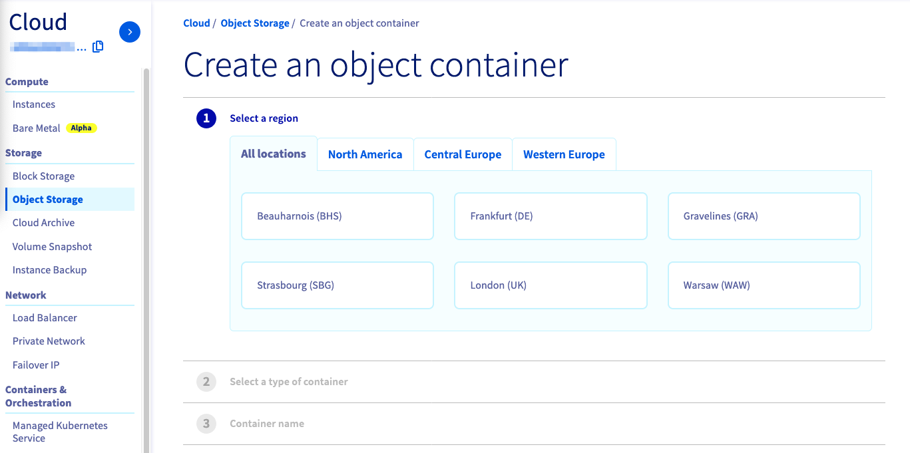
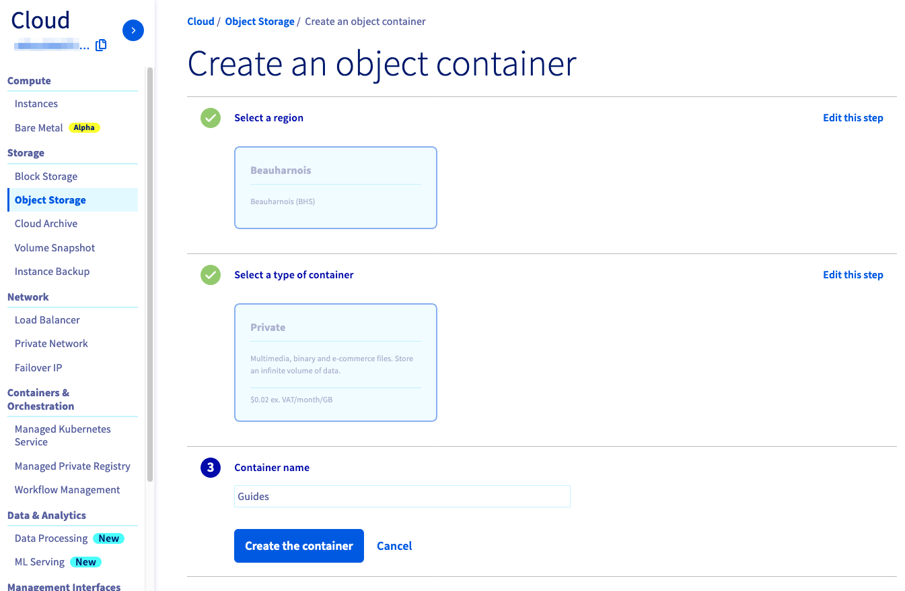

## 
La première étape pour utiliser la solution de stockage dans le Cloud public consiste à créer un conteneur pour vos fichiers. Ce guide explique comment en créer un à partir du panneau de contrôle OVHcloud.

## Prérequis

- Un projet de Public Cloud 

## 

- Connectez-vous au [panneau de contrôle OVHcloud](https://ca.ovh.com/manager/public-cloud/#/)
- Sélectionnez "Object Storage" sur la gauche

{.thumbnail}

- Cliquez sur "Ajouter des objets"

Une nouvelle fenêtre s'ouvrira:

{.thumbnail}

D'ici, vous pouvez :

- La région du conteneur
- Le type de conteneur 
- Le nom de votre conteneur
- Sélectionnez le type de conteneur

{.thumbnail}

Ensuite, votre conteneur apparaîtra et de nouvelles options seront disponibles:

{.thumbnail}

Vous le pouvez :

- Voir les détails de votre conteneur
- Supprimer et ajouter des contenus 

{.thumbnail}

## 
 

