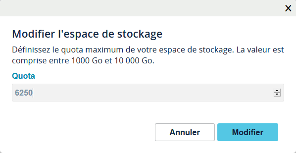
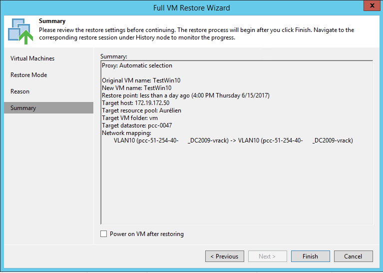

**Stand 10.09.2020**

## Einleitung

Veeam Cloud Connect ist eine Lösung des Softwareherausgebers Veeam, mit der Sie Remote-Backups verwalten können, ohne dass die Verwaltung eines sekundären Standorts erforderlich wird. Die Idee hinter Veeam Cloud Connect besteht darin, ein einfaches und sicheres Tool für die Durchführung von Backups und Datenwiederherstellungen in der Cloud bereitzustellen.

**In dieser Anleitung erfahren Sie, wie Sie Ihr Veeam Cloud Connect Angebot konfigurieren.**

## Voraussetzungen

- Sie haben das [Veeam Cloud Connect](https://www.ovh.com/de/storage-solutions/veeam-cloud-connect/){.external} Angebot abonniert.

## Beschreibung

### Kompatible Produkte

Der größte Vorteil von Veeam Cloud Connect – abgesehen von seiner Einfachheit – ist, dass diese Lösung unabhängig davon funktioniert, wo Ihre Betriebsinfrastruktur gehostet wird. Diese kann bei OVHcloud (eine Hosted Private Cloud oder ein dedizierter Server, auf dem Sie selbst mithilfe eines VMware- oder Microsoft-Hypervisors die Virtualisierung übernehmen), einem anderen Anbieter oder auch an Ihrem eigenen Standort gehostet werden.

Liste kompatibler OVHcloud Produkte:

- [Hosted Private Cloud](https://www.ovhcloud.com/de/enterprise/products/hosted-private-cloud/){.external}
- auf unseren [Dedicated Servern](https://www.ovh.com/de/dedicated_server/){.external} gehostete virtuelle Maschinen, die via Microsoft Hyper-V oder VMware ESXi verwaltet werden

### Angebot bestellen

Sie können das Angebot über die Website [OVH.com](https://www.ovh.com/de/storage-solutions/veeam-cloud-connect/){.external} bestellen.

Wenn die Zahlung abgeschlossen ist, erhalten Sie eine E-Mail mit folgenden Angaben:

- IP-Adresse/Name Ihres Dienstes
- Benutzer und Passwort

### OVHcloud Kundencenter

Gehen Sie in Ihrem OVHcloud Kundencenter in den Bereich `Server` und dann zu `Plattformen und Dienstleistungen`.

{.thumbnail}

Sie gelangen so zu dieser Seite, auf der die Konfiguration Ihres Angebots, Ihr Abonnement sowie der Speicherort angezeigt werden.

{.thumbnail}

Im zweiten Tab, `Speicherplatz`, finden Sie den Namen Ihres Speicherplatzes, seine Nutzung, das Quota sowie das Replikations-Datacenter.

{.thumbnail}

Am Ende dieser Zeile finden Sie einen Button.

Über diesen können Sie das Speicherquota erhöhen oder verringern.

{.thumbnail}

Wenn Sie den Wert verändert haben, erscheint folgende Nachricht:

{.thumbnail}

### Installation

Um Veeam Cloud Connect einzurichten, benötigen Sie zuerst einen eigenen Veeam-Backup-Server.

Dieser wird über dasselbe Interface verwaltet wie Veeam Cloud Connect: die Veeam Backup & Replication Konsole, die Sie über die [Veeam](https://www.veeam.com/){.external}-Website herunterladen können.

> \[!success]
>
> Auf dieser Seite finden Sie die Installation der Konsole.
> 

Fügen Sie zunächst den Dienst in Ihrer Konsole hinzu, indem Sie auf „ADD SERVICE PROVIDER“ klicken.

{.thumbnail}

Geben Sie die IP-Adresse / den Namen Ihres Angebots ein, den Sie per E-Mail erhalten haben.

{.thumbnail}

Fügen Sie den Benutzer und das Passwort hinzu und wenden Sie die Änderungen an.

{.thumbnail}

Die Zusammenfassung der verfügbaren Ressourcen dieses Angebots erscheint.

{.thumbnail}

Außerdem wird eine letzte Zusammenfassung angezeigt.

{.thumbnail}

Klicken Sie auf `Beenden`{.action}, damit Ihr Dienst in der Konsole angezeigt wird.

{.thumbnail}

### Konfiguration

Um die Replikation eines Ihrer Backups durchzuführen, gehen Sie links unten in der Konsole in den Tab `Backup & Replication`.

Hier finden Sie Ihre Backup-Tasks. Um die Konfiguration zu beginnen, klicken Sie in der Aktionsleiste im oberen Teil der Konsole auf `Backup Copy`{.action}.

{.thumbnail}

Geben Sie dem neuen Task zuerst einen Namen. Sie können auch die Frequenz des Tasks festlegen.

{.thumbnail}

Wenn Sie auf den Button `Hinzufügen`{.action} klicken, werden Ihnen drei Optionen angezeigt. Diese werden auf [dieser Seite](https://helpcenter.veeam.com/docs/backup/vsphere/backup_copy_vms.html?ver=95){.external} genauer beschrieben.

Im vorliegenden Beispiel wollen wir ein Backup replizieren.

{.thumbnail}

Wählen Sie nun das zuvor unter „Resources“ angezeigte Backup-Repository.

{.thumbnail}

Für den Transfer Ihres Server-Backups über die Veeam Cloud Connect Lösung auf unsere Infrastruktur können Sie die Kommunikation auf „Direkt“ stehen lassen oder den WAN-Beschleuniger verwenden.

Die Funktionsweise des [WAN-Beschleunigers](https://helpcenter.veeam.com/docs/backup/vsphere/wan_hiw.html?ver=95){.external} wird auf dieser Seite erklärt.

{.thumbnail}

Sie können auch die Zeiträume festlegen, während derer dieser Task durchgeführt wird.

{.thumbnail}

Ihnen wird eine Zusammenfassung angezeigt. Um das Hinzufügen dieses Tasks abzuschließen, klicken Sie einfach auf `Beenden`{.action}.

{.thumbnail}

Bleibt der Haken zum Starten des Tasks nach der Bestätigung gesetzt, so wird der Task ausgeführt.

Auf der Startseite finden Sie nun Ihren neuen Task.

{.thumbnail}

### Wiederherstellung

Um Ihr Backup wiederherzustellen, ist nur ein Rechtsklick auf den Task erforderlich.

Sie können auswählen, ob Sie die gesamte virtuelle Maschine wiederherstellen möchten, oder nur bestimmte Dateien.

{.thumbnail}

Wählen Sie die VM und das wiederherzustellende Backup aus.

{.thumbnail}

Wählen Sie anschließend den Wiederherstellungsort aus (der ursprüngliche oder ein anderer Ort).

{.thumbnail}

Wenn Sie möchten, können Sie einen Grund angeben, und es wird eine Zusammenfassung des Vorgangs angezeigt.

{.thumbnail}

In Ihrer Veeam-Konsole öffnet sich ein Fenster, in dem die laufenden Tasks angezeigt werden.

In Ihrem vSphere werden Ihnen nach dem Start der Wiederherstellung verschiedene Operationen angezeigt.

{.thumbnail}

## Weiterführende Informationen

Für den Austausch mit unserer User-Community gehen Sie auf [https://community.ovh.com/en/](https://community.ovh.com/en/){.external}.
