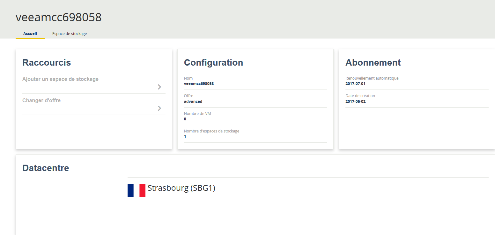
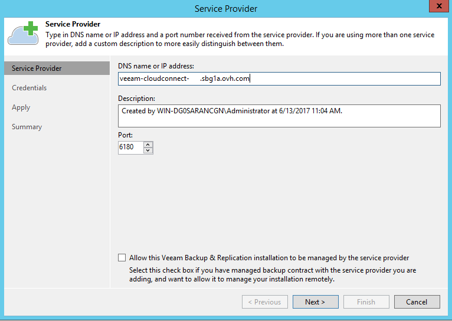
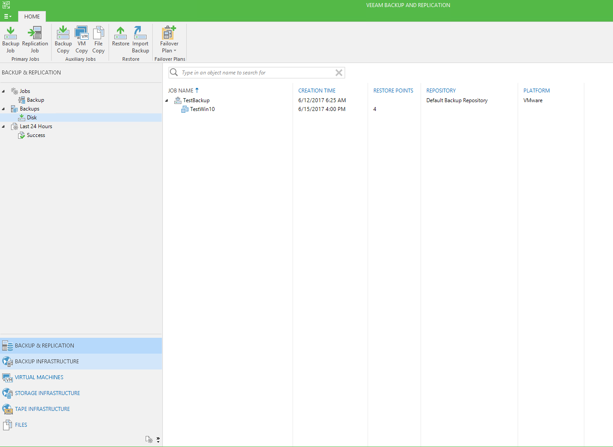
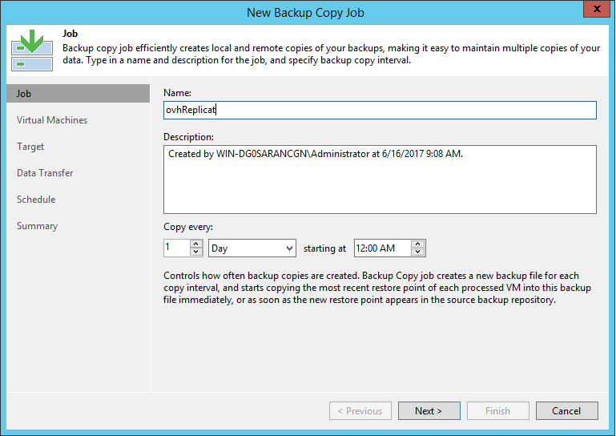
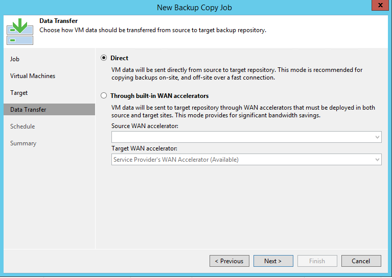
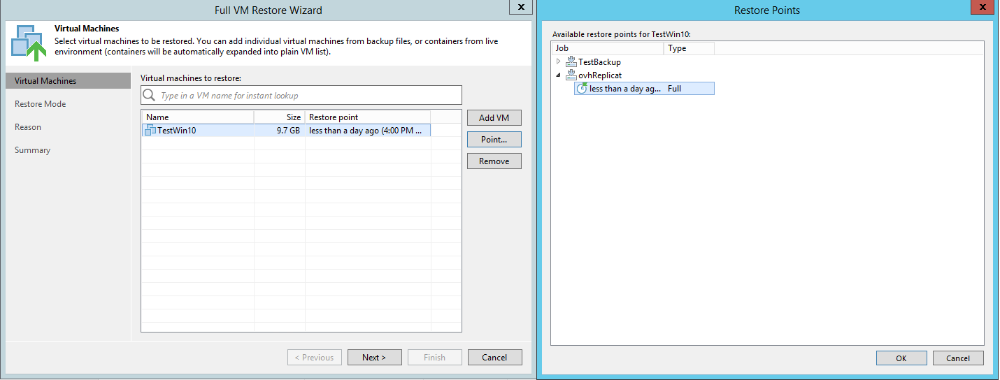

**Ultimo aggiornamento: 22/07/2020**

## Obiettivo

Veeam Cloud Connect è una soluzione proposta dal produttore di software Veeam. Questa soluzione consente di disporre di una copia di backup al di fuori del sito e senza dover gestire un’infrastruttura su un altro sito. L’idea di Veeam Cloud Connect è quella di fornire un mezzo facile e sicuro per effettuare backup e ripristinare i tuoi dati a partire dal Cloud.

**Questa guida ti mostra come configurare la tua offerta Veeam Cloud Connect.**

## Prerequisiti

- Disporre di una soluzione [Veeam Cloud Connect](https://www.ovh.it/storage-solutions/veeam-cloud-connect/).

## Procedura

### Prodotti compatibili

Il vantaggio principale di Veeam Cloud Connect, oltre alla sua semplicità, è che lavora indipendentemente dal luogo in cui è ospitata la tua infrastruttura.  Infatti, questa può essere ospitata in OVHcloud (un Hosted Private Cloud, oppure un server dedicato su cui si effettua la virtualizzazione con un hypervisor VMware o Microsoft), presso un altro provider, oppure presso la propria sede.

Lista dei prodotti OVHcloud compatibili:

- [Hosted Private Cloud](https://www.ovhcloud.com/it/enterprise/products/hosted-private-cloud/)
- Macchine virtuali ospitate sui nostri [Server dedicati](https://www.ovhcloud.com/it/bare-metal/) e gestiti tramite Microsoft Hyper-V o VMware ESXi.

### Come ordinare la soluzione

È possibile ordinare la soluzione dal [sito](https://www.ovh.it/storage-solutions/veeam-cloud-connect/)

Una volta effettuato il pagamento, riceverai un’email contenente:

- l’indirizzo IP/nom del tuo servizio.
- il nome utente e la password

### Spazio Cliente OVHcloud

Nel tuo Spazio Cliente OVHcloud, accedi alla sezione `Bare Metal Cloud` e poi clicca su `Piattaforme e Servizi`.

{.thumbnail}

A questo punto visualizzi la pagina con la configurazione della tua soluzione, il tuo abbonamento, il luogo di archiviazione.

{.thumbnail}

Nella seconda scheda `Spazio di storage`, troverai il nome del tuo spazio di storage, il suo utilizzo, la capacità e il datacenter di replica.

{.thumbnail}

In corrispondenza della riga, visualizzi un pulsante

che serve ad aumentare o diminuire la capacità di storage.

{.thumbnail}

Una volta modificato il valore, visualizzi questo messaggio:

{.thumbnail}

### Installazione

Per implementare il Veeam Cloud Connect, è necessario disporre prima di un server di backup Veeam.

L’implementazione del Veeam Cloud Connect si effettua dalla stessa interfaccia, la console Veeam Backup & Replication, disponibile sul sito di [Veeam](https://www.veeam.com/){.external}.

>[!success]
>
> L’installazione della console è disponibile in questa pagina.
> 

Per prima cosa, clicca su “ADD SERVICE PROVIDER" per aggiungere il servizio alla tua console.

{.thumbnail}

Inserisci l’IP/nom della tua soluzione, che ti è stato inviato tramite email.

{.thumbnail}

Aggiungi nome utente e password, e poi conferma l’operazione.

{.thumbnail}

A questo punto, visualizzi una finestra con le risorse disponibili su questa offerta.

{.thumbnail}

Infine, visualizzi un riepilogo.

{.thumbnail}

Una volta cliccato su `termina`{.action}, il tuo servizio comparirà sulla console. 

{.thumbnail}

### Configurazione

Per effettuare la replica di uno dei tuoi backup, clicca sulla scheda `Backup & Replication` situato in basso a sinistra della console.

A questo punto puoi consultare le attività di backup e clicca sul pulsante `Backup Copy`{.action} nella barra degli strumenti nella parte superiore della console, per iniziare la configurazione.

{.thumbnail}

Per prima cosa, assegna un nome alla nuova attività ed eventualmente scegli la frequenza con cui vuoi che venga effettuata.

{.thumbnail}

Cliccando sul pulsante `Aggiungi`{.action}puoi scegliere tra tre opzioni, illustrate nel dettaglio[in questa pagina](https://helpcenter.veeam.com/docs/backup/vsphere/backup_copy_vms.html?ver=95){.external}

In questo esempio, effettueremo la replica di un backup:

{.thumbnail}

Qui di seguito, seleziona la cartella di archiviazione vista precedentemente.

{.thumbnail}

Per trasferire il backup dal tuo server alla nostra infrastruttura, attraverso la soluzione Veaam Cloud Connect, hai due possibilità: puoi selezionare la modalità diretta, oppure utilizzare il servizio WAN accelerator.

Consulta questa pagina per conoscere il funzionamento del servizio[WAN accelerator](https://helpcenter.veeam.com/docs/backup/vsphere/wan_hiw.html?ver=95){.external}.

{.thumbnail}

Inoltre puoi pianificare i periodi di esecuzione di queste attività.

{.thumbnail}

A questo punto visualizzi un riepilogo, e non devi fare altro che cliccare su `Termina`{.action} per aggiungere l’attività.

{.thumbnail}

Una volta confermata l’operazione, l’attività si avvia immediatamente.

Visualizzi di nuovo la pagina iniziale con la nuova attività.

{.thumbnail}

### Ripristino

Per ripristinare il backup, è sufficiente cliccare con il tasto destro sull’attività.

Puoi scegliere se ripristinare l’intera macchina virtuale oppure soltanto alcuni file.

{.thumbnail}

Seleziona la VM e il backup da ripristinare.

{.thumbnail}

Quindi seleziona il luogo di ripristino (quello iniziale o un altro).

{.thumbnail}

Se vuoi, puoi indicare un motivo. Dopodiché visualizzi un riepilogo dell’operazione.

{.thumbnail}

Infine, si apre una finestra nella tua console Veeam, che indica le attività in corso.

Durante il ripristino, vedrai comparire varie operazioni nel tuo vSphere.

{.thumbnail}

## Per saperne di più

Contatta la nostra Community di utenti all’indirizzo [https://community.ovh.com/en](https://community.ovh.com/en/){.external}.
