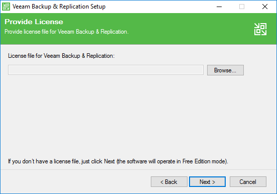
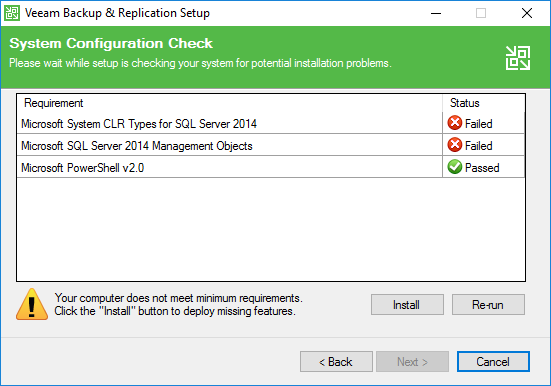
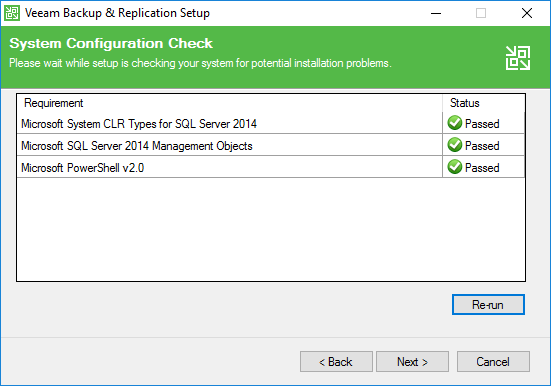
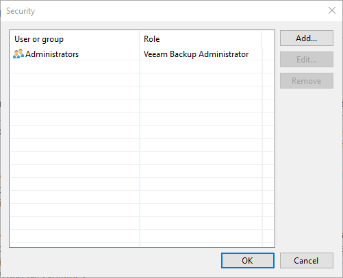
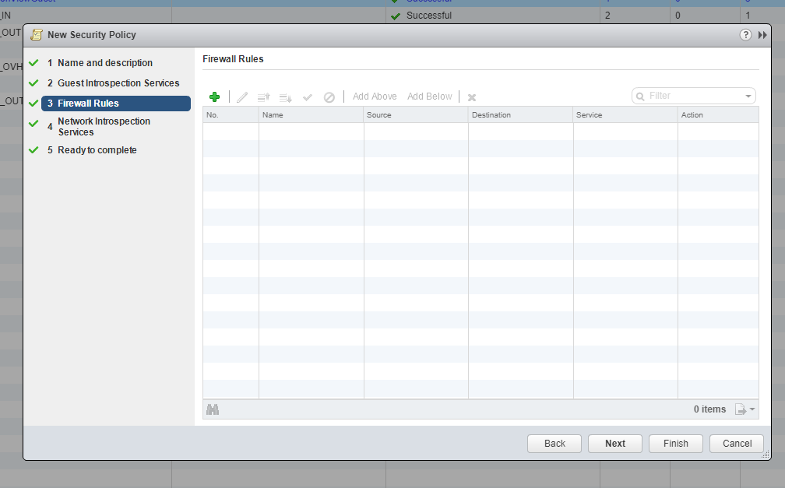

**Last updated 09/25/2018**

## Objective

Implement a **Veeam Backup & Replication** server using the **Veeam Enterprise** service offered by OVH for licence provisioning.

**This guide explains how to install Veeam Backup & Replication and register it with the OVH licence server.**

## Requirements

* Have a Veeam Enterprise offer
* Have a Windows Server 2012 or 2016 machine

## Instructions

### Veeam Backup & Replication installation

First of all, you need to download the **Veeam Backup & Replication** solution from the Veeam website. If you do not have an account, it will be necessary to create an account (the one is free).

This is in the form of an ISO (cd-rom image).

After transferring the ISO to a Private Cloud datastore, select the CD drive of the machine and then select the image.

In the machine you can now launch the installer.

Select `Veeam Backup & Replication Install`{.action}

{.thumbnail}

Accept the licence agreement after reading it with `Next`{.action}.

{.thumbnail}

Skip the licence file information step with `Next`{.action}.

{.thumbnail}

In the step of selecting the components to be installed, do not change anything. Depending on your needs, you can change the destination path of the installation. Confirm with `Next`{.action}.

{.thumbnail}

The installer will then check the prerequisites. If you are starting from a fresh Windows installation, some components will be missing. Don't worry, the installer will take care of the downloading and installation if necessary. Confirm with `Next`{.action}.

{.thumbnail}

Let the installation of the prerequisites take place.

{.thumbnail}

Once this step has been successfully completed, you can validate the actual installation of **Veeam Backup & Replication**. Confirm with `Next`{.action}.

{.thumbnail}

In the step of customising the installation of **Veeam Backup & Replication**, validate with `Install`{.action}.

{.thumbnail}

Let the installation proceed.

{.thumbnail}

Once it is ended, exit the installer with `Finish`{.action}.

{.thumbnail}

At the end, the installer indicates that it is necessary to restart Windows to complete the startup of **Veeam Backup & Replication**. To immediately restart select `Yes`{.action}.

{.thumbnail}

### Creating the Veeam Enterprise Service Account

#### Creating the service account

To perform this step, it is necessary to generate a **strong** password that must then be entered when registering the VeeamBackup .

To create a domain account, proceed as follows:

On the command line, with an administrator account :

```powershell
New-LocalUser "OVHVeeamEnterprise" -Password (ConvertTo-SecureString -AsPlainText "P@ssword01" -Force) -Description "OVH Service Account for Veeam Enterprise" -PasswordNeverExpires:$true -UserMayNotChangePassword:$true -AccountNeverExpires:$true
```
Note that the account name and password is an example and should be replaced:

* Account Name : OVHVeeamEnterprise
* Password: P@ssword01

#### Define service account authorisations

Launch the Veeam console.

{.thumbnail}

On the console, you can check that you are in **Free Edition** mode in the lower right corner.


{.thumbnail}

Go to the menu, then click on `Users and Roles`{.action}.

{.thumbnail}

In the new window `Security`{.action}, do `Add...`{.action}.

{.thumbnail}

In the new window `Add User`{.action}, enter the service account previously created and select the role **Veeam Backup Administrator** and finally validate with `OK`{.action}

{.thumbnail}

Back in the **Security** window, you can check that the account is well defined.

{.thumbnail}

Go to the menu, then click on `Users and Roles`{.action}.

{.thumbnail}

In the new window `Security`{.action}, do `Add...`{.action}.

{.thumbnail}

In the new window `Add User`{.action}, enter the service account previously created and select the role **Veeam Backup Administrator** and finally validate with `OK`{.action}

{.thumbnail}

Back in the **Security** window, you can check that the account is well defined.

{.thumbnail}


### Register the Veeam Backup server

## With OVH Manager

In the manager, open the Cloud universe then the section `Plateforms and services`{.action}, select your service **backupserverenterprise**.

{.thumbnail}

From the main page of the service, choose `Enable the license`{.action}.

{.thumbnail}

In the new window, enter the following information:

* The public IP address by which your **Veeam Backup & Replication** server can be contacted.
* The port of your veeam backup (usually **9392/TCP**)
* The login of the service account previously created
* The password of the service account

Then validate with `OK`{.action}.

When the activation is done, you will find the main information on the service page.

{.thumbnail}

## With OVH API

Get your serviceName :

> [!api]
>
> @api {GET} /veeam/veeamEnterprise
>

Then do the registration :

> [!api]
>
> @api {POST} /veeam/veeamEnterprise/{serviceName}/register
>

You must provide the following information:

* The public IP address by which your **Veeam Backup & Replication** server can be contacted.
* The port of your veeam backup (usually **9392/TCP**)
* The login of the service account previously created
* The password of the service account

You can obtain the public IP address used by Veeam Enterprise to contact your server **Veeam Backup & Replication** via :

> [!api]
>
> @api {GET} /veeam/veeamEnterprise/{serviceName}
>

### Check the registration

Launch the Veeam console.

{.thumbnail}

Go to the menu, then click on `Licence`{.action}

{.thumbnail}

In the licence information, you can check that this is the OVH licence.

{.thumbnail}

## Go further

Join our community of users on <https://community.ovh.com/en/>.
