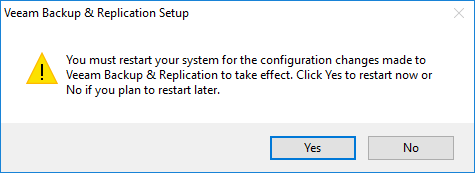
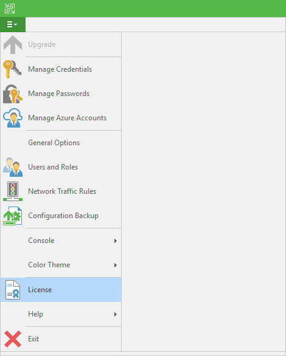
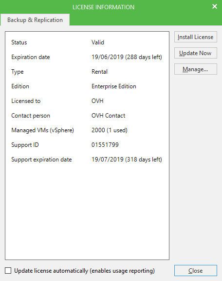

**Dernière mise à jour le 24/09/2018**

## Objectif

Mettre en oeuvre un serveur **Veeam Backup & Replication** en utilisant le service **Veeam Enterprise** proposer par OVH pour la fourniture des licences.

**Ce guide vous explique comment installer Veeam Backup & Replication et enregistrer celui-ci auprès du serveur de licence OVH.**


## Prérequis

* Posséder une offre Veeam Enterprise
* Avoir à disposition une machine Windows Server 2012 ou 2016

## En pratique

### Installation de Veeam Backup & Replication

Il vous faut tout d'abord télécharger depuis le site de Veeam la solution **Veeam Backup & Replication**. Si vous n'avez pas de compte, il sera nécessaire de créer un compte (celui est gratuits).

Celle-ci se présente sous la forme d'un ISO (image cd-rom).

Après avoir transféré, l'image dans un datastore du Private Cloud, sélectionner le lecteur CD de la machine puis sélectionner l'image.

Dans la machine vous pouvez désormais lancer l'installeur.

Sélectionner `Veeam Backup & Replication Install`{.action}

{.thumbnail}

Accepter le contrat de licence après l'avoir lu avec `Next`{.action}.

{.thumbnail}

Passer l'étape de renseignement du fichier de licence avec `Next`{.action}.

{.thumbnail}

Dans l'étape de sélection des composants à installer, ne rien modifier. Selon vos besoins, vous pouvez changer le chemin de destination de l'installation. Valider avec `Next`{.action}.

{.thumbnail}

L'installateur va ensuite effectuer un contrôle des prérequis. Si vous partez d'une installation brute de Windows, certains composants seront manquants. Pas de panique, l'installeur se chargera du téléchargement et de l'installation de ceux-ci au besoin.
Valider avec `Next`{.action}.

{.thumbnail}

Laisser l'installation des prérequis se faire.

{.thumbnail}

Une fois cette étape correctement effectuée, vous pouvez valider l'installation à proprement parler de **Veeam Backup & Replication**.
Valider avec `Next`{.action}.

{.thumbnail}

Dans l'étape de personnalisation de l'installation de **Veeam Backup & Replication**, valider avec `Install`{.action}.

{.thumbnail}

Laisser l'installation se faire.

{.thumbnail}

Une fois celle-ci terminer, quitter l'installateur avec `Finish`{.action}.

{.thumbnail}

Au moment de quitter, l'installeur indique qu'il est nécessaire de redémarrer Windows pour finaliser le démarrage de **Veeam Backup & Replication**. Pour lancer le redémarrage immédiatement choisir `Yes`{.action}.

{.thumbnail}

### Création du compte de service Veeam Enterprise

#### Création du compte de service

Pour réaliser cette étape, il est nécessaire de générer un mot de passe **complexe** qu’il faudra ensuite renseigner lors de l'enregistrement du VeeamBackup .

Afin de créer un compte de domaine, procédez de cette façon :

En ligne de commande, avec un compte administrateur :
```powershell
New-LocalUser "OVHVeeamEnterprise" -Password (ConvertTo-SecureString -AsPlainText "P@ssword01" -Force) -Description "OVH Service Account for Veeam Enterprise" -PasswordNeverExpires:$true -UserMayNotChangePassword:$true -AccountNeverExpires:$true
```
On notera que le nom du compte et le mot de passe correspondent à un exemple et sont à remplacer :
 * Nom du Compte : OVHVeeamEnterprise
 * Mot de passe : P@ssword01

#### Définir les autorisations du compte de services

Lancer la console Veeam.

{.thumbnail}

Sur la console, vous pouvez vérifier que vous êtes en mode **Free Edition** dans le coin en bas à droite.

{.thumbnail}

Allez dans le menu, puis cliquer sur `Users and Roles`{.action}.

{.thumbnail}

Dans la nouvelle fenêtre `Security`{.action}, faire `Add...`{.action}.

{.thumbnail}

Dans la nouvelle fenêtre `Add User`{.action}, saisir le compte de service précédemment créé et sélectionner le rôle **Veeam Backup Administrator** et enfin valider avec `OK`{.action}

{.thumbnail}

De retour dans la fenêtre **Security**, vous pouvez vérifier que le compte est bien définit.

{.thumbnail}

#### Enregistrer le serveur Veeam Backup

Cette étape se fait aujourd'hui uniquement au travers de l'API OVH.

Récupérer votre serviceName :

> [!api]
>
> @api {GET} /veeam/veeamEnterprise
>

Puis effectuer l'enregistrement :

> [!api]
>
> @api {POST} /veeam/veeamEnterprise/{serviceName}/register
>

Vous devez vous munir des informations suivantes :

 * L'adresse IP publique par laquelle votre serveur **Veeam Backup & Replication** peut-etre contacté.
 * Le port de votre veeam backup (usuellement **9392/TCP**)
 * le login du compte de service précédemment crée
 * le mot de passe du compte de service

Vous pouvez obtenir l'adresse IP publique utilisée par Veeam Enterprise pour contacter votre serveur **Veeam Backup & Replication** via :

> [!api]
>
> @api {GET} /veeam/veeamEnterprise/{serviceName}
>

#### Vérifier l'enregistrement

Lancer la console Veeam.

{.thumbnail}

Allez dans le menu, puis cliquer sur `Licence`{.action}

{.thumbnail}

Dans les informations de licence, vous pouvez vérifier qu'il s'agit bien de la licence d'OVH.

{.thumbnail}

## Aller plus loin

Échangez avec notre communauté d’utilisateurs sur <https://community.ovh.com/>.
