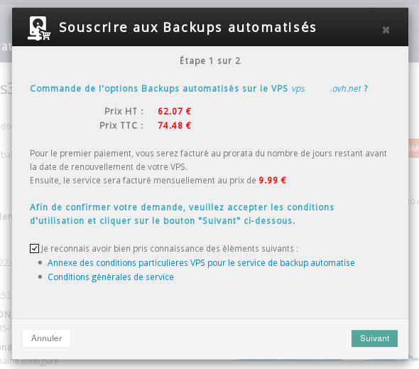
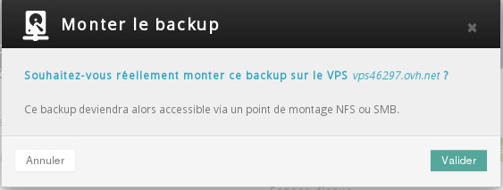

## 
Per gestire il Backup automatico ti serve:


- un VPS della gamma Cloud
- i tuoi dati di accesso allo Spazio Cliente OVH
- l'accesso al tuo server (SSH o RDP)


## Dallo Spazio Cliente OVH
Per prima cosa, accedi allo [Spazio Cliente OVH](https://www.ovh.com/manager/web/).

{.thumbnail}

- Inserisci il tuo username

- Inserisci la tua password


Seleziona dal menù di sinistra il tuo VPS:

{.thumbnail}
Dal menù principale, seleziona il tab "Backup automatico":

{.thumbnail}
Clicca ora sull'icona a destra "Attiva il Backup automatico"

{.thumbnail}
Non ti resta altro che cliccare su "Conferma" per procedere:

{.thumbnail}
A questo punto, il backup sarà attivo.


## Dallo Spazio Cliente OVH
Per prima cosa, collegati allo Spazio Cliente OVH e seleziona il VPS in questione.
Dal menù principale, seleziona il tab "Backup automatico" in cui trovi l'elenco dei backup disponibili:

{.thumbnail}
Seleziona il backup che vuoi ripristinare:

{.thumbnail}
Una volta fatto, verrà creato un task di ripristino (la cui durata varia da 30 minuti a 1 ora a seconda del VPS).

A ripristino concluso riceverai un'email con le informazioni di connessione al tuo VPS:


```
PARAMETRI DI ACCESSO:

L'indirizzo IPv4 del VPS è: tuo IPv4
L'indirizzo IPv6 del VPS è: tuo IPv6

Il nome del VPS è: vpsXXXXX.ovh.net

La password del tuo VPS è la password che era attiva il 2014-06-24 02:37:16.
```


## Dallo Spazio Cliente OVH
Una volta connesso allo Spazio Cliente (per info vedi sopra), nel menù del VPS clicca sul tab "Backup automatico" e seleziona il backup che vuoi utilizzare:

{.thumbnail}
Conferma la richiesta per ricevere via email i dati di accesso per installare il tuo backup sul tuo VPS.

Nell'email troverai i comandi per utilizzare il tuo backup in NFS o CIFS:


```
Puoi utilizzare il tuo backup con Linux con questi comandi:

mount -t nfs -o ro,vers=3 IP.IP.IP.IP:/mnt/veeam/vpsXXXXX /mnt

L'installazione del pacchetto nfs-common in Debian e Ubuntu o dei pacchetti nfs-utils e nfs-utils-lib utilizzando Centos potrebbe essere necessaria.

mount -t cifs -o username=vpsXXXXX,password=YYYYYY //IP.IP.IP.IP/VPSXXXXX /mnt

L'installazione del pacchetto cifs-utils in Debian, Ubuntu e Centos potrebbe essere necessaria.
```


