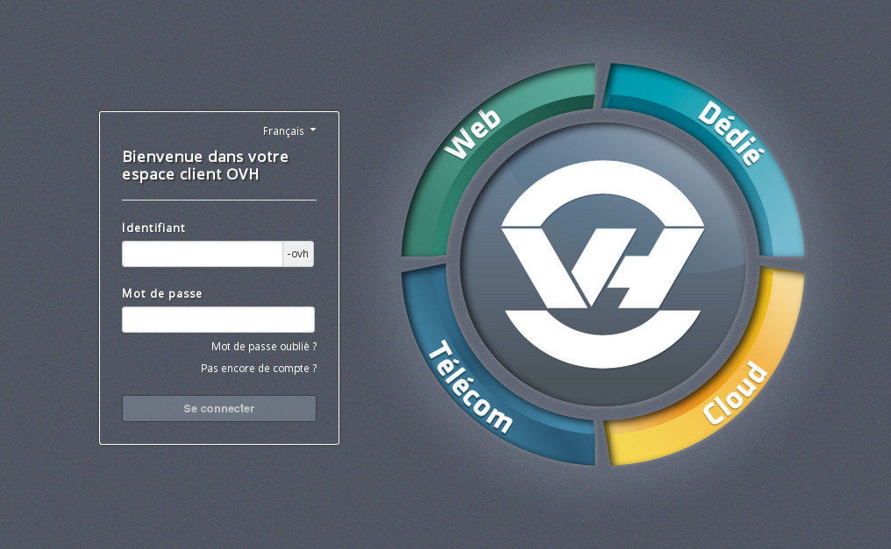
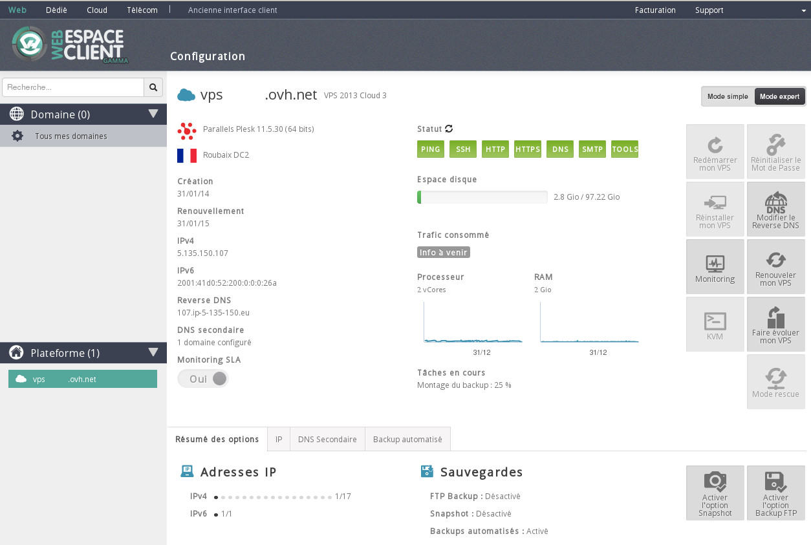
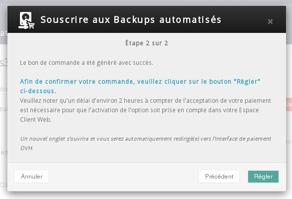
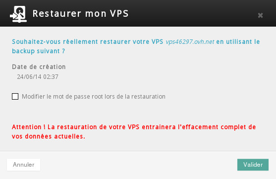

## 
Aby móc skorzystać z opcji automatycznego backupu, należy posiadać:


- serwer VPS Cloud,
- dane do logowania do panelu Manager OVH,
- dostęp do serwera (SSH lub RDP).


## W panelu Manager
Najpierw należy się zalogować do panelu Manager na tej stronie:
[Manager](https://www.ovh.com/manager/web/)

{.thumbnail}

- Podaj identyfikator klienta (konto klienta w OVH).
- Podaj hasło przypisane do konta klienta.


Wybierz serwer VPS w menu z lewej strony:

{.thumbnail}
W menu głównym wybierz zakładkę "Zautomatyzowany backup":

{.thumbnail}
Kliknij na znajdującą się z prawej strony ikonkę "Włącz zautomatyzowany backup".

{.thumbnail}
Po zatwierdzeniu formularza pojawi się zamówienie:

{.thumbnail}
Po zaksięgowaniu płatności usługa zostanie aktywowana.


## W panelu Manager
Najpierw należy się zalogować do panelu Manager i wybrać serwer VPS, który posiada włączoną tę opcję.
Wybierz zakładkę "Zautomatyzowany backup", w której będziesz mógł sprawdzać listę dostępnych kopii zapasowych:

{.thumbnail}
Kliknij na ikonkę przywracania:

{.thumbnail}
Po zaakceptowaniu zostanie dodane zadanie przywracania kopii zapasowej. Czas trwania: od 30 minut do godziny w zależności od modelu serwera VPS. 

Po zakończeniu przywracania kopii zapasowej otrzymasz e-mail z danymi do połączenia z serwerem VPS:


```
DANE DO LOGOWANIA:

Adres IPv4 serwera VPS: Twoje IPv4
Adres IPv6 serwera VPS: Twoje IPv6

Nazwa serwera VPS: vpsXXXXX.ovh.net

Hasło do serwera VPS to hasło z dnia 2014-06-24 02:37:16.
```


## Z poziomu panelu Manager
Po zalogowaniu do panelu klienta (procedura opisana powyżej) w menu serwera VPS należy wybrać zakładkę "Zautomatyzowany backup" oraz punkt montowania:

{.thumbnail}
Po zaakceptowaniu zlecenia otrzymasz e-mail z danymi dostępowymi niezbędnymi do zamontowania kopii zapasowej na serwerze VPS. 

W e-mailu znajdziesz polecenia, które należy wykonać, żeby zamontować kopię zapasową za pomocą protokołu NFS lub CIFS:


```
Możesz zamontować kopię zapasową korzystając z systemu Linux za pomocą poniższych poleceń:

mount -t nfs -o ro,vers=3 IP.IP.IP.IP:/mnt/veeam/vpsXXXXX /mnt

Możliwe, że będzie konieczne zainstalowanie pakietu nfs-common w przypadku systemu Debian i Ubuntu i/lub pakietów nfs-utils i nfs-utils-lib w przypadku systemu CentOS.

mount -t cifs -o username=vpsXXXXX,password=YYYYYY //IP.IP.IP.IP/VPSXXXXX /mnt

Możliwe, że będzie konieczne zainstalowanie pakietu cifs-utils w przypadku systemu Debian, Ubuntu i CentOS.
```


