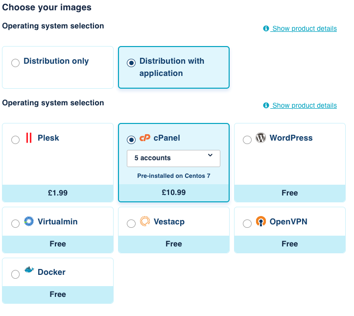

**Dernière mise à jour le 15/05/2020**

## Objectif

cPanel est un panneau de configuration conçu pour les hébergeurs web. Constitué d'une interface graphique permettant l'automatisation des paramètres, l'hébergement de site web est ainsi simplifié.

**Découvrez comment déployer cPanel en un clic avec les applications pré-installées sur VPS.**


## Prérequis

Afin de créer votre serveur cPanel, il faut d'abord commander un VPS avec la distribution cPanel.



Quand votre VPS est prêt, vous recevez un e-mail vous donnant les accès pour vous connecter à votre serveur cPanel :

> Vos application(s):
> Vous pouvez vous connecter à cpanel depuis https://<ip>:2087/<session_parameters>

Votre serveur cPanel est maintenant prêt à être utilisé.

## En pratique

### Première connexion

L'url ci-dessus vous permet de vous connecter sans login et mot de passe à votre manager cPanel.
Il faut dans un premier temps valider votre licence puis ensuite configurer votre mot de passe du user root afin de vous connecter ensuite à cette interface.


L'url générée est temporaire afin de sécuriser l'accès. Si une demande d'identification vous est adressée lorsque vous cliquez sur le lien, cela signifie que le token dans l'url a expiré.

Vous pouvez regénérer cette url avec un outil disponible en ligne de commande sur votre vps. La procédure est expliquée [ci-dessous](./#regenerer-votre-url-de-connexion)

La page suivante vous demande de renseigner votre adresse e-mail et les serveurs de noms que vous souhaitez utiliser.


### Regénérer votre url de connexion

Connectez vous en SSH avec les identifiants fournis dans l'e-mail d'accès et exécutez la commande suivante :

```sh
sudo whmlogin
```

Vous pouvez maintenant cliquer sur le lien généré pour accéder à votre interface d'administration et configurer votre mot de passe root.

## Aller plus loin

Échangez avec notre communauté d'utilisateurs sur <https://community.ovh.com>.
