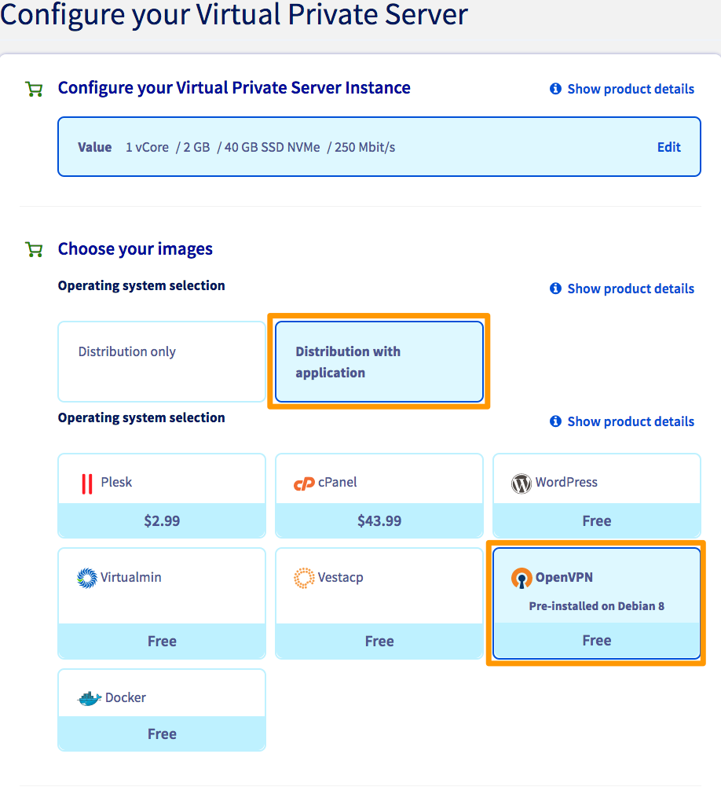
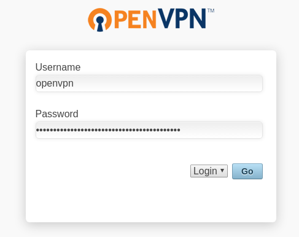
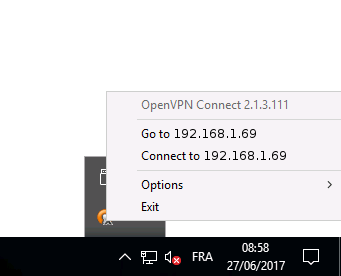
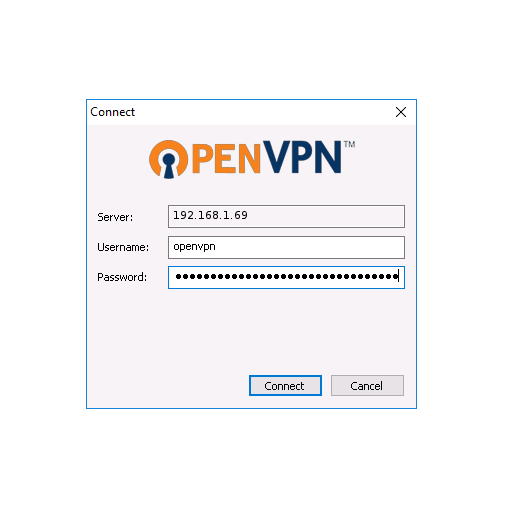
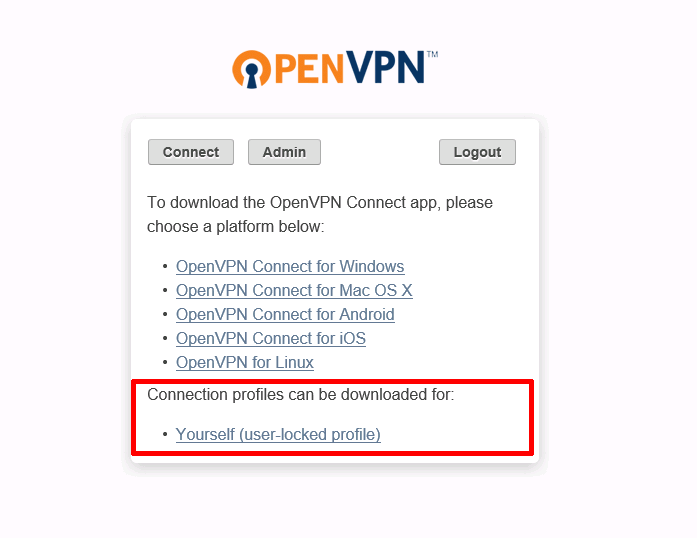
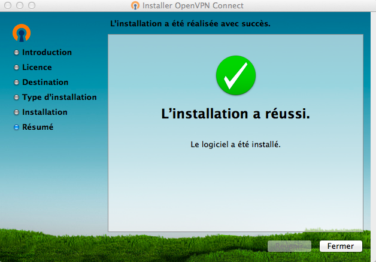
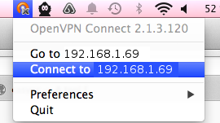
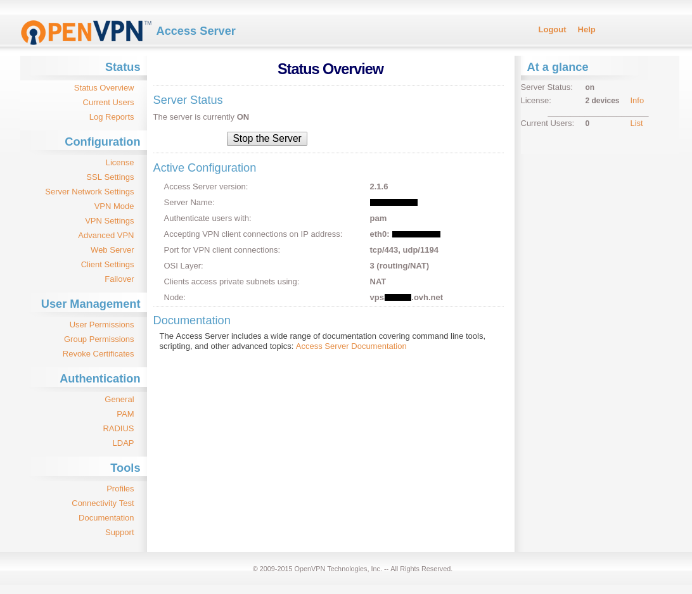

## Objectivo

OpenVPN es un software que le brinda la posibilidad de crear una Red Virtual Privada (VPN).

## Requisitos

- Acceso al [panel de control de OVHcloud](https://ca.ovh.com/auth/?action=gotomanager)
- un [servicio OVHcloud VPS](https://www.ovh.com/world/es/vps/){.external}

## Orden

Para crear su servidor OpenVPN, deberá solicitar un VPS. (Si ya tiene un VPS, puede instalar la plantilla OpenVPN a través de su panel de control OVHcloud)

{.thumbnail}

Una vez que su VPS esté instalado, recibirá un correo electrónico con sus credenciales:

{.thumbnail}

Su servidor VPN ya está listo.

Haga clic en el enlace dentro del correo electrónico de credenciales.

Inicie sesión con las credenciales en el correo electrónico.

{.thumbnail}

## Cliente

### Para Windows

Seleccione el `cliente OpenVPN para Windows`{.action}

{.thumbnail}

Guarde el archivo y ejecútelo.

{.thumbnail}

Conéctese a la VPN:

{.thumbnail}

Ahora se comunicará a través de Internet con la IP de su VPN.

Puede verificar su IP con esta página web <https://ifconfig.ovh/>

###En linux

Para distribuciones como Fedora / CentOS / RedHat:

```sh
sudo yum install openvpn
```

Para distribuciones como Ubuntu / Debian:

```sh
sudo apt-get install openvpn
```

Deberá descargar el archivo de configuración client.ovpn aquí:

{.thumbnail}

**Lanze el cliente OpenVPN con un archivo de configuración**

```sh
sudo openvpn --config client.ovpn
```

Se le pedirá que ingrese sus credenciales:

```sh
 Enter Auth Username: openvpn
 Enter Auth Password: ******************************************
```

Ahora se comunicará a través de Internet con la IP de su VPN.

Puede verificar su IP con esta página web <https://ifconfig.ovh/>.

### En MacOS

Seleccione el cliente OpenVPN para Mac OS X {.action}:

{.thumbnail}

Guarde el archivo y ejecútelo.

{.thumbnail}

Una vez que se complete la instalación, conéctese a la VPN.

{.thumbnail}

{.thumbnail}

Ahora se comunicará a través de Internet con la IP de su VPN.

Puede verificar su IP con esta página web <https://ifconfig.ovh/>.


## Servidor

Dirijase al URL dentro del correo electrónico y seleccione `Admin`:

{.thumbnail}

Inicie sesión con las credenciales recibidas en el correo electrónico y acepte los términos y condiciones.

{.thumbnail}

Ahora tiene acceso al panel de control:

{.thumbnail}


## Más información

Interactúe con nuestra comunidad de usuarios en <https://community.ovh.com/en/>
