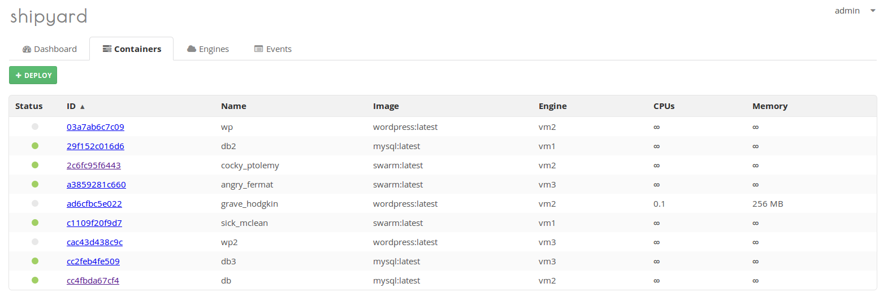
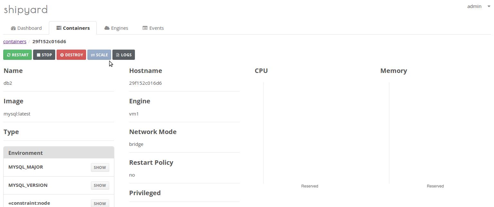

## 
Aplikace Shipyerd byla vytvořena komunitou uživatelů Docker. Může být vhodnou alternativou k Swarm a má GUI pro správu clusteru Docker serverů, umožňující Vám naplánovat úkoly a alokovat zdroje pro kontejnery z poolu zdrojů. My nejprve vygenerujeme klíče a certifikáty, které nám umožní přihlášení k různým serverům a použití TSL pro zabezpečení komunikace mezi našimi servery pro zabránění neautorizovaným osobám v přístupu k Vašim uzlům (node). K našemu Docker klientovi na vzdáleném serveru se budou moci přihlásit pouze servery s certifikátem.


Pro toto postupujte podle oficiální dokumentace Docker:
[https://docs.docker.com/articles/https/](https://docs.docker.com/articles/https/)

Jakmile si vygenerujete své certifikáty, přesuneme se na klientské servery (uzly - node). V našem příkladě se bude cluster skládat ze 3 serverů (IP: 1.1.1.1, 2.2.2.2 a 3.3.3.3).

Zkopírujte klíče a vygenerované certifikáty do adresáře  /etc/docker/certs/ jednotlivých uzlů (node) pomocí následujícího příkazu:


```
scp ca.pem server-cert.pem server-key.pem user@1.1.1.1:/etc/docker/certs/
scp ca.pem server-cert.pem server-key.pem user@2.2.2.2:/etc/docker/certs/
scp ca.pem server-cert.pem server-key.pem user@3.3.3.3:/etc/docker/certs/
```


Pro navýšení bezpečnosti na úrovni clusteru, nastavíme iptables pravidla na našem master serveru a našich uzlech (node). Níže jsou uvedeny příklady iptables pravidel, které mohou být použity:

Na uzlu (node):

Pro instalaci iptables:


```
# Udržení vytvořeného připojení
iptables -A INPUT -m state --state RELATED,ESTABLISHED -j ACCEPT

# Autorizace loopback
iptables -t filter -A INPUT -i lo -j ACCEPT

# ICMP (Ping)
iptables -t filter -A INPUT -p icmp -j ACCEPT

# SSH In
iptables -t filter -A INPUT -s 4.4.4.4 -p tcp --dport 22 -j ACCEPT

# /!\ POZOR: ujistěte se, že v tomto kroku zadáváte správnou IP adresu. Jde o IP adresu Vašeho připojení, nebo IP adresu master serveru. Půjde o jedinou IP adresu, ze které se půjde moci připojit k jednotlivým uzlům (node) přes SSH.

# HTTP In
iptables -t filter -A INPUT -p tcp --dport 80 -j ACCEPT

# SSL In
iptables -t filter -A INPUT -p tcp --dport 443 -j ACCEPT

# Docker In
iptables -t filter -A INPUT -s 4.4.4.4 -p tcp --dport 2375 -j ACCEPT

# /!\ POZOR: ujistěte se, že v tomto kroku zadáváte správné IP adresy. Jde o IP adresu master serveru, což bude jediná IP adresa, ze které se půjde připojit na port 2375.

# Zabránění všem příchozím připojením.
iptables -P INPUT DROP
iptables -P FORWARD DROP
```


Jakmile dojde k nadefinování pravidel, je potřeba je uložit, aby byly spuštěny při startu serveru:


```
apt-get install iptables-persistent
```


A zvolte "yes" při dotazu, zda chceme uložit IPv4 iptables.

/!\ POZOR: doporučujeme otestovat, zda zadaná pravidla správně fungují před jejich uložením. Jestliže potřebujete resetovat jakékoli neuložené pravidlo, jednoduše restartujte svůj server.

Kdykoli můžete přidat iptable pravidlo a uložit ho pomocí:


```
iptables-persistent save
```


Na master serveru:

Nainstalujeme iptable pravidla:


```
# Udržení vytvořeného připojení
iptables -A INPUT -m state --state RELATED,ESTABLISHED -j ACCEPT

# Autorizace loopback
iptables -t filter -A INPUT -i lo -j ACCEPT

# ICMP (Ping)
iptables -t filter -A INPUT -p icmp -j ACCEPT

# Shipyard web In
iptables -t filter -A INPUT -s "The public IP of your connection or VPN" -p tcp --dport 8080 -j ACCEPT

# /!\ POZOR: ujistěte se, že v tomto kroku zadáváte správné IP adresy. Mělo by jít například o IP Vašeho připojení k VPN. To budou jediné IP adresy, ze kterých se půjde připojit k rozhraní Shipyard.

# SSH In
iptables -t filter -A INPUT -s "The public IP of your connection or VPN" -p tcp --dport 22 -j ACCEPT

# /!\ POZOR: ujistěte se, že v tomto kroku zadáváte správné IP adresy. Mělo by jít například o IP Vašeho připojení k VPN. Tyto IP adresy budou jediné, ze kterých se půjde připojit k master serveru pomocí SSH.

# Zabránění všem příchozím připojením
iptables -t filter -P INPUT DROP
iptables -t filter -P FORWARD DROP
```


Jakmile dojde k nadefinování pravidel, je potřeba je uložit, aby byly spuštěny při startu serveru:


```
apt-get install iptables-persistent
```


A zvolte "yes" při dotazu, zda chceme uložit IPv4 iptables.

/!\ POZOR: doporučujeme otestovat, zda zadaná pravidla správně fungují před jejich uložením. Jestliže potřebujete resetovat jakékoli neuložené pravidlo, jednoduše restartujte svůj server.

Kdykoli můžete přidat iptable pravidlo a uložit ho pomocí:


```
iptables-persistent save
```


## 
Jakmile je Docker nainstalován na našich 3 serverech (viz  [tuto příručku](https://community.runabove.com/kb/en/instances/docker-in-5-minutes-on-runabove-with-docker-machine.html)). My budeme nastavovat Docker daemon na port (port 2375 - oficiální port přiřazený [IANA](http://www.iana.org/assignments/service-names-port-numbers/service-names-port-numbers.xhtml?search=docker)), takže tyto služby budou moci komunikovat s master serverem. Začneme zastavením Docker na všech serverech příkazem:


```
service docker stop
```


Poté otevřete adresář obsahující naše certifikáty:


```
cd /etc/docker/
```


Poté, pro spuštění Docker a komunikace na portu 2375 s TLS autentizací, spusťte níže uvedený příkaz na všech Vašich uzlech (node):


```
docker -d --tlsverify --tlscacert=/etc/docker/certs/ca.pem --tlscert=/etc/docker/certs/server-cert.pem --tlskey=/etc/docker/certs/server-key.pem -H=0.0.0.0:2375 --label name=node1

docker -d --tlsverify --tlscacert=/etc/docker/certs/ca.pem --tlscert=/etc/docker/certs/server-cert.pem --tlskey=/etc/docker/certs/server-key.pem -H=0.0.0.0:2375 --label name=node2

docker -d --tlsverify --tlscacert=/etc/docker/certs/ca.pem --tlscert=/etc/docker/certs/server-cert.pem --tlskey=/etc/docker/certs/server-key.pem -H=0.0.0.0:2375 --label name=node3
```


/!\ POZOR: toto nejsou trvalé možnosti. Jestliže dojde k restartu serveru, budete muset Docker s těmito možnosti restartovat. Nejlepší by byla jejich definice v $DOCKER_OPTS. V Ubuntu mohou být snadno definovány v /etc/default/docker

Zde "--label name=node1" nám umožní dát každému uzlu (node) unikátní označení. Poté budeme schopni spustit Docker kontejner na určitém uzlu (node) s množinou omezení.

Nyní můžeme instalovat Shipyard na správcovský server.


## 
Začneme spuštěním RethinkDB data volume instance:


```
docker run -it -d --name shipyard-rethinkdb-data --entrypoint /bin/bash shipyard/rethinkdb -l
```


Spustíme RethinkDB s v předchozím kroku vytvořeným data volume:


```
docker run -it -P -d --name shipyard-rethinkdb --volumes-from shipyard-rethinkdb-data shipyard/rethinkdb
```


/!\ POZOR: jestliže Váš server může být připojen přímo z Internetu, berte na vědomí, že RethinkDB bude fungovat na portu 49153 (lokální instance), 49154 (cluster) a 49155 (webové rozhraní).

Poté spustíme Shipyard jeho připojením k databázi pomocí (--link shipyard-rethinkdb:rethinkdb):


```
docker run -it -p 8080:8080 -d --name shipyard --link shipyard-rethinkdb:rethinkdb shipyard/shipyard
```


Shipyard pak automaticky nastaví uživatele "admin" s "shipyard" jako implicitním heslem.

Nežli se připojíte do webového rozhraní, doporučujeme Vám změnit Vaše Shipyard heslo. Začneme spuštěním kontejneru, který nám umožní přistupovat k Shipyard CLI:


```
docker run -it shipyard/shipyard-cli
```


Zadejte:


```
shipyard cli> shipyard login
URL:http://<YOUR_SERVER>:8000
Username: admin
Password: shipyard
Then we will change the password
shipyard cli> shipyard change-password
Password: <YOUR_PASSWORD>
Confirm: <RE-ENTER_YOUR_PASSWORD>
```


Jakmile dokončíme operaci, použijeme ctrl+d pro odchoz z CLI.

Nyní se můžete připojit k rozhraní Shipyard pomocí http://<ip_vaseho_hostitele>:8080 a pomocí uživatele "admin" a Vašeho hesla.

Jakmile jste připojeni, budeme přidávat uzly (node) pomocí webového rozhraní Shipyard v sekci Engines:

{.thumbnail}
Nezapomeňte zkopírovat bezpečnostní certifikáty, které jste si vygenerovali, do sekcí s SSL certifikáty, SSL klíčem a CD certifikací.
Toto musíte provést pro všechny uzly (node) (ujistěte se, že jste dali každému uzlu (node) unikátní označení).

{.thumbnail}
Také můžete přidat engine přes CLI. Nejdříve spusťte Shipyard CLI  kontejner:


```
docker run -it -v /etc/docker/certs/:/home/ shipyard/shipyard-cli
```


"-v /etc/docker/certs/:/home/" nám umožní vytvořit běžný repositář mezi Vašim hostitelským serverem (master server) a Shipyard CLI kontejnerem, který běží na stejném serveru, takže kontejner může přistupovat k již vytvořeným certifikátům.

Zadejte:


```
shipyard cli> shipyard login
URL:http://:8000
Username: admin
Password: votre_mot_de_passe
```


A poté spusťte příkaz:


```
shipyard add-engine --id node1 --addr https://1.1.1.1:2375 --label node1 --ssl-cert /home/client-cert.pem --ssl-key /home/client-key.pem --ca-cert /home/ca.pem
```


Po dokončení operace použijte ctrl+d pro opuštění CLI.


## 
Nyní můžeme vidět a spravovat všechny kontejnery nasazené na našich různých uzlech (node) pod sekcí Containers:

{.thumbnail}

{.thumbnail}
Nakonec klikneme na DEPLOY pro spuštění kontejnerů na všech uzlech (node), nabo na specifickém uzlu (node) (zvolením označení každého uzlu).

{.thumbnail}
Nyní máte organizační systém Docker serveru, který umožňuje snadné a rychlé nasazení aplikací a kontejnerů ve Vašem clusteru pomocí GUI. Jestliže byste si přáli otestovat Docker, můžete si objednat vlastní Sailabove zde: https://labs.runabove.com/docker. Právě jsme tam umístili image Ubuntu 14.04 + Docker (předinstalovaný) na VPS Classic a Cloud (dostupné na všech našich VPS mimo VPS Classic 1, který nemá dostatečnou diskovou kapacitu), který Vám umožní vytvářet container-ready servery přímo a využít tím nedílných výhod  VPS od OVH.

