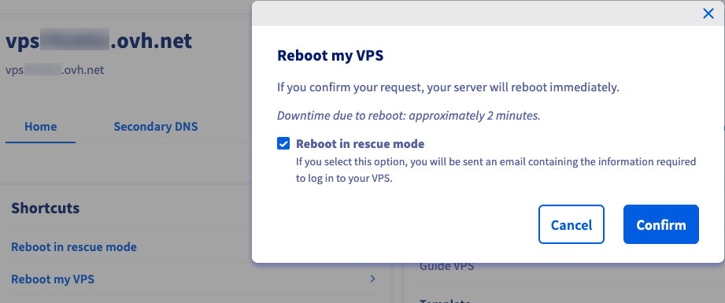

**Last updated 24th November 2020**

## Objective

Rescue mode is a tool provided by OVHcloud to boot your VPS into a temporary operating system. You can utilise it to diagnose and possibly resolve various issues on your primary OS.

Usual tasks the rescue mode is appropriate for include:

- Resetting your root password
- Diagnosing network problems
- Repairing a broken operating system
- Fixing a software firewall misconfiguration
- Testing disk performance

Performing checks in rescue mode helps to determine whether an issue is software-related or the hardware is at fault. We recommend doing this before contacting our support teams.

> [!warning]
>
> If you have any services still online, rescue mode will interrupt them as the machine is being rebooted into the auxiliary rescue environment.
>

**This guide explains how to reboot your VPS into rescue mode.**

## Requirements

- access to the [OVHcloud Control Panel](https://ca.ovh.com/auth/?action=gotomanager)
- an OVHcloud [VPS service](https://www.ovhcloud.com/en-au/vps/) already set up

> [!warning]
>OVHcloud is providing you with services for which you are responsible, with regard to their configuration and management. You are therefore responsible for ensuring they function correctly.
>
>This guide is designed to assist you in common tasks as much as possible. Nevertheless, we recommend contacting a specialised provider and/or the software publisher for the service if you encounter any difficulties. We will not be able to assist you ourselves. You can find more information in the “Go further” section of this guide.
>

## Instructions

### Activating rescue mode

Log in to the [OVHcloud Control Panel](https://ca.ovh.com/auth/?action=gotomanager), go to the `Bare Metal Cloud`{.action} section and select your server from the list in the left-hand navigation under `VPS`{.action}.

#### With a current VPS range

On the `Home`{.action} tab, click on `...`{.action} next to "Boot" in the **Your VPS** box.

{.thumbnail}

Select `Reboot in rescue mode`{.action} from the menu.

#### With older VPS ranges

On the `Home`{.action} tab, click on the shortcut link labelled `Reboot in rescue mode`{.action}.

{.thumbnail}

Click on the checkbox **Reboot in rescue mode** and then on `Confirm`{.action}.

### Using rescue mode

After you have initiated the reboot, a progress bar will show how the task is progressing. Note that this can take several minutes.

> [!primary]
>
> You will receive an automated email with the SSH credentials for rescue mode access. Please wait for the email to arrive before taking any further action. This email is also available in your [OVHcloud Control Panel](https://ca.ovh.com/auth/?action=gotomanager) when it is sent: Click on the name associated with your NIC handle (Customer ID) in the menu bar in the top right-hand corner, then select `Service emails`{.action}.
>

You can now connect via SSH to your VPS using the dedicated rescue mode credentials. Once you have completed your actions in rescue mode, reboot the VPS again in 'normal' mode from the OVHcloud Control Panel.

## Go further

[Changing your root password on a VPS](../root-password/)

[Introduction to SSH](../../dedicated/ssh-introduction/)

Join our community of users on <https://community.ovh.com/en/>.
