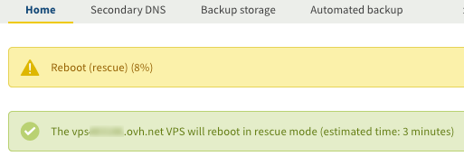

**Last updated 31/01/2018**

## Objective

In rescue mode, you can reboot your server on an independent OVH configuration. Your disk can then be mounted like an independent partition.

The advantage of this is that you can carry out tests and make configuration changes when it is most convenient for you, and when it will have the least impact on the operations performed by your server. This also allows you to correct any configuration errors made, which prevented you from accessing the server from the drive.

> [!warning]
>
> If you have any services online, rescue mode will interrupt them as the machine is being rebooted into the OVH rescue environment.
> 

This guide will show you how to reboot your VPS in rescue mode.

## Requirements

- You must be logged in to your [Control Panel](https://ca.ovh.com/auth){.external}.

## Instructions

Once you have logged in to your Control Panel, go to the `Dedicated`{.action} section, and choose your VPS in the left-hand column:

{.thumbnail}

On the main screen of your VPS, right-click on the `Rescue Mode`{.action} button and confirm that you wish to reboot it:

{.thumbnail}

A progress bar will show how the reboot task is progressing (this can take several minutes):

{.thumbnail}

> [!primary]
>
> Once you have completed this step, you will receive an automated email with the SSH credentials for rescue mode. This email is also available on your Control Panel, in the `My account`{.action} section, then `Emails received`{.action}.
> 

You can now connect via SSH to your VPS in rescue mode. Once these changes have been completed with rescue mode, you can reboot the VPS on your main hard drive by pressing the `Reboot my VPS`{.action} button.

## Go further

[Introduction to SSH](https://docs.ovh.com/sg/en/dedicated/ssh-introduction/){.external}

Join our user community on <https://community.ovh.com/en/>.