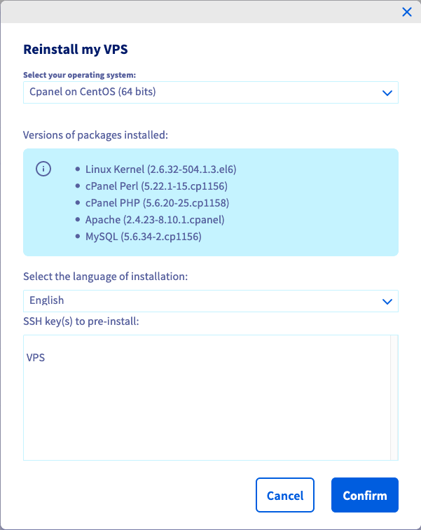

**Stand 18.04.2018**
 
## Einleitung

Ein Virtual Private Server oder VPS ist ein virtualisierter Dedicated Server. Im Gegensatz zum Webhosting (auch „Shared Hosting" genannt), bei dem die technische Verwaltung von OVHcloud geleistet wird, sind Sie allein für die Verwaltung Ihres VPS verantwortlich. 

**In dieser Anleitung finden Sie einige Anhaltspunkte zur Verwaltung Ihres neuen und frisch installierten VPS.**


> [!warning]
>
> OVHcloud stellt Ihnen Maschinen zur Verfügung, für die Sie die alleinige Verantwortung tragen. Da wir keinen Zugriff auf diese Maschinen haben, können wir keinerlei Administrator-Aufgaben für diese Server übernehmen. Es liegt daher in Ihrer Verantwortung, das Softwaremanagement und die tägliche Sicherheit Ihrer Anlage zu gewährleisten. Wir stellen Ihnen diesen Leitfaden zur Verfügung, um Ihnen bei der Bewältigung alltäglicher Server-Verwaltungsaufgaben zu helfen.  Wir empfehlen Ihnen jedoch, sich an einen spezialisierten Dienstleister zu wenden, wenn Sie Schwierigkeiten oder Zweifel hinsichtlich der Verwaltung, Nutzung oder Sicherheit eines Servers haben.  Genauere Informationen finden Sie im Teil "Weiterführende Informationen" dieser Anleitung. 
> 


## Voraussetzungen

- Sie haben einen VPS aus dem Angebot der [OVHcloud Website](https://www.ovhcloud.com/de/){.external} gebucht.
- Sie haben nach der Installation (Betriebssystem wird bei der Bestellung ausgewählt) eine E-Mail mit Ihren Zugangsdaten erhalten.


## Beschreibung

Wenn Sie in Ihrem [Kundencenter](https://www.ovh.com/auth/?action=gotomanager){.external} eingeloggt sind, gehen Sie in den Bereich `Cloud`{.action} und klicken Sie anschließend in der linken Spalte auf `Server`{.action}. Hier finden Sie alle Informationen zu Ihrem VPS: die allgemeinen Informationen in der Mitte, die Aktionen, in Form von Schaltflächen, auf der rechten Seite und die Optionen im unteren Teil des Bildschirms.

### Mit dem VPS verbinden

Bei der Installation (oder Neuinstallation) Ihres VPS wird Ihnen eine E-Mail mit dem Passwort für den Root-Zugriff, also die Verbindung via SSH-Protokoll, zugeschickt.  SSH ist ein sicheres Kommunikationsprotokoll.  Der Zugang erfolgt über Kommandozeile / Terminal (Linux oder MAC) oder über Dritt-Software in Windows (z. B. Putty).

Im offenen Terminalfenster geben Sie folgenden Befehl ein, um die Verbindung zu Ihrem VPS herzustellen: 

```sh
ssh root@IPv4_Ihres_VPS
```

Alternativ:

```sh
ssh root@Referenz_Ihres_VPS
```

Die Referenz Ihres VPS beginnt immer mit vpsXXXX.ovh.net (wobei XXXX eine Ziffernfolge ist).


### Installation oder Neuinstallation des VPS

Jede Neuinstallation erfolgt direkt in Ihrem Kundencenter. Klicken Sie einfach auf die Schaltfläche `Meinen VPS reinstallieren`{.action}.

{.thumbnail}

Es wird ein Fenster geöffnet, in dem Sie Folgendes auswählen:

- Ihr Betriebssystem aus dem Drop-down-Menü
- Die Benutzersprache
- Einen SSH-Schlüssel, falls Sie in Ihrem Kundencenter bereits solche Schlüssel angelegt haben. 


{.thumbnail}

> [!primary]
>
> Für einige Distributionen wie Plesk oder Windows benötigen Sie vor der Installation eine Lizenz, die Sie bei OVHcloud oder einem Reseller erwerben können. Diese müssen Sie dann manuell oder über Ihr Kundencenter einbinden. Die Verwaltung Ihrer Lizenzen geschieht in dem Bereich `Dedicated`{.action} unter `Lizenzen`{.action}.
> Auf dieser Seite können Sie außerdem Lizenzen bestellen (Button rechts `Bestellen`{.action}) oder Ihre eigene Windows- oder SQL-Server-SPLA-Lizenz hinzufügen (Button rechts `Eine SPLA-Lizenz hinzufügen`{.action}).
> 

In Ihrem Kundencenter  wird ein Ladebalken eingeblendet, der Ihnen den Fortschritt der Neuinstallation anzeigt. Diese kann bis zu 30 Minuten dauern


### Sicherheit Ihres VPS

Wie im Abschnitt „Einleitung" In dieser Anleitung finden Sie einige Anhaltspunkte zur Verwaltung Ihres neuen und frisch installierten VPS. Dadurch sind Sie allein für Ihre Daten und deren Sicherheit verantwortlich. 

Detaillierte Informationen zu diesem Thema finden Sie in unserer [Anleitung zur VPS Sicherheit](https://docs.ovh.com/de/vps/vps-sicherheit/){.external}.


### Domain mit einem SSL-Zertifikat sichern

Sobald Ihr VPS installiert und gesichert ist, können Sie Ihre Domain und Ihre Website ebenfalls absichern. Installieren Sie hierzu ein SSL-Zertifikat, damit Ihre Website statt nur über http auch über https erreichbar ist.

Sie können das SSL-Zertifikat manuell direkt auf Ihrem VPS installieren. Bitte beachten Sie dazu die offizielle Dokumentation der von Ihnen verwendeten Distribution.

Sie können aber auch die automatische Lösung von OVHcloud nutzen: [SSL Gateway](https://www.ovh.de/ssl-gateway/){.external}. Weitere Informationen zu SSL Gateway finden Sie auf der [Produktseite](https://www.ovh.de/ssl-gateway/){.external} oder in der zugehörigen [Dokumentation](https://docs.ovh.com/de/ssl-gateway/verwendung-von-ssl-gateway/){.external} .


## Weiterführende Informationen

[SSH Einführung](https://docs.ovh.com/de/dedicated/ssh-einfuehrung/){.external}.

Für den Austausch mit unserer User Community gehen Sie auf <https://community.ovh.com/en/>.