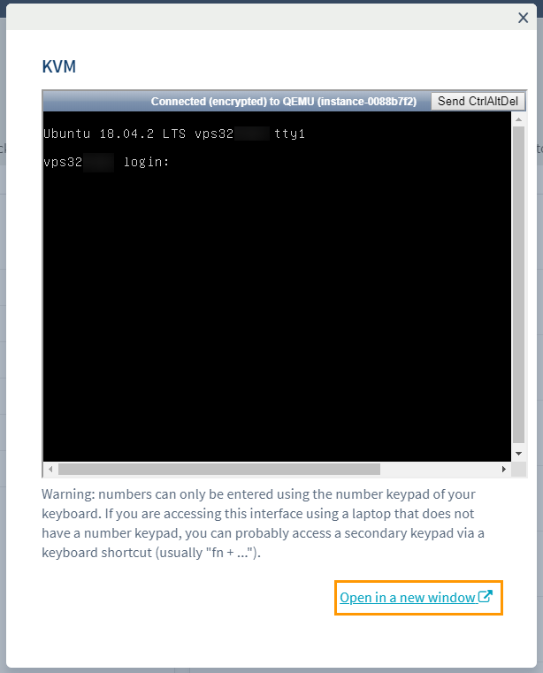

**Última actualización: 17/07/2020**

## Objectivo

La consola KVM le permite conectarse directamente a su VPS sin la necesidad de utilizar software externo como Terminal o Putty. Se puede acceder a esta consola a través de su Panel de control o las API.

**Esta guía explica ambos métodos de acceso.**

## Requisitos

- Debe iniciar sesión en su [Panel de control](https://ca.ovh.com/auth/?action=gotomanager).

## Procedimiento

### Conexión al KVM a través del panel de control

Una vez que haya iniciado sesión en su Panel de control, haga clic en la pestaña Servidor, luego, en la columna de la izquierda, elija su VPS. Haga clic en el botón `···` {.action} al lado de su nombre de VPS y verá `KVM`{.action}:

{.thumbnail}

Luego, una ventana iniciará la conexión a su VPS. Esto podría tomar unos segundos. Entonces todo lo que tiene que hacer es conectarse:

{.thumbnail}

> [!primary]
>
> El teclado puede tener un diseño diferente al suyo. Asegúrese de verificarlo, ya que el teclado podría ser AZERTY en lugar de QWERTY, por ejemplo.
>

### Conexión a KVM a través de las API

A veces puede experimentar problemas para conectarse al KVM a través de su Panel de control. En este caso, puede usar la solución API. Primero, inicie sesión a través de la [API de OVHcloud](https://ca.api.ovh.com).

> [!api]
>
> @api {POST} /vps/{serviceName}/getConsoleUrl
>

## Más información

Interactúe con nuestra comunidad de usuarios en <https://community.ovh.com/en/>
