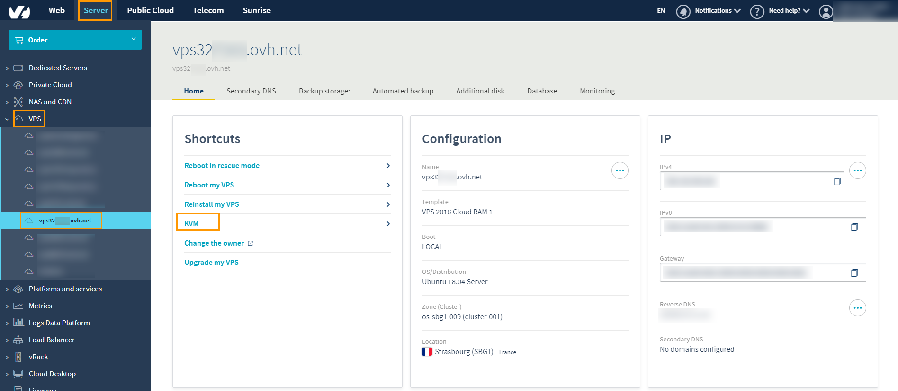

**Ostatnia aktualizacja dnia 2018-01-15**

## Wprowadzenie

Konsola KVM umożliwia bezpośrednie połączenie z Twoim serwerem VPS bez konieczności korzystania z oprogramowania zewnętrznego (terminal, Putty itp.). Konsola ta jest dostępna w Panelu klienta OVH lub z API.  

**W tym przewodniku zostaną przedstawione obydwa rozwiązania.**

## Wymagania początkowe

- Logowanie do [Panelu klienta OVH](https://www.ovh.com/auth){.external}

## W praktyce

### Logowanie do KVM przez Panel klienta

Po zalogowaniu do Panelu klienta należy przejść na stronę zarządzania Twoim serwerem VPS. Po prawej stronie znajduje się przycisk `KVM`{.action}:

{.thumbnail}

 
Pojawi się okno inicjujące połączenie do serwera VPS, co może potrwać kilka sekund. Teraz wystarczy się zalogować:

{.thumbnail}

> [!primary]
>
> Układ klawiatury może różnić się od klawiatury, z której korzystasz. Należy sprawdzić ustawienia klawiatury, gdyż zamiast np. w układzie QWERTY, może być AZERTY.
>

### Logowanie do KVM przez API

Czasami zdarzają się problemy z logowaniem do KVM przez Panel klienta. Można wówczas zalogować się przez API. Najpierw należy zalogować się na stronie [API OVH](https://api.ovh.com/).

### Serwery VPS z oferty 2014

Na serwerach VPS z oferty 2014 mogą pojawić się błędy 1006, które powinno rozwiązać skorzystanie z  API. Należy korzystać z API:

> [!api]
>
> @api {POST} /vps/{serviceName}/openConsoleAccess
>

Pomimo pozytywnej informacji ze strony API możliwe jest, że w rzeczywistości łączenie będzie trwało od jednej do dwóch minut, jest to czas niezbędny do otwarcia portu.

### Serwery VPS z oferty 2016

W przypadku problemów z połączeniem przez KVM, zalecamy skorzystanie z API:

> [!api]
>
> @api {POST} /vps/{serviceName}/getConsoleUrl
>

## Sprawdź również

Przyłącz się do społeczności naszych użytkowników na stronie <https://community.ovh.com>.