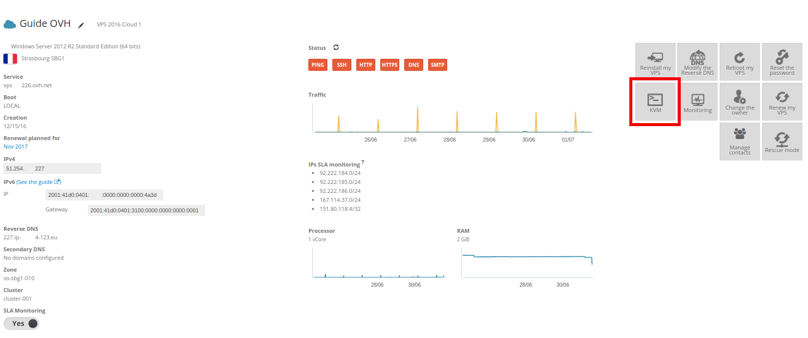
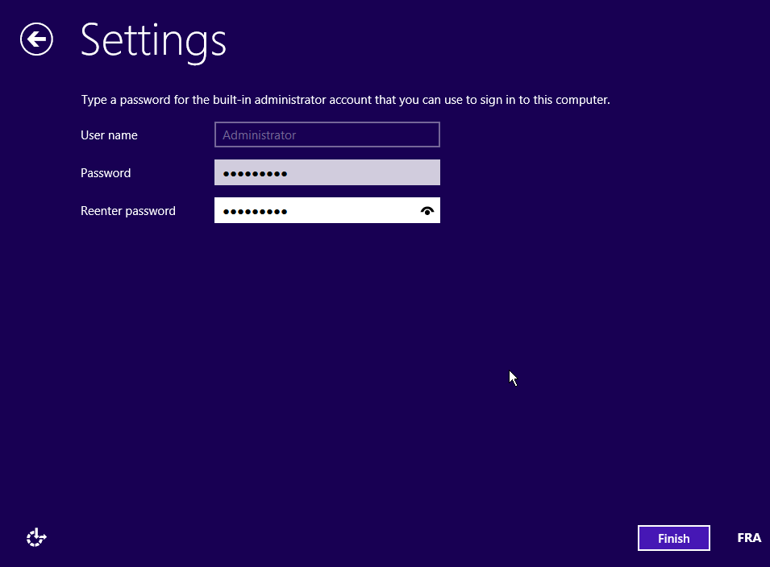

## Voraussetzungen
Bei der Installation von Windows Server 2012, 2012 R2 oder 2016 auf einem VPS kann es vorkommen, dass die Remotedesktop-Verbindung sowie die ICMP-Antwort deaktiviert sind. In dieser Anleitung wird erklärt, wo Sie die entsprechenden Änderungen vornehmen, um diese zu aktivieren.

Sie benötigen dazu:

- Einen VPS mit Windows 2012, 2012 R oder 2016.
- Zugang zu Ihrem OVH Kundencenter.

## Beschreibung

### Schritt 1&#58; Mit dem KVM verbinden
Um sich mit dem KVM zu verbinden, begeben Sie sich zunächst in Ihr `OVH Kundencenter`{.action} in den Bereich `Dedicated`{.action} und gehen dort zu Ihrem VPS.

Dann klicken Sie rechts auf den Button `KVM`{.action}.

{.thumbnail}

Sie haben nun Zugriff zu Ihrem VPS per virtueller Maus und Tastatur.

### Schritt 2&#58; Erste Windows-Einstellungen
Windows wird in dem KVM Fenster gestartet. Legen Sie nun die Windows-Tastatursprache fest und geben Sie ein **Administrator-Passwort** ein.

{.thumbnail}

{.thumbnail}

### Schritt 3&#58; Windows Firewall einstellen
Gehen Sie nach der Installation in den Bereich `Verwaltung`{.action} und klicken Sie auf `Windows-Firewall mit erweiterter Sicherheit`{.action}.

{.thumbnail}

Hier aktivieren Sie das ICMP-Protokoll sowie die Remotedesktop-Verbindung *(Rechtsklick -> Regel aktivieren)*.

{.thumbnail}