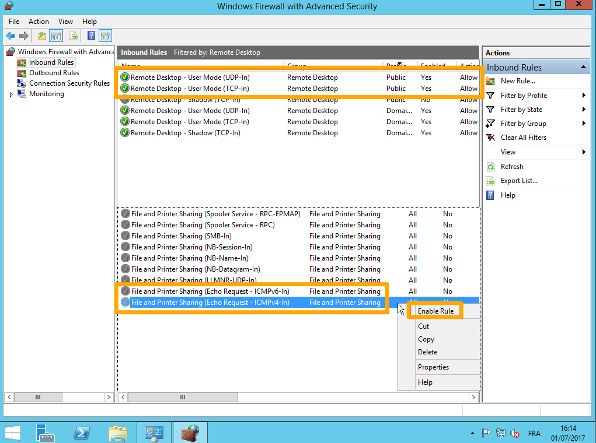

## Requirements
When you install Windows Server 2012, 2012 R2 or 2016 on a VPS, the connection to your remote desktop can sometimes be disabled, as well as the ICMP protocol response. If this is the case, this guide will show you which settings need to be changed.

To do this, you will need:

- A VPS with Windows Server 2012, 2012 R2 or 2016 installed.
- Access to your OVH Control Panel.

## Procedure

### Step 1&#58; Log in to the KVM
In order to log in to the KVM, you must log in to your `OVH Control Panel`{.action}, go to the `Dedicated`{.action} tab, then to your VPS.

Then click on the `KVM`{.action} button in the top right hand corner of your Control Panel.

{.thumbnail}

You will have “virtual keyboard and mouse” access to your VPS.

### Step 2&#58; First Windows settings
On the KVM screen, you will see Windows starting up. You will then need to configure the Windows keyboard language, as well as the **Administrator** password.

{.thumbnail}

### Step 3&#58; Modifying Windows Firewall
Once the installation is complete, go to `Administrative Tools`{.action}, then `Windows Firewall with advanced security`{.action}.

You will then need to enable the ICMP and the remote desktop connection *(right-click -> Enable rule)*.

{.thumbnail}